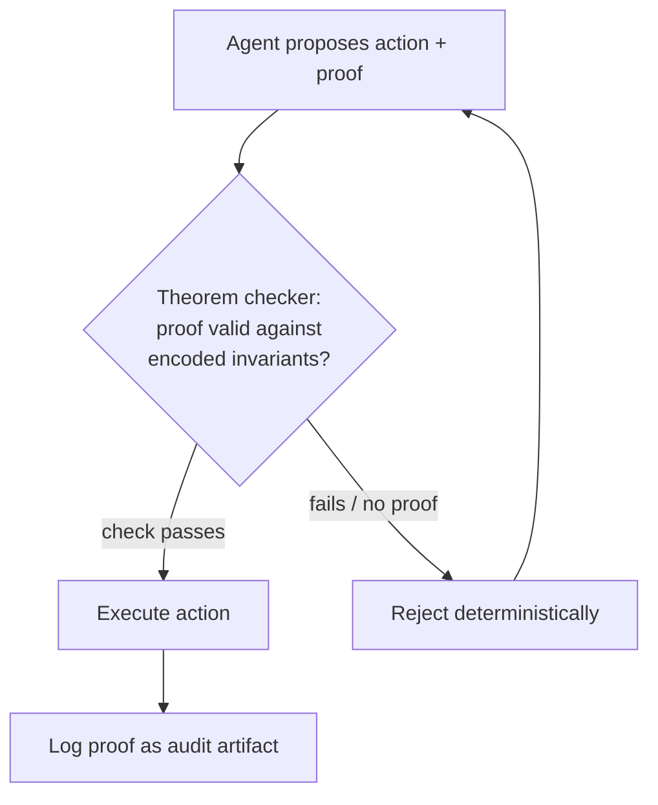

# Formal-Proof Compliance Gate

**Also known as:** Type-Checked Compliance, Theorem-Prover Action Gate, Machine-Checked Compliance Proof

**Category:** Safety & Control  
**Status in practice:** experimental

## Intent

Require every agent-proposed action to ship a machine-checked proof that it satisfies the binding regulatory invariants, and reject deterministically any action whose proof does not check.

## Context

An agent proposes consequential actions in a regulated domain such as order routing, capital allocation, or fund transfers, where a single non-compliant action carries legal liability rather than mere inconvenience. The binding constraints are written law — position limits, capital-adequacy floors, best-execution duties, segregation-of-funds rules — and a supervisor must be able to show, after the fact, that no executed action ever violated them. A probabilistic check that is usually right is not enough when one slip is a reportable breach.

## Problem

An agent reasons stochastically, so any guard that asks the model whether an action is compliant inherits that uncertainty, and a heuristic rule engine only covers the cases its author anticipated. Audit-after-execution finds breaches only once the damage is done, and statistical guardrails leave a residual probability of letting a forbidden action through. The supervisor needs a guarantee that holds by construction before the action runs, not a confidence score that holds most of the time.

## Forces

- A breach in a regulated domain is a legal event, so a residual error rate that is acceptable for a recommendation engine is unacceptable here.
- Heuristic policy engines are fast to write but only enforce the cases their rules enumerate; an unanticipated action shape slips through.
- A machine-checked proof is a hard guarantee, but encoding regulation as formal theorems and producing a proof per action costs specialist effort and latency.
- Not every regulatory duty is cleanly formalisable, so the gate covers the invariants that can be stated as theorems and must defer the rest to other controls.

## Therefore

Therefore: state the binding constraints as formal theorems, require each proposed action to carry a proof that it satisfies them, and let a theorem prover or type checker decide deterministically whether the proof holds before the action is allowed to execute.

## Solution

Encode the binding regulatory invariants once as formal theorems in a proof assistant or a sufficiently expressive type system, for example position and capital invariants expressed as Lean 4 theorems. Every action the agent proposes must be accompanied by a machine-checkable proof object that, given the current state and the action's parameters, the post-action state still satisfies those theorems. A deterministic checker runs the proof: if it type-checks, the action is admitted to execution; if it does not check, or no proof is supplied, the action is rejected outright and never reaches the side-effecting layer. The agent may search for an action and its proof, but only the checker grants execution, so compliance is established mathematically before anything runs rather than asserted by the model or sampled by a statistical filter. The checked proofs accumulate into an audit record that a supervisor can re-verify independently.

## Structure

```
Agent proposes (action, proof) --> Theorem checker verifies proof against encoded invariants --> check passes: execute + log proof | check fails / no proof: reject deterministically
```

## Diagram



*Each proposed action carries a proof; only a passing machine check admits it to execution, and the proof is retained as an audit artifact.*

## Example scenario

A trading agent proposes to buy 5,000 shares for a client account. Alongside the order it emits a proof that, after the fill, the account stays inside its position limit and the firm's capital-adequacy floor still holds. A Lean checker runs the proof in milliseconds; it type-checks, so the order is released and the proof is stored. A later proposal that would breach the position limit cannot be proven, so the checker rejects it and the order never leaves the system.

## Consequences

**Benefits**

- An executed action carries a mathematical guarantee that the encoded invariants hold, not a confidence score, eliminating the residual breach probability of a statistical gate.
- Rejection is deterministic and reproducible: the same action and state always reach the same verdict, so behaviour is auditable rather than sampled.
- Each checked proof is an independently re-verifiable audit artifact, shifting compliance evidence from after-the-fact reconstruction to before-execution record.

**Liabilities**

- Encoding regulation as formal theorems demands specialist proof-engineering effort and is only as correct as the formalisation of the law.
- The gate covers only the invariants that can be stated formally; duties that resist formalisation still need other controls and can create a false sense of total coverage.
- Producing and checking a proof per action adds latency and tooling that a heuristic check does not, which constrains throughput-sensitive paths.

## Failure modes

- Mis-formalised invariant — the theorem does not faithfully capture the regulation, so a proof checks for an action that is in fact non-compliant.
- Coverage gap mistaken for coverage — duties outside the formalised set pass the gate unexamined because the gate only guards what was encoded.
- Proof-checker bypass — a path that executes actions without routing through the checker quietly defeats the guarantee.
- Stale invariant — a regulatory change is not reflected in the encoded theorems, so proofs validate against an outdated rule set.

## What this pattern constrains

An action may not execute unless it ships a machine-checked proof that the required regulatory invariants still hold after it; actions with a failing proof or no proof are rejected deterministically and never reach the side-effecting layer.

## Applicability

**Use when**

- Actions run in a regulated domain where a single non-compliant action is a reportable breach, not a recoverable mistake.
- The binding constraints can be stated as formal invariants over the action and the resulting state.
- A supervisor must be able to re-verify, independently and deterministically, that each executed action was compliant.

**Do not use when**

- The governing duties resist formalisation, so a heuristic policy gate or human review covers more of the real obligations.
- The action path is throughput-sensitive and the per-action proof latency is prohibitive while a residual error rate is tolerable.
- A confidence-scored statistical guardrail is legally sufficient for the domain, making the proof-engineering cost unjustified.

## Components

- Invariant theory — the binding regulatory constraints encoded once as formal theorems in a proof assistant or expressive type system
- Proof-carrying action — the proposed action bundled with a machine-checkable proof that the invariants hold after it
- Theorem checker — the deterministic proof assistant or type checker that admits or rejects the action by verifying the proof
- Execution layer — the side-effecting component that runs only actions the checker has admitted
- Proof ledger — the store of checked proofs that a supervisor can re-verify independently as audit evidence

## Tools

- Lean 4 (or a comparable proof assistant) — encodes regulatory invariants as theorems and checks per-action proofs
- Dependently-typed or refinement-typed language — expresses invariants in types so the type checker is the gate
- Audit ledger — durable store retaining each admitted action's proof for independent re-verification

## Evaluation metrics

- Proof-coverage fraction — share of governing obligations expressible as the encoded invariants vs those left to other controls
- Rejection determinism — whether the same action and state always reach the same verdict across re-checks
- Per-action proof latency — time to produce and check a proof, bounding throughput on the gated path
- Independent re-verification rate — fraction of stored proofs a supervisor can re-check and confirm without trusting the runtime

## Known uses

- **[Type-Checked Compliance (Lean 4)](https://arxiv.org/abs/2604.01483)** _pure-future_ — Research design that encodes financial regulatory constraints as Lean 4 theorems and requires each agentic action to carry a theorem-prover-checked proof before execution, rejecting unprovable actions by construction.
- **[Harmonic Aristotle](https://tooldirectory.ai/tools/harmonic)** _available_ — Aristotle formalizes each answer as a Lean 4 proof and runs the Lean 4 deterministic checker before returning anything, presenting only results whose proof checks out, which is exactly this gate's reject-unprovable contract applied to mathematical outputs rather than financial actions.
- **[Lean Copilot / LeanDojo](https://github.com/lean-dojo/LeanCopilot)** _available_ — An LLM proposes proof tactics and candidate proofs that are admitted only if the Lean proof assistant verifies them, so the model can search but only the deterministic checker grants acceptance, eliminating hallucinated steps by construction.

## Related patterns

- _alternative-to_ **Policy-as-Code Gate** — Policy-as-code evaluates externally-managed machine-readable rules for an allow/deny verdict; this gate demands a machine-checked mathematical proof, covering only formalisable invariants but giving a hard guarantee where a rule verdict gives a heuristic one.
- _specialises_ **Stochastic-Deterministic Boundary (SDB)** — Specialises the proposer-verifier-commit-reject contract by fixing the verifier as a theorem prover and the admission test as a proof check, so the boundary's guarantee is mathematical rather than contract-shaped.
- _complements_ **Simulate Before Actuate** — Simulation computes expected post-action deltas and invariants and asks a verifier to green-light them; a formal proof establishes the invariants hold for all inputs in the modelled domain rather than for the one simulated trajectory.
- _complements_ **Compliance-Certified Launch Gate** — Launch certification gates whether a system may go live; this gate runs per action at runtime, so a certified system can still prove each individual action compliant before it executes.

## References

- [Type-Checked Compliance: Deterministic Guardrails for Agentic Financial Systems Using Lean 4 Theorem Proving](https://arxiv.org/abs/2604.01483) — 2026
- [Provably Secure Agent Guardrail](https://arxiv.org/abs/2605.29251) — Benlong Wu, Weiming Zhang, Kejiang Chen, Han Fang, Nenghai Yu, 2026
- [Proof-Carrying Code](https://dl.acm.org/doi/10.1145/263699.263712) — George C. Necula, 1997
- [Lean Copilot: Large Language Models as Copilots for Theorem Proving in Lean](https://arxiv.org/abs/2404.12534) — Peiyang Song, Kaiyu Yang, Anima Anandkumar, 2024
