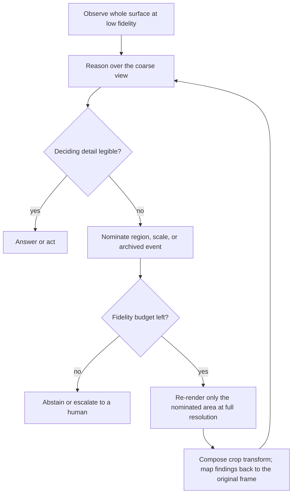

# Foveated Perception Escalation

**Also known as:** Global-to-Local Visual Allocation, Coarse-to-Fine Zoom, Budgeted Fidelity Restoration, Adaptive Resolution Perception

**Category:** Tool Use & Environment  
**Status in practice:** emerging

## Intent

Treat observation fidelity as a budget the agent allocates: perceive the whole surface coarsely, let the reasoning name the region that decides the answer, then re-observe only that region at full resolution.

## Context

An agent works from rendered surfaces — a scanned page, a dense screenshot, a history of past screens. The cost of such an observation grows with pixel area, because a vision-language model turns image area into tokens, so a full-acuity rendering of every page or every archived frame either does not fit the active window or costs more than the task is worth. The usual response is a single fixed downscale applied uniformly before the model ever sees the image, and a rule that only the most recent few frames keep their pixels at all.

## Problem

A uniformly downscaled observation loses exactly the detail some questions depend on — a figure caption, a small toggle, the state of a control that was clicked twenty steps earlier — and it loses it silently. The model still answers, in the same fluent register it would use at full acuity, and nothing in the output marks resolution as the limiting factor, so the trace shows a confident wrong answer rather than a legibility failure. Raising the global resolution to cover the worst case pays the full price on every observation, and almost none of them needed it.

## Forces

- Vision token cost grows with pixel area, so full acuity over a whole page, screen or screenshot history is unaffordable at long horizons, while the area that decides the answer is usually a small fraction of the surface.
- A coarse observation yields a confident answer rather than an abstention, so an acuity failure leaves no signal at the point where it happens.
- Which region needs acuity is question-dependent and cannot be fixed in advance; only reasoning over the coarse view can name it.
- Every escalation is another observation round trip, so an agent that zooms at every step spends the latency the coarse pass was meant to save.
- Restoring fidelity to an archived observation competes with the newest one for the same budget, and recency is the cheap default that is often, but not always, the right allocation.
- A finding read off a crop is expressed in crop coordinates, so the escalation only pays off if the transform back to the original frame is kept and applied.

## Therefore

Therefore: observe the whole surface once at low fidelity, have the reasoning nominate the region or past event whose detail decides the answer, spend a capped fidelity budget only there, and map every finding back to the original coordinate frame before acting on it.

## Solution

Split perception into a cheap global pass and a small number of expensive local ones. The first pass renders the entire surface at low resolution, enough to see layout, structure and rough positions but not enough to read fine detail; optional coordinate anchors such as detected text boxes and interface elements make that coarse view good enough to point with. The reasoning then either answers, or declares the deciding detail illegible and nominates a target: a region and scale on the current screen, a page in a document, or an archived frame whose pixels should come back. A budget caps how many such escalations a task may spend, on the spatial axis and on the temporal one, and each new view has to be strictly finer than the one it came from so the loop narrows instead of drifting. The nominated area is re-rendered at full resolution, the composed crop transform is kept, and any coordinate the model returns is mapped back to the original frame before an action uses it. When the budget runs out and the detail is still not legible, the loop abstains or escalates rather than answering from the coarse view.

## Structure

```
Coarse whole-surface observation -> reasoning nominates region, scale or archived event -> budget check (at most B escalations) -> high-fidelity re-render of the nominated area only -> finding mapped back through the composed crop transform -> answer, act, or nominate again.
```

## Diagram



*A cheap global pass locates the deciding region; a capped number of expensive local passes read it, and every finding is mapped back to the original coordinate frame.*

## Example scenario

An assistant is asked which lab value in a 60-page scanned report is marked abnormal. Rendering every page at full resolution would not fit its window, so it reads all the pages at low resolution and finds the one table that carries flags. It then re-renders just that table at full resolution, reads the flagged row, and reports the value together with the page it came from.

## Consequences

**Benefits**

- The expensive rendering is paid only for the area the question depends on: coarse-to-fine cropping raised interface grounding accuracy by up to 24.9 percentage points, and a document agent that treats resolution as a reasoning-time resource gained 4.3 to 16.4 accuracy points while cutting inference latency by 41 to 68 percent.
- The loop gains an explicit way to say that a detail is not legible at this scale, which turns a silent acuity failure into a further observation; the same document agent reduced hallucination on long documents by more than 40 percent.
- Applying the budget along the time axis lets an older observation outbid a recent one: restoring archived screenshots by predicted utility beat spending the whole visual budget on recency, 36.8 percent against 30.2 percent across 117 mobile tasks.
- Fidelity becomes an accountable line item, so observation cost per solved task can be measured and capped instead of being fixed at authoring time.

**Liabilities**

- The nomination step can name the wrong region, and a confident answer read off a sharp crop of the wrong area is harder to catch than an obviously blurry one.
- Each escalation costs a round trip, and on short horizons the selector does not earn it: under a 15-step limit, utility-scored fidelity restoration and plain recency were statistically indistinguishable.
- The gain concentrates where the answer really depends on a distant region or event; on single-application control tasks the same machinery showed no detectable difference, 43.6 percent against 42.4 percent.
- Coordinates from a crop must be mapped back through the composed transform, and an off-by-scale mapping produces a click that lands near the target but not on it.
- Teaching an agent to zoom well is its own cost: the document agent needed 17.9K supervised zoom trajectories plus 19.2K reinforcement examples before the behaviour was reliable.

## Failure modes

- The coarse view is answered directly and confidently and no escalation is ever requested, so the acuity limit never appears anywhere in the trace.
- The agent zooms at every step regardless of need, spends the whole escalation budget on early screens, and reaches the deciding region with nothing left.
- The high-fidelity crop is read correctly but its coordinates are mapped back at the wrong scale or offset, so the action misses the control it identified.
- The fidelity budget is spent entirely on the newest observations, and the one archived screenshot carrying the needed state is never restored.
- Escalation oscillates between two adjacent regions without narrowing, because nothing requires each new view to be strictly finer than the last.
- The nominated region is enlarged past the resolution of the stored original, so the crop is upsampled noise and the model reads detail that is not there.

## What this pattern constrains

The agent must not render the whole surface at full fidelity: a high-resolution observation is permitted only for a region the reasoning nominated from a coarse view, at most a fixed budget of such escalations per task, each view strictly finer than the one before it, and a finding taken from a crop cannot be acted on before its coordinates are mapped back to the original frame.

## Applicability

**Use when**

- The observation is a rendered surface whose token cost scales with area, such as a document page, a dense screenshot, or a history of past screenshots.
- The detail that decides the answer occupies a small fraction of the surface, and which fraction depends on the question.
- A coarse view is enough to locate the region even when it is not enough to read it.
- The surface can be re-rendered on demand at a chosen scale, and the crop transform can be inverted to recover original coordinates.
- The task runs long enough that observation cost, not reasoning cost, is what limits the horizon.

**Do not use when**

- The whole surface fits the budget at full acuity, so a second look only adds round trips.
- The answer depends on the surface as a whole, such as an overall layout or style judgement, and no single region can be nominated.
- The source cannot be re-observed because the image arrived once at a fixed resolution and no higher-fidelity original is stored.
- The latency budget leaves no room for a second observation round trip before the action must be taken.
- Interface state is available as structured accessibility data, which gives exact targets without any pixel budget at all.

## Components

- Coarse observer — renders the whole surface at low fidelity so the reasoning can see all of it cheaply
- Region nominator — reads the coarse view and names the region, scale or archived event whose detail decides the answer
- Fidelity budget — caps how many high-resolution re-observations a task may spend, on the spatial axis and the temporal one
- High-fidelity renderer — re-observes only the nominated area at full resolution instead of the whole surface
- Coordinate mapper — keeps the composed crop transform and translates a finding back to the original frame before any action uses it
- Escalation controller — stops the loop when the budget is spent, when views stop narrowing, or when the detail becomes legible
- Archived observation store — holds full-resolution past frames so a selected event can regain its pixels within budget

## Tools

- Variable-resolution vision-language model — accepts an image at a caller-chosen scale, so fidelity becomes a cost the loop can trade
- Image crop and resample library — produces the nominated sub-view and records the transform needed to invert it
- Optical character recognition and interface element detector — supplies coordinate anchors that make a coarse view good enough to nominate from
- Screenshot archive with per-frame retention policy — stores originals at full resolution so restoration is possible at all
- Trajectory evaluation harness — replays tasks at different budgets to find where escalation stops paying for itself

## Evaluation metrics

- Vision tokens per solved task — whether the budget actually fell against uniform full-resolution observation
- Escalations per task — how often the loop pays for a second look, and whether it terminates within the cap
- Nomination precision — share of escalations that landed on a region actually containing the answer
- Coordinate mapping error — pixel distance between the mapped-back point and the true target in the original frame
- Accuracy at the deciding detail against a fixed-downscale baseline, split by whether the task needed acuity at all
- Silent acuity failure rate — confident answers produced from a coarse view that the full-resolution view contradicts
- Restoration hit rate — share of restored archived frames that the answer actually depended on

## Known uses

- **[InSight-doc](https://github.com/m-Just/InSight-doc)** _pure-future_ — Document agent that treats visual resolution as an adaptive reasoning-time resource, starting at low resolution and zooming selectively into high-resolution regions with no external retriever; reported 4.3 to 16.4 accuracy points over document question-answering benchmarks, more than 40 percent less hallucination on long documents, and 41 to 68 percent lower inference latency.
- **[GUI-Lens](https://arxiv.org/abs/2608.03270)** _pure-future_ — Coarse-to-fine grounding loop in which a general-purpose vision-language model picks the region and scale of the next view, the crop is enlarged for finer detail, proposed crops and clicks are checked against the instruction, and the final local position is mapped back to the original screen coordinates; up to 24.9 percentage points of grounding accuracy.
- **[CausalCache](https://arxiv.org/abs/2608.22577)** _pure-future_ — Applies the same budget to the time axis for long-horizon interface agents: every past event stays summarized as text while a fixed budget decides which events regain their archived screenshots, scored by predicted utility rather than by recency.
- **[Mobile-Agent / GUI-Owl](https://github.com/X-PLUG/MobileAgent)** _available_ — Detects interface elements on the screenshot and crops and enlarges the detected regions before they are described, which is the spatial half of the loop in a shipping open-source agent stack.
- **[OpenAI vision image detail parameter](https://platform.openai.com/docs/guides/images-vision)** _available_ — Exposes fidelity as a caller-chosen cost, with a low-detail mode that spends a fixed small token count per image and a high-detail mode that tiles the image into crops; the escalation policy itself is left to the calling agent.

## Related patterns

- _complements_ **Dual-System GUI Agent** — That splits planning from grounding across two models; this iterates observation scale inside whichever component perceives, and fits on either side of that split.
- _complements_ **Policy-Localizer-Validator** — The Localizer is the natural place for the escalation loop to run, and the Validator is the natural place to check that a proposed crop still matches the instruction.
- _complements_ **Adaptive Compute Allocation** — That allocates inference-time thinking budget per query; this allocates input-side observation fidelity, so the two budgets are spent on different axes and can be tuned separately.
- _complements_ **Hierarchical Retrieval** — There a coarse index narrows to candidates across a corpus; here a single observation is already in hand and the descent is a re-observation of the same surface at a finer scale, with no index and no retrieval step.
- _complements_ **Tool-Result Eviction** — Eviction prunes consumed observations to reclaim context; foveation decides fidelity before and during perception, and lets an archived observation regain its pixels rather than only lose them.
- _complements_ **Modality-Conflict Arbitration** — When channels disagree about a claim, re-observing the disputed region at higher fidelity is one way to settle it without falling back on an implicit modality preference.
- _used-by_ **Computer Use** — Screen control is where the cost of full-acuity observation bites hardest, because every step produces another dense screenshot.
- _used-by_ **Mobile UI Agent** — Small screens with dense controls are the case where a coarse view locates a target that it cannot resolve precisely enough to touch.

## References

- [InSight-doc: Agentic Visual Perception for Long-Document Understanding](https://arxiv.org/abs/2608.10628) — Kaican Li, Weiyan Xie, Lewei Yao, Jiannan Wu, Lanqing Hong, Yongxiang Huang, Nevin L. Zhang, 2026
- [GUI-Lens: Coarse-to-Fine Cropping for GUI Grounding with General-Purpose VLMs](https://arxiv.org/abs/2608.03270) — Zichuan Fu, Shirong Wang, Wenlin Zhang, Guojing Li, Yimin Deng, Jingtong Gao, Xiangyu Zhao, 2026
- [CausalCache: Conditional High-Fidelity Restoration for Long-Horizon GUI Agents](https://arxiv.org/abs/2608.22577) — Jiaxuan Luo, Zhanfeng Liao, Jiayao Teng, Yuan Wang, 2026
- [Efficient GUI Agents: A Systems Survey of Observation, Memory, Action, and Runtime Optimization](https://arxiv.org/abs/2609.02309) — Bizhe Bai, Jiakang Yuan, Hongming Wu, Xinyue Wang, Jie Ren, Tao Chen, 2026
- [V*: Guided Visual Search as a Core Mechanism in Multimodal LLMs](https://arxiv.org/abs/2312.14135) — Penghao Wu, Saining Xie, 2023
- [Qwen2-VL: Enhancing Vision-Language Model's Perception of the World at Any Resolution](https://arxiv.org/abs/2409.12191) — Peng Wang, Shuai Bai, Sinan Tan, Shijie Wang, 2024
- [OpenAI Platform: Images and vision](https://platform.openai.com/docs/guides/images-vision)
