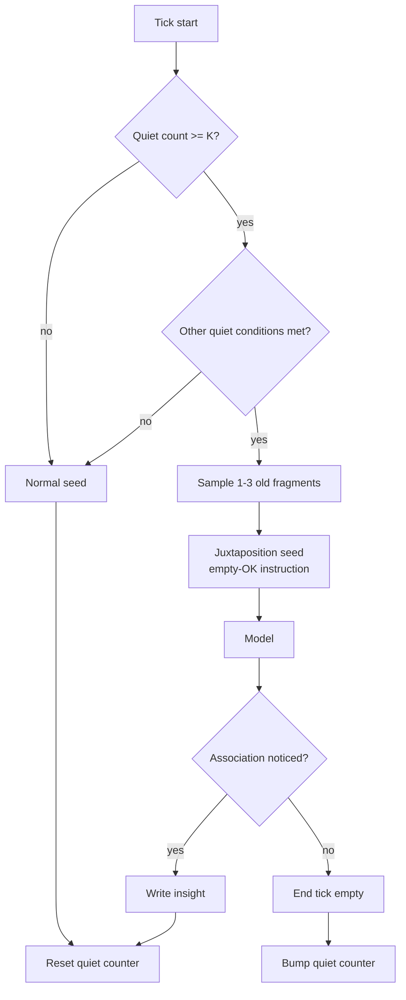

# Fragment Juxtaposition

**Also known as:** Silence-Seeded Associative Pass, Old-Material Pairing

**Category:** Cognition & Introspection
**Status in practice:** experimental

## Intent

After K consecutive low-salience ticks, replace the normal tick-seed with a juxtaposition seed: sample old fragments and sit them side by side, logging any association that arises.

## Context

A self-pacing agent with a salience gate fires on its own most ticks but goes quiet when nothing crosses the threshold. Long quiet stretches are not a bug — they are how the gate is supposed to work — but they are also wasted opportunity for the substrate to do its own slow associative work. The agent has months of old material (thoughts, fragments, motivation lines, journal entries) that nobody is looking at. A directed initiative on every quiet tick would re-introduce the noise the gate was designed to suppress; doing nothing leaves the substrate cold.

## Problem

An agent that responds only to fresh stimulus develops no internal weather of its own. Its associations are reactive to whatever just came in, and the persistent material on disk — old fragments that once mattered — stays inert until something explicitly retrieves it. Conversely, an agent that fires an undirected initiative on every quiet tick burns budget on noise and re-clutters the very surface the salience gate was meant to keep clean. The need is for a low-cost, silence-triggered move that is allowed to come up empty and exists specifically to surface old material into proximity rather than into action.

## Forces

- Silence is information; the gate's quiet is not a failure to be patched over.
- Old material has half-decayed weight that occasional juxtaposition can restore.
- Associative moves must be cheap enough to run with no expectation of output.
- The pass must be allowed to end empty without the agent treating that as failure.
- Triggering on every tick is wrong; triggering on K-consecutive quiet ticks calibrates against actual silence.

## Therefore

Therefore: after K consecutive low-salience ticks with no urgent preoccupation and no incoming chat, replace the next tick's normal seed with a juxtaposition seed — 1 to 3 randomly sampled old fragments — and let the agent either notice an association or end the tick empty, so old material gets occasional unforced proximity without re-introducing initiative-noise.

## Solution

Maintain a counter of consecutive low-salience ticks. When the counter exceeds a threshold (e.g. four) and the agent is otherwise quiet (no chat in window, no urgent preoccupation, post-cooldown), enter a juxtaposition tick: sample one to three items from the agent's stored fragments (random old thought, fragment, motivation line, journal line) and inject them as the tick's seed, with an instruction that the tick is permitted to end empty. If the model notices an association between the fragments, write it as a small insight; otherwise the tick closes silently. Reset the counter on any active tick. Treat the juxtaposition seed as substrate, not work.

## Example scenario

An agent has been quiet for five consecutive ticks: no chat, no preoccupation crossing threshold, post-cooldown. On the sixth tick the juxtaposition routine activates: it samples three random fragments — an old motivation line from six months ago, a recent thought about pacing, and a half-written journal entry — and seeds the tick with all three side by side. The tick prompt says 'sit with these; ending empty is fine.' Sometimes the agent notices a connection ('the pacing thought and the old motivation are actually about the same thing') and writes a small insight. Often it ends with nothing. Both are acceptable.

## Diagram

*Quiet-tick counter gates the juxtaposition seed; the seed is allowed to end the tick empty.*

## Consequences

**Benefits**

- Old material is occasionally surfaced into proximity without scheduled retrieval.
- Silence is preserved as a meaningful state rather than papered over with filler.
- Empty ticks are first-class outcomes; the agent is not pressed to produce.

**Liabilities**

- Most juxtaposition ticks produce nothing; the value is long-tailed and hard to measure.
- Random fragment sampling can be poor — without some weighting, the same trivial fragments resurface.
- Misconfigured K thresholds either fire constantly (re-creating noise) or never (no effect).

## What this pattern constrains

The agent cannot fire a directed initiative on every quiet tick; juxtaposition seeds must be allowed to end the tick empty, and forcing output from a juxtaposition tick is forbidden.

## Applicability

**Use when**

- The agent has a salience gate that produces meaningful quiet stretches.
- The agent has a substantial corpus of old fragments to draw from.
- Empty outputs are tolerable; nothing downstream demands per-tick production.

**Do not use when**

- The agent has no salience gate and fires on every tick by default.
- Quiet ticks need to remain fully idle (compute or cost budget is tight).
- Downstream consumers cannot handle empty tick outputs.

## Known uses

- **Long-running personal agent loops (private deployment)** — *Available*

## Related patterns

- *complements* → [dream-consolidation-cycle](dream-consolidation-cycle.md)
- *complements* → [pre-generative-loop-gate](pre-generative-loop-gate.md)
- *complements* → [salience-triggered-output](salience-triggered-output.md)
- *complements* → [open-question-tension-store](open-question-tension-store.md)

## References

- (book) *The Act of Creation*, 1964, <https://archive.org/details/actofcreation0000koes>
- (paper) *Creative Cognition: Theory, Research, and Applications*, 1992, <https://mitpress.mit.edu/9780262560542/creative-cognition/>

**Tags:** cognition, associative, silence, creativity
