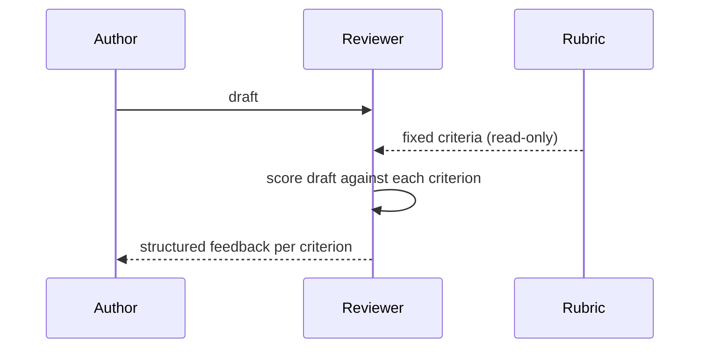

# Frozen Rubric Reflection

**Also known as:** Scoped Self-Review, Closed-Set Critic

**Category:** Verification & Reflection  
**Status in practice:** emerging

## Intent

Constrain reflection to a fixed, hand-authored rubric of criteria so the reviewer cannot invent new ones each run.

## Context

A team uses a model to review the output of another model (or its own previous draft) as a quality gate before shipping. The review needs to be consistent across runs and across users so that two outputs from the same kind of task get judged against the same criteria. Auditors or downstream consumers want to know which checks were performed on each output.

## Problem

When the reviewer is given a free-form instruction like 'review this output and flag any issues', it invents fresh criteria on every call: today it notices tone, tomorrow it notices grammar, the day after it notices factual claims. Reviews stop being comparable across runs because they were not measuring the same thing. The reviewer also tends to drift over time, gradually narrowing its attention onto whatever issue it last saw and forgetting categories it used to check. The team has no stable answer to the question 'what did the reviewer actually look for on this run?', which makes the reviewer useless for audit and unreliable as a gate.

## Forces

- Authoring a good rubric is non-trivial up-front work.
- Rubric drift over time is a separate problem from per-call drift.
- Some defects fall outside the rubric and go unflagged.

## Therefore

Therefore: hand the reviewer a fixed rubric and a schema that rejects out-of-rubric findings, so that the critique surface stays stable instead of drifting on every run.

## Solution

A fixed rubric file (or schema) lists exactly the categories the reviewer may flag. The reviewer prompt includes the rubric and a JSON Schema enforcing it. Temperature is zero. Output validates against the schema; new finding categories are rejected.

## Applicability

**Use when**

- Review criteria should be stable across runs so verdicts compare.
- Auditors need an explicit list of categories the model checked.
- Reflection drift across calls is producing inconsistent reviews.

**Do not use when**

- Defects of interest do not fit any predefined rubric category.
- The domain shifts faster than the rubric can be re-authored.
- Exploratory critique is the goal; a rubric narrows it too much.

## Example scenario

A code-review agent reviews every pull request against a fixed checklist: tests added? naming consistent? error handling? security risk? Without the fixed list, the reviewer would invent new criteria each call and reviews would not be comparable across PRs. Reviewers can only score against the listed criteria — they cannot make new ones up mid-review.

## Diagram

## Consequences

**Benefits**

- Consistent reviews across runs and users.
- Rubric is the single load-bearing artefact; iteration is in one place.

**Liabilities**

- Hard ceiling on what the reviewer can catch.
- Rubric authorship is its own engineering discipline.

## What this pattern constrains

The reviewer cannot output finding categories outside the rubric; the JSON schema rejects them.

## Known uses

- **Knitting-DSL Pipeline (Stash2Go)** — *Available*. Six-item rubric in scopedLlmReviewer.js: duplicate NOTEs, finishing order, construction voice, prose omissions, prose inventions, pattern name sanity.

## Related patterns

- *specialises* → [reflection](reflection.md)
- *uses* → [structured-output](structured-output.md)
- *composes-with* → [deterministic-llm-sandwich](deterministic-llm-sandwich.md)
- *complements* → [dream-consolidation-cycle](dream-consolidation-cycle.md)

## References

- (blog) *Marco Nissen, Working with the models*, 2026

**Tags:** reflection, rubric, structured-output
