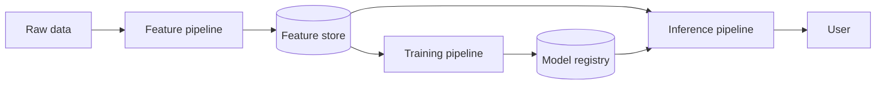

# FTI LLM Pipeline Split

**Also known as:** Feature-Training-Inference Split, FTI Architecture for LLMs

**Category:** Structure & Data  
**Status in practice:** mature

## Intent

Decompose an LLM/RAG system into three independently-deployable pipelines — feature, training, inference — communicating only via a feature store and a model registry.

## Context

An LLM application team owns data ingestion (cleaning raw documents into RAG features), model adaptation (SFT / DPO over the resulting datasets), and serving (retrieval + generation). Each axis has different cadence, hardware, and team ownership. Bundling them into one repository and deploy cycle couples otherwise independent work.

## Problem

A monolithic LLM application makes every change touch every team. Re-embedding the corpus requires a deploy that the inference path inherits. Bumping the SFT recipe forces retraining tied to the inference release cycle. Serving SLOs are held hostage by data-pipeline failures. Without a clean decomposition along the F/T/I axes, teams step on each other and the system drifts toward incoherent versioning.

## Forces

- Feature, training, and inference have different cadences (continuous, periodic, on-request).
- Different teams (data, ML, platform) want to own different axes.
- Feature store and model registry are the natural integration points.
- Decomposition adds two integration surfaces that must be operated.

## Applicability

**Use when**

- Feature, training, and inference have materially different cadences and ownership.
- MLOps tooling (feature store, model registry) is available or worth standing up.
- Independence of deploys is a real value to the organisation.

**Do not use when**

- System is small enough that one repository and one deploy cycle is fine.
- Team cannot operate the two integration surfaces.
- Latency-critical use cases that the registry round-trip would block.

## Therefore

Therefore: decompose into three pipelines communicating only via a feature store and a model registry, so each pipeline iterates on its own cadence with its own ownership and no direct code coupling.

## Solution

Define three pipelines. Feature pipeline: ingests raw documents, cleans, chunks, embeds, writes to the feature store (typically a vector DB plus a document store). Training pipeline: reads features from the store, fine-tunes (SFT, DPO), writes models to the model registry. Inference pipeline: reads from the feature store at request time, loads the model from the registry, generates. Communication is only via the two integration surfaces — no direct code or service calls cross pipelines. Each pipeline deploys on its own cadence.

## Example scenario

A RAG-and-fine-tuned-model product splits into three pipelines. The data team owns the feature pipeline that ingests Confluence and Salesforce, embeds, and writes to Pinecone. The ML team owns the training pipeline that periodically pulls eval-curated feature subsets and produces DPO-tuned models registered in MLflow. The platform team owns the inference service that reads Pinecone at request time and loads the current registered model. Each team deploys without coordination.

## Diagram

## Consequences

**Benefits**

- Teams iterate independently; deploys decouple.
- Feature store and model registry are clean abstractions for version tracking.
- Standard MLOps tooling (feature stores, model registries) applies directly.

**Liabilities**

- Two integration surfaces to operate and version.
- Schema changes across the feature store ripple through downstream pipelines.
- Decomposition overhead is not worth it for very small or one-off systems.

## What this pattern constrains

An LLM/RAG system must not couple feature ingestion, model adaptation, and serving in one deploy unit; the three pipelines communicate only through a feature store and a model registry.

## Known uses

- **LLM Engineer's Handbook (Iusztin, Labonne) — FTI architecture chapter** — *Available* — <https://www.packtpub.com/en-us/product/llm-engineers-handbook-9781836200079>
- **Hopsworks feature-store + model-registry deployments** — *Available*
- **Most large-scale RAG/LLM platforms (internal at major vendors)** — *Available*

## Related patterns

- *composes-with* → [business-llm-microservice-split](business-llm-microservice-split.md)
- *composes-with* → [cdc-vector-sync](cdc-vector-sync.md)
- *composes-with* → [streaming-feature-pipeline](streaming-feature-pipeline.md)
- *complements* → [naive-rag](naive-rag.md)
- *uses* → [vector-memory](vector-memory.md)
- *complements* → [augmented-llm](augmented-llm.md)
- *composes-with* → [crawler-dispatcher](crawler-dispatcher.md)

## References

- (book) *LLM Engineer's Handbook*, Paul Iusztin, Maxime Labonne, 2024, <https://www.packtpub.com/en-us/product/llm-engineers-handbook-9781836200079>
- (blog) *Simplifying AI pipelines using the FTI Architecture*, <https://www.packtpub.com/en-us/learning/author-posts/simplifying-ai-pipelines-using-the-fti-architecture>

**Tags:** architecture, mlops, data-pipeline
