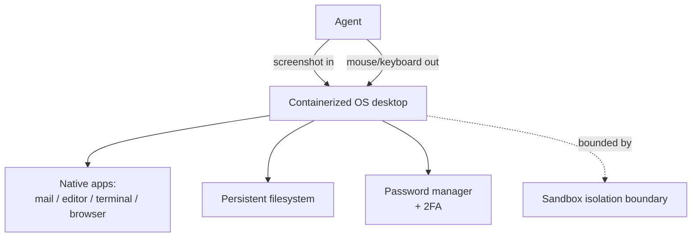

# Full-Desktop Computer Use

**Category:** Tool Use & Environment  
**Status in practice:** emerging

## Intent

Give the agent a complete containerized OS desktop with native apps, a persistent filesystem, and desktop credential stores, so it can finish multi-application workflows a browser-only surface cannot.

## Context

A team needs an agent to complete real end-user workflows that cross several native applications: download an invoice in a mail client, edit it in a spreadsheet app, sign into a vendor portal through a password manager, then file the result in a local folder. The applications have no shared API, some live only on the desktop, and steps depend on files and logins that must survive from one step to the next.

## Problem

A browser-only agent reaches web pages but cannot drive native desktop applications, install tools it needs mid-task, or hold a working filesystem across steps. A single-app or pixel-only Computer Use surface drives one screen at a time but provides no durable storage and no credential store, so logins, downloaded artifacts, and installed tooling evaporate between turns. Workflows that span a mail client, an editor, a terminal, and an authenticated portal stall because no single narrow surface covers all of them and nothing carries state across the application boundaries.

## Forces

- Full-OS scope covers native apps a browser surface cannot reach.
- A persistent filesystem and installed tooling must survive across steps.
- Desktop credential stores enable logins and 2FA but widen the blast radius.
- A whole OS is heavier and slower to provision than a single browser tab.

## Applicability

**Use when**

- The task spans several native desktop applications with no shared API.
- State (downloads, installed tools, logins) must persist across steps or sessions.
- The agent needs authenticated access through a desktop password manager, including 2FA.

**Do not use when**

- The whole task lives in the browser and a Browser Agent surface suffices.
- A clean API covers the workflow and is cheaper and more reliable than driving a desktop.
- The deployment cannot afford the provisioning cost or the blast radius of a persistent credentialed OS.

## Therefore

Therefore: run the agent inside a containerized OS desktop with native applications, a persistent filesystem, and a configured password manager, so that it completes multi-application workflows end-to-end while staying inside an isolation boundary.

## Solution

Provision a containerized desktop OS (for example Ubuntu with a lightweight window manager) preloaded with a browser, mail client, editor, and terminal. The agent observes the screen and emits mouse and keyboard actions over the whole desktop, not one app. A mounted persistent filesystem retains downloads, installed packages, and intermediate artifacts across steps. A desktop password manager extension supplies credentials and handles two-factor prompts. The entire desktop is the sandbox: the agent has full scope inside it and none outside it.

## Example scenario

An operations agent must pull a PDF invoice from a mail client, reconcile it in a desktop spreadsheet, log into a supplier portal that requires two-factor authentication, and save a receipt locally. A browser-only agent cannot open the mail client or the spreadsheet app and loses the downloaded file between steps. Placed on a full containerized desktop with a persistent home directory and a configured password manager, the agent opens each native app in turn, keeps the invoice on disk across steps, and clears the 2FA prompt from the password manager extension.

## Diagram

## Consequences

**Benefits**

- Completes workflows that span native desktop applications, not just web pages.
- Persistent filesystem and installed tooling carry state across steps and sessions.
- Desktop credential stores let the agent clear logins and 2FA without hardcoded secrets.

**Liabilities**

- A whole OS is slower and costlier to provision and snapshot than a single browser tab.
- Stored credentials and a persistent disk widen the blast radius if the agent is compromised or prompt-injected.
- Maintaining a desktop image (apps, drivers, window manager) is ongoing engineering.

## What this pattern constrains

The agent must operate inside the containerized desktop boundary only; it cannot reach the host OS or any resource outside the provisioned image.

## Known uses

- **[Bytebot](https://github.com/bytebot-ai/bytebot)** — *Available* — Self-hosted agent running a containerized Ubuntu desktop (XFCE) with Firefox, an editor, and a mail client; persistent filesystem, and password-manager extensions for logins and 2FA.
- **[Anthropic Computer Use reference desktop image](https://www.anthropic.com/news/3-5-models-and-computer-use)** — *Available* — Ships a containerized desktop (browser plus utilities) the model drives end-to-end, used as the canonical full-desktop reference environment.

## Related patterns

- *specialises* → [computer-use](computer-use.md)
- *uses* → [sandbox-isolation](sandbox-isolation.md)
- *alternative-to* → [browser-agent](browser-agent.md)

## References

- (repo) *bytebot-ai/bytebot*, <https://github.com/bytebot-ai/bytebot>
- (doc) *Bytebot Documentation*, <https://docs.bytebot.ai>
- (blog) *Introducing computer use, a new Claude 3.5 Sonnet, and Claude 3.5 Haiku* (Anthropic, 2024), <https://www.anthropic.com/news/3-5-models-and-computer-use>

**Tags:** environment, desktop, gui
