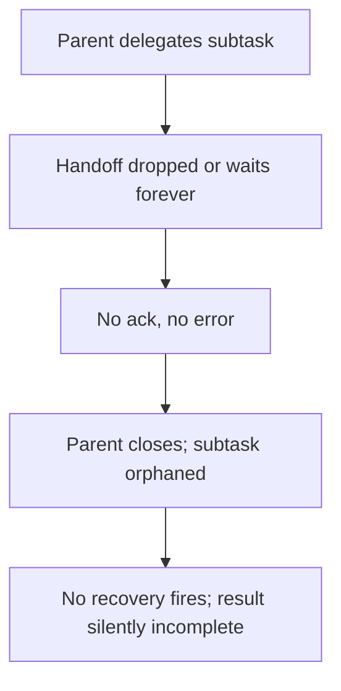

# Ghost Delegation

**Also known as:** Lost Handoff, Orphaned-Subtask Delegation

**Category:** Anti-Patterns  
**Status in practice:** emerging

## Intent

Anti-pattern: in a multi-agent hierarchy a task handoff silently vanishes — the delegated work waits forever and the parent closes while its subtask is orphaned, and because no error fires nothing restarts it.

## Context

A multi-agent system decomposes work hierarchically: a parent or orchestrator agent delegates subtasks to other agents and waits for their results to assemble a final answer. Delegation happens through messages, queues, or tool calls between agents. The parent expects each delegated subtask to come back, and composes its result once the children report in.

## Problem

Sometimes a handoff just disappears: the delegated subtask is never picked up, or it enters a wait that never resolves, while the parent — having no signal that anything went wrong — eventually closes or moves on, leaving the subtask orphaned. Because nothing raised an error, no retry, timeout, or recovery path triggers; the work is simply gone, and the final result is silently incomplete. In production multi-agent systems this lost-handoff failure is a large share of observed breakdowns, and it is hard to spot precisely because there is no error to find.

## Forces

- Delegation across agents is asynchronous, so a dropped or never-acknowledged handoff produces silence rather than an exception.
- A parent that composes results when children report cannot distinguish a slow child from one that will never return without an explicit timeout.
- No error means no automatic retry or recovery fires, so a lost subtask stays lost.
- Adding acknowledgements, timeouts, and orphan detection to every handoff is overhead a happy-path design skips.

## Therefore

Therefore: do not treat a delegated subtask as fire-and-forget; require acknowledgement of every handoff, put a timeout and explicit completion contract on each subtask, and detect orphaned or never-returning work so it is restarted or escalated instead of silently lost.

## Solution

Make every delegation accountable end to end. Require the receiving agent to acknowledge a handoff, so an unpicked-up subtask is detectable rather than silent, and put a timeout and an explicit completion contract on each delegated subtask so a never-resolving wait surfaces as a failure the system can act on. Track outstanding subtasks against their parent so the parent cannot close while a child is still owed, and detect orphaned work to retry or escalate it. Treat a missing result as an error condition, not as nothing — the absence of a report is itself the signal. The control is acknowledgement plus timeouts plus orphan detection, so a lost handoff becomes a recoverable event rather than a silent gap.

## Structure

```
Parent delegates subtask -> handoff dropped or waits forever (no ack, no error) -> parent closes, subtask orphaned -> no recovery fires -> result silently incomplete (BROKEN) ; Corrected: ack + timeout + completion contract + orphan detection -> retry/escalate
```

## Diagram



*A handoff vanishes with no acknowledgement or error, so the parent closes over an orphaned subtask and nothing triggers recovery.*

## Example scenario

An orchestrator agent delegates a data-fetch subtask to a worker and moves on to assemble the report. The worker never acknowledges the handoff — a queue hiccup dropped it — so it never runs, and nothing errors. The orchestrator, seeing no failure, finishes and returns a report missing that data. No log shows a problem; the only sign is the silently absent section, discovered later by a user.

## Consequences

**Liabilities**

- Final results are silently incomplete because a delegated subtask vanished with no error to flag it.
- Orphaned subtasks consume resources or hang indefinitely while the parent reports done.
- Debugging is hard: there is no exception, log line, or failure to trace back to the lost handoff.
- The failure scales with hierarchy depth, since every delegation boundary is another place a handoff can disappear.

## Failure modes

- Lost handoff — a delegated subtask is never acknowledged or picked up and simply disappears.
- Infinite wait — the subtask enters a state that never resolves, with no timeout to end it.
- Orphaned subtask — the parent closes while a child it delegated is still outstanding.
- No recovery trigger — because nothing errored, no retry or escalation path ever fires.

## What this pattern constrains

A delegated subtask must not be treated as fire-and-forget; every handoff is acknowledged, each subtask carries a timeout and completion contract, and a parent cannot close while a delegated child is still outstanding — a missing result is handled as a failure rather than ignored.

## Applicability

**Use when**

- Recognising this failure when a multi-agent system returns silently incomplete results with no error to trace.
- Reviewing a delegation design where handoffs are fire-and-forget with no acknowledgement or timeout.
- Diagnosing orphaned subtasks or parents that close while children are still outstanding.

**Do not use when**

- Every handoff is acknowledged, each subtask has a timeout and completion contract, and orphaned work is detected and recovered.
- There is no inter-agent delegation, so no handoff can be lost.
- Delegation is synchronous and a dropped subtask raises an immediate error.

## Components

- Parent or orchestrator agent — delegates subtasks and composes their results
- Delegated subtask — the unit of work handed to a child agent that can silently vanish
- Handoff channel — the message, queue, or call across which delegation can be dropped
- Missing acknowledgement and timeout — the absent contract that would make a lost handoff detectable
- Missing orphan detection — the absent tracking that would catch a never-returning subtask

## Tools

- Multi-agent orchestrator — runs the delegation this anti-pattern leaves unacknowledged
- Handoff acknowledgement and timeout — the corrective contract on each delegated subtask
- Outstanding-task tracker — the corrective that detects orphaned work for retry or escalation

## Evaluation metrics

- Lost-handoff rate — fraction of delegated subtasks that never returned and were not detected
- Silent-incompletion rate — share of final results missing a subtask with no error raised
- Orphan-detection latency — time from a dropped handoff to it being caught
- Recovery coverage — fraction of lost subtasks retried or escalated rather than abandoned

## Known uses

- **[Multi-agent orchestration post-mortem (Ghost Delegation)](https://shalomeir.substack.com/p/multi-agent-orchestration-problems)** _available_ — Production write-up attributing a large share of failures to delegation that should have happened entering infinite wait, with handoffs vanishing mid-process and subtasks left orphaned.
- **[CrewAI delegation ping-pong](https://azguards.com/technical/the-delegation-ping-pong-breaking-infinite-handoff-loops-in-crewai-hierarchical-topologies/)** _available_ — Hierarchical CrewAI topologies hit infinite handoff loops that saturate the context window and crash, a related lost-control-of-delegation failure.
- **[MAST multi-agent failure taxonomy](https://arxiv.org/abs/2503.13657)** _available_ — Empirical taxonomy whose premature-termination, information-withholding, and task-derailment modes formalise a handoff ending before objectives are met, clustered under inter-agent misalignment.

## Related patterns

- _complements_ **Phantom Action Completion** — Phantom completion narrates a task as done that never ran; ghost delegation makes no claim — a handoff just vanishes, leaving an orphaned subtask and no error.
- _complements_ **Cascading Agent Failures** — Cascading failures propagate an error across agents; ghost delegation fires no error at all, the handoff disappears so nothing triggers recovery.
- _complements_ **Multi-Agent on Sequential Workloads** — Sequential degradation loses accuracy splitting a sequential task; ghost delegation loses the subtask entirely when a handoff is dropped.
- _complements_ **Composable Termination Conditions** — An explicit timeout and completion contract on each delegated subtask is part of the corrective; ghost delegation is what happens when a subtask can wait forever with no stop condition.

## References

- [Why Multi-Agent Orchestration Goes Wrong](https://shalomeir.substack.com/p/multi-agent-orchestration-problems) — 2026
- [The Delegation Ping-Pong: Breaking Infinite Handoff Loops in CrewAI Hierarchical Topologies](https://azguards.com/technical/the-delegation-ping-pong-breaking-infinite-handoff-loops-in-crewai-hierarchical-topologies/) — 2026
- [Why Do Multi-Agent LLM Systems Fail?](https://arxiv.org/abs/2503.13657) — 2025
