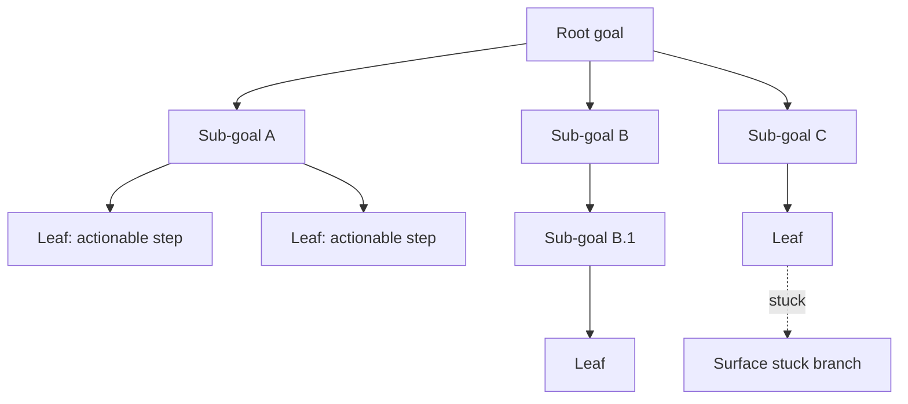

# Goal Decomposition

**Also known as:** Hierarchical Task Network, Goal Setting & Monitoring, Task Tree

**Category:** Planning & Control Flow  
**Status in practice:** mature

## Intent

Decompose a goal into sub-goals recursively until each leaf is directly actionable.

## Context

Long-horizon tasks where the top-level goal cannot be acted on directly; intermediate scaffolding is needed.

## Problem

Without explicit decomposition, the agent attacks the goal in one shot and produces shallow work.

## Forces

- Decomposition depth: too shallow loses scaffolding; too deep loses the forest.
- Sub-goal independence affects parallelisation.
- Goal-monitoring at each level adds overhead.

## Therefore

Therefore: recursively split the goal into sub-goals until every leaf is directly actionable and monitor progress at each level, so that long-horizon work becomes tractable and stuck branches surface instead of vanishing into a summary.

## Solution

Build a tree of goals. The root is the user's goal. Each non-leaf goal decomposes into sub-goals. Leaves are directly actionable steps. Monitor progress at each level; surface stuck branches. Distinct from least-to-most (which is sequential) by allowing parallel sibling goals.

## Example scenario

A team building a procurement assistant gives it a single brief: 'renew our cloud contracts before Q4'. Asked in one shot, the agent produces a three-paragraph summary and stalls. They wrap the agent in a goal-decomposition tree: the root splits into inventory-current-contracts, gather-renewal-quotes, and negotiate-and-sign, each of which decomposes again until each leaf is a concrete email or spreadsheet update. Progress now shows up at every level, and the negotiate branch surfaces as 'stuck' for two weeks instead of vanishing into the summary.

## Diagram

## Consequences

**Benefits**

- Long-horizon tasks become tractable.
- Progress is visible at multiple granularities.

**Liabilities**

- Tree construction is itself work.
- Stuck branches at deep levels are easy to lose.

## What this pattern constrains

Action is taken only at leaf goals; non-leaf goals must decompose further before action.

## Applicability

**Use when**

- Goals are large enough that a single-shot attempt produces shallow work.
- Sub-goals can be expressed in a tree where each leaf is directly actionable.
- Parallel sibling goals exist and you want to track stuck branches explicitly.

**Do not use when**

- Goals are atomic and decomposition would invent fake sub-structure.
- Strict sequential structure fits better (use least-to-most prompting instead).
- Tracking the tree adds more overhead than it saves in execution quality.

## Known uses

- **Classical AI Hierarchical Task Networks** — *Available*
- **Gulli ch.20 Goal Setting & Monitoring** — *Available*

## Related patterns

- *alternative-to* → [least-to-most](least-to-most.md)
- *complements* → [hierarchical-agents](hierarchical-agents.md)
- *specialises* → [plan-and-execute](plan-and-execute.md)

## References

- (book) *Agentic Design Patterns (Gulli, ch. 20 Prioritization)*, 2025

**Tags:** planning, decomposition, htn
