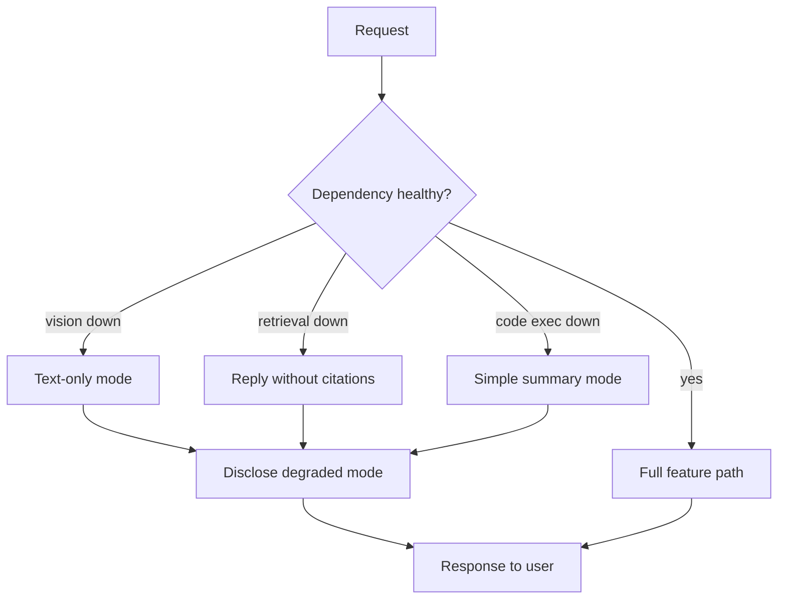

# Graceful Degradation

**Also known as:** Feature-Level Fallback, Degraded Mode

**Category:** Routing & Composition  
**Status in practice:** mature

## Intent

When a dependency fails, downgrade the user-facing experience to a working subset rather than failing entirely.

## Context

A user-facing agent product combines several optional capabilities — a retrieval-augmented-generation backend that produces citations, a vision model that reads screenshots, a sandbox that runs user code, a payment integration. Each of these dependencies can have its own bad day independently of the others. The product is more than the sum of any single capability and can produce something useful even when one piece is missing.

## Problem

If the product treats every dependency as load-bearing and fails the whole request when any one of them is down, an isolated vendor outage becomes a complete product outage from the user's point of view. If it silently drops the failing capability and ships whatever it can produce without disclosure, the user gets a worse answer than expected without knowing why and loses trust the next time it happens. Without a defined per-feature fallback, neither outcome is acceptable.

## Forces

- Degradation paths multiply test surface.
- User-visible degradation messaging is its own UX problem.
- Some failures must hard-fail (PII path, payment).

## Therefore

Therefore: define per-feature downgrades and disclose them to the user when triggered, so that a dependency outage reduces the experience instead of killing it.

## Solution

Define per-feature fallback behaviour. On dependency failure, downgrade (text-only when vision fails, no citations when retrieval fails, simple summary when code execution fails) and disclose to the user that degraded mode is active. Feature flags double as degradation switches.

## Example scenario

A multimodal customer-support bot relies on a vision model to read screenshots, a vector store for citations, and a code sandbox for repro. During an outage of the vision provider, every screenshot upload returns a 503 and the whole conversation errors out. The team adds graceful degradation: when vision fails the bot falls back to asking the user to describe the screenshot in words and tells them so plainly; when retrieval is down it answers from the model's own knowledge with a visible 'no sources today' badge. Outages now feel like reduced service rather than total failure.

## Diagram

## Consequences

**Benefits**

- Product resilience under partial outages.
- User trust via transparent degradation.

**Liabilities**

- Test matrix grows with feature count.
- Degraded modes can themselves have bugs.

## What this pattern constrains

On failure, the agent must produce a degraded response with disclosure rather than a generic error.

## Applicability

**Use when**

- A dependency outage would otherwise fail the user request entirely.
- Per-feature fallback behaviour can be defined (text when vision fails, no citations when retrieval fails).
- The user can be told that degraded mode is active without breaking trust.

**Do not use when**

- There is no meaningful subset of working features to degrade to.
- Silent degradation would mislead the user and explicit failure is more honest.
- Feature flags do not exist and per-feature fallback cannot be wired without a major refactor.

## Known uses

- **Perplexity (citations missing under retrieval issues)** — *Available*
- **ChatGPT (vision unavailable falls back to text)** — *Available*

## Related patterns

- *complements* → [fallback-chain](fallback-chain.md)
- *uses* → [circuit-breaker](circuit-breaker.md)
- *specialises* → [exception-recovery](exception-recovery.md)

## References

- (book) *Release It! (Michael Nygard, ch. 4)*, 2007

**Tags:** routing, resilience, degradation
