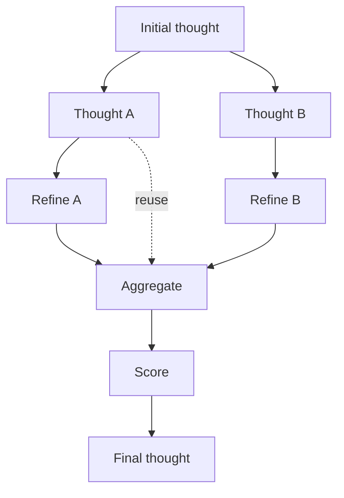

# Graph of Thoughts

**Also known as:** GoT, DAG Reasoning

**Category:** Reasoning  
**Status in practice:** experimental

## Intent

Model reasoning as an arbitrary DAG so thoughts can be merged, refined, and aggregated across branches.

## Context

A team is solving problems whose natural shape is not a chain or a tree but a graph in which partial results need to be combined: sorting where partial sorted runs have to be merged, set operations whose intermediate sets feed each other, or document-merge tasks where several draft sections converge into a single output. They have already tried plain chain-of-thought and tree-of-thoughts search and found that both shapes lose the dependency structure of the underlying problem.

## Problem

In a tree-shaped search, each branch is explored in isolation and the model cannot reuse what one sibling branch has already computed when working on another. When the answer further depends on combining several intermediate results, the tree has no operator to merge them, so the same sub-computation is repeated under different branches and the joint answer has to be reassembled awkwardly at the end. Without explicit operators for generating, aggregating, refining and scoring partial thoughts in a directed graph, the reasoning is more expensive than it needs to be and the structure of the problem is not preserved.

## Forces

- Richer reasoning topology vs orchestration complexity.
- Cross-branch reuse vs aggregation prompt cost.
- DAG expressiveness vs cycle-safety enforcement.

## Therefore

Therefore: represent reasoning as an arbitrary DAG of thoughts that can be generated, refined, aggregated, and scored, so that branches share work instead of recomputing the same intermediates.

## Solution

Reasoning state is a DAG of thoughts. Operations include generate (CoT-style), aggregate (merge multiple thoughts), refine (improve one thought), and score. The orchestrator chains operations to produce a final thought; the agent can reuse intermediate nodes across branches.

## Diagram

## Example scenario

A research agent comparing five drug candidates across efficacy, safety, and cost gets stuck in tree-of-thoughts because each branch evaluates one candidate in isolation and cannot reuse a sub-analysis across siblings. The team rebuilds the reasoning state as a DAG: each per-candidate efficacy node feeds into a shared aggregation node that ranks candidates jointly, and a refine operator can revisit any node when new evidence appears. Intermediate scoring is computed once and merged across branches, and the final ranking cites the aggregation node as its source.

## Consequences

**Benefits**

- Strict superset of CoT and ToT.
- Most useful when subproblems have non-tree dependencies.

**Liabilities**

- Orchestration overhead.
- Hard to debug when the DAG grows.

## What this pattern constrains

Thought operations must be composed via the named operators; ad-hoc reasoning outside the operator vocabulary is forbidden.

## Applicability

**Use when**

- Reasoning benefits from merging or refining partial solutions across branches.
- Intermediate thoughts can be reused or aggregated rather than discarded.
- Problems have a DAG-shaped structure rather than a single linear chain.

**Do not use when**

- A simple chain-of-thought or tree-of-thoughts already solves the task at lower cost.
- Operations to score, aggregate, or refine thoughts cannot be defined for the domain.
- Latency budgets cannot absorb multi-node graph traversal.

## Components

- Thought graph — DAG store holding nodes for partial thoughts and edges for dependencies
- Generate operator — CoT-style expansion that produces new thoughts from a parent node
- Aggregate operator — merges several thoughts into a combined thought
- Refine operator — rewrites a single thought into an improved version
- Score operator — assigns a value to a thought used for ranking and selection
- Orchestrator — composes operators into a graph traversal and returns the final thought

## Tools

- LLM API — invoked once per operator application on graph nodes
- Graph engine — DAG data structure with cycle-safety enforcement and node reuse lookup

## Evaluation metrics

- Solve rate on aggregation-shaped problems — wins on sort, set-union, and document-merge tasks vs CoT and ToT
- Node reuse ratio — share of thoughts referenced by more than one downstream node
- Operator-call count per solve — orchestration overhead relative to a tree baseline
- Aggregate-prompt cost share — fraction of total tokens spent inside aggregate operations
- DAG depth and width at solve — structural signature of successful runs for debug

## Known uses

- **GoT paper benchmarks (sorting, set intersection, document merge)** _available_
- **[Graph of Thoughts (spcl/graph-of-thoughts)](https://github.com/spcl/graph-of-thoughts)** _available_ — Framework that models a problem as a Graph of Operations (Generate/Aggregate/Score/Improve) executed with an LLM as the engine.

## Related patterns

- _generalises_ **Tree of Thoughts**
- _complements_ **Language Agent Tree Search**
- _composes-with_ **Blackboard**
- _complements_ **LLMCompiler**

## References

- [Graph of Thoughts: Solving Elaborate Problems with Large Language Models](https://arxiv.org/abs/2308.09687) — Besta, Blach, Kubicek, Gerstenberger, Podstawski, Gianinazzi, Gajda, Lehmann, Niewiadomski, Nyczyk, Hoefler, 2023
