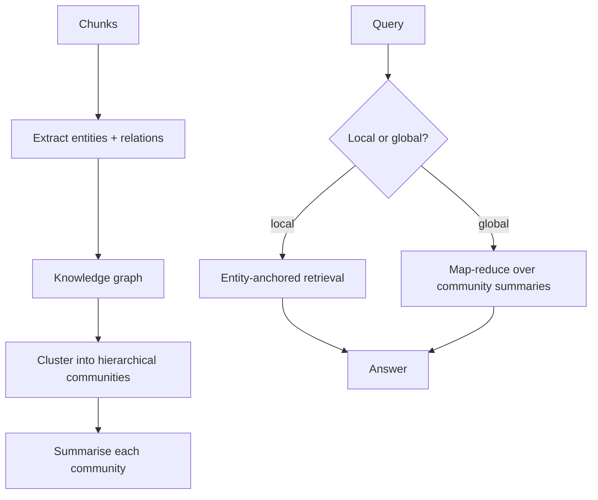

# GraphRAG

**Also known as:** Graph-Based RAG, Knowledge Graph RAG

**Category:** Retrieval & RAG  
**Status in practice:** emerging

## Intent

Build an LLM-extracted entity-and-relation knowledge graph plus hierarchical community summaries, then answer global queries via map-reduce over those summaries.

## Context

Sensemaking and corpus-level questions ('what are the main themes?') that naive top-k retrieval cannot answer because they require seeing the whole.

## Problem

Naive RAG retrieves local chunks and cannot answer global queries; chunk-level retrieval is mismatched to corpus-level questions.

## Forces

- Indexing cost is high (LLM calls per entity, relation, community).
- Graph quality depends on extraction prompts.
- Local-search vs global-search modes serve different query types and must be routed.

## Applicability

**Use when**

- Users ask global, corpus-wide questions that local chunk retrieval cannot answer.
- The corpus has clear entities and relations worth extracting into a graph.
- Index-time cost can be paid up front to enable hierarchical community summaries.

**Do not use when**

- Queries are narrowly local and naive RAG already serves them well.
- The corpus is small or volatile enough that graph extraction will not pay off.
- Entity and relation extraction quality is too low to trust the resulting graph.

## Solution

Index time: extract entities and relations from chunks; build a knowledge graph; cluster into hierarchical communities; summarise each community. Query time: classify query as local (entity-specific) or global (corpus-wide). Local queries use entity-anchored retrieval; global queries map-reduce over community summaries.

## Variants

- **Global GraphRAG (map-reduce)** — Map the query over community summaries, reduce to a single answer; suits corpus-wide sensemaking.
- **Local GraphRAG** — Anchor on a named entity and walk its neighbourhood in the graph; suits entity-specific questions.
- **DRIFT GraphRAG** — Hybrid that starts local around a seed entity and progressively widens to community-level context if the local context is insufficient (Microsoft DRIFT).

## Diagram

## Example scenario

An analyst pointed at a 4000-page deal-room corpus asks 'what are the recurring risk themes across these contracts?' Naive RAG returns five chunks and an answer that misses two themes entirely because no single chunk carries them. The team switches to GraphRAG: at index time the LLM extracts parties, obligations, and clauses into a knowledge graph, clusters the graph into communities, and writes a summary of each. The corpus-wide question now map-reduces over community summaries and surfaces the recurring themes the chunk-level retriever could not see.

## Consequences

**Benefits**

- Answers corpus-level sensemaking questions naive RAG cannot.
- Communities are inspectable artefacts of the corpus.

**Liabilities**

- High indexing cost (orders of magnitude more LLM calls).
- Entity extraction errors cascade through the graph.

## What this pattern constrains

Global queries operate only on community summaries, not raw chunks; local queries operate only on entity-anchored neighbourhoods.

## Known uses

- **[Microsoft GraphRAG (open source)](https://github.com/microsoft/graphrag)** — *Available*

## Related patterns

- *alternative-to* → [naive-rag](naive-rag.md)
- *uses* → [map-reduce](map-reduce.md)
- *composes-with* → [knowledge-graph-memory](knowledge-graph-memory.md)

## References

- (paper) Edge, Trinh, Cheng, Bradley, Chao, Mody, Truitt, Metropolitansky, Ness, Larson, *From Local to Global: A Graph RAG Approach to Query-Focused Summarization*, 2024, <https://arxiv.org/abs/2404.16130>

**Tags:** rag, graph, sensemaking
