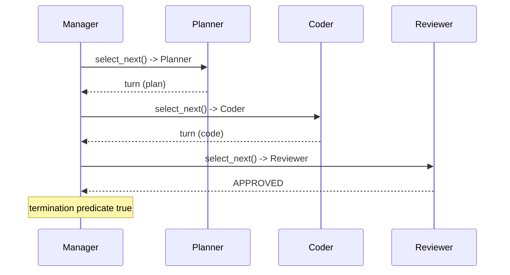

# Group-Chat Manager

**Also known as:** Speaker Selector, Conversation Chair, Team Manager Agent

**Category:** Multi-Agent  
**Status in practice:** mature

## Intent

Place a dedicated manager between the participants of a multi-agent group chat that decides which participant speaks next on each turn.

## Context

Multi-agent systems where several specialist agents share a conversation context and only one should speak per turn; without a chair, everyone speaks at once or nobody speaks.

## Problem

Free-for-all turn-taking either talks over itself (every agent emits every turn) or stalls (no agent picks itself); per-pair hand-offs do not generalise past three agents.

## Forces

- Turn allocation must be explicit when more than two agents share a thread.
- A round-robin chair is simple but blind to relevance; an LLM-based chair is relevance-aware but adds a model call per turn.
- Termination must be evaluated centrally so the chat ends predictably.
- Allowing any agent to hand off to any other (swarm-style) is flexible but harder to audit.

## Applicability

**Use when**

- Three or more agents must share a single conversation context.
- Turn order, termination, and audit need to live in one component.
- Relevance-aware speaker selection is worth a per-turn model call.

**Do not use when**

- Only two agents are involved (use autogen-conversational instead).
- Agents must run concurrently without a shared turn (use actor-model-agents).
- Hand-offs are per-pair and a swarm of bilateral edges is simpler.

## Therefore

Therefore: place one manager between the participants and let it pick the next speaker each turn — by round-robin, by LLM relevance scoring, by named-handoff token, or by orchestrator decree — so that turn allocation, termination, and audit-ability live in one component.

## Solution

Define a Manager that owns the shared conversation transcript and a `select_next(transcript, participants) -> participant` function. On each turn the manager appends the new message to the transcript, calls `select_next`, and invokes the chosen participant. Implementations vary in how `select_next` is computed (see Variants). The manager also enforces termination — a turn cap, a content predicate, or an explicit `STOP` signal from a participant.

## Variants

- **Round-Robin Manager** — Participants speak in a fixed rotation; the manager picks the next one by position. *Distinguishing factor: selection by deterministic rotation.* *When to use:* every agent should contribute predictably and per-turn LLM cost matters.
- **Selector (LLM-Chosen)** — An LLM reads the transcript and picks the most relevant next speaker. *Distinguishing factor: selection by ChatCompletion call on the transcript.* *When to use:* relevance matters more than fairness and the per-turn model cost is acceptable.
- **Handoff Token** — Each participant ends its turn with a token like `transfer_to(agent_id)`; the manager honours the named handoff. *Distinguishing factor: selection delegated to the current speaker.* *When to use:* swarm-style systems where agents know who should answer next better than a central chair does. See also: swarm.
- **Magentic Orchestrator** — A long-lived orchestrator agent maintains a plan over the team and picks the next speaker against the plan. *Distinguishing factor: selection driven by a persistent plan rather than per-turn re-evaluation.* *When to use:* long multi-step tasks where the team should remain coherent across many turns.

## Example scenario

A coding team agent has a planner, a coder, a reviewer, and a tester sharing one transcript. A round-robin manager is too rigid — the tester should not speak before the coder has produced code. The team swaps the manager for an LLM-driven selector that reads the transcript and picks the most relevant speaker, falling back to round-robin if the selector is uncertain. Termination triggers when the reviewer emits an `APPROVED` token or after twenty turns. The same skeleton later supports a swarm variant where the current speaker emits a `transfer_to(...)` token at the end of its turn.

## Diagram

## Consequences

**Benefits**

- Single place to enforce turn allocation and termination.
- Variants let the same skeleton serve fair (round-robin) and relevance-aware (selector) conversations.
- Audit trail is centralised in the manager.

**Liabilities**

- The manager is a single point of failure for the conversation.
- LLM-based selectors add a model call per turn.
- Per-pair affinity is harder to express than in pure handoff designs.

## What this pattern constrains

Participants may not speak unless the manager selects them; no agent is allowed to emit a turn out of band.

## Known uses

- **AutoGen Teams (RoundRobinGroupChat, SelectorGroupChat, Swarm, MagenticOneGroupChat)** — AutoGen's GroupChat family realises round-robin, LLM-selector, handoff-token, and orchestrator variants of this pattern. *Available* — [link](https://microsoft.github.io/autogen/stable/user-guide/agentchat-user-guide/tutorial/teams.html)
- **CAMEL role-playing** — Two-agent variant with an implicit fixed chair (user-agent speaks first, assistant-agent responds). *Available* — [link](https://www.camel-ai.org/)

## Related patterns

- *specialises* → [supervisor](supervisor.md)
- *complements* → [autogen-conversational](autogen-conversational.md)
- *uses* → [handoff](handoff.md)
- *complements* → [swarm](swarm.md)
- *complements* → [role-assignment](role-assignment.md)

## References

- *doc*: [AutoGen — Teams](https://microsoft.github.io/autogen/stable/user-guide/agentchat-user-guide/tutorial/teams.html) — Microsoft

**Tags:** multi-agent, speaker-selection, group-chat, autogen
