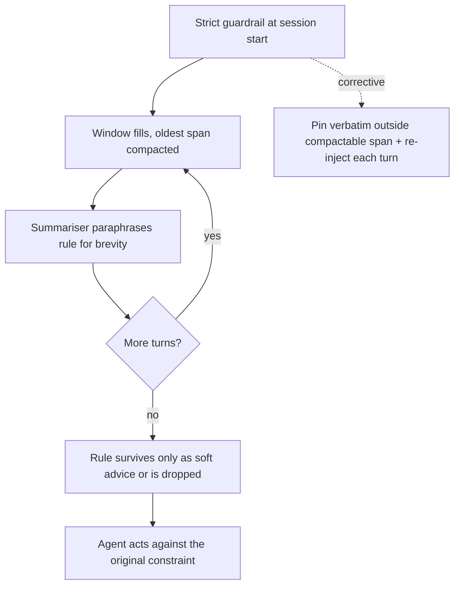

# Guardrail Erosion Through Compaction

**Also known as:** Safety Drift Through Summarisation, Guardrail Demotion

**Category:** Anti-Patterns  
**Status in practice:** emerging

## Intent

Anti-pattern: each compaction pass rewrites the running history, so a hard safety instruction is gradually paraphrased into vague advice and its force decays the longer the agent runs.

## Context

A long-running agent compacts or summarises its conversation history to stay inside the context window, and the operator places critical safety instructions — refuse this action, never touch that file, always ask before paying — at the start of the session. As the agent works, those early turns become the oldest span and are the first to be folded into a model-written digest, often repeatedly across many sessions.

## Problem

A summariser is rewarded for brevity and for keeping the gist, not for preserving the exact wording and binding force of a constraint. Each pass paraphrases the strict rule a little more loosely, until a categorical prohibition such as "never run a destructive command without confirmation" survives only as a soft note like "be careful with risky commands", or drops out entirely under a mass of intermediate tool output. The instruction is still nominally inside the window, yet it no longer reads as a hard constraint, so the model weighs it like any other suggestion and eventually acts against it.

## Forces

- Compaction must shrink the oldest span to free budget, but the oldest span is exactly where the operator put the founding safety rules.
- A summariser optimises for compact gist, while a guardrail depends on its precise, categorical wording to bind behaviour.
- The erosion is silent and gradual: each pass looks reasonable in isolation, and no single compaction visibly drops the rule.
- Operators assume an instruction that is still present in the context is still in force, but presence is not the same as binding strength.

## Therefore

Therefore (the corrective): pin safety constraints outside the compactable span and re-inject their verbatim wording every turn, so no summarisation pass can ever paraphrase or discard them.

## Solution

The corrective is to treat hard constraints as un-summarisable. Hold the verbatim safety block in a pinned region — the system prompt or a fixed header — that the compactor is forbidden to touch, and re-inject it on every turn rather than letting it age into the rollable history. Where a constraint must live in the conversation, tag it so the summariser copies it through unchanged instead of paraphrasing, and run a post-compaction check that the exact guardrail strings are still present and unweakened. The compactable span should carry only working detail whose loss is recoverable, never the rules that gate action.

## Structure

```
Pinned safety block (never compacted) + compactable working history (digested each pass); a guardrail demoted from the pinned block into the rollable span erodes turn over turn
```

## Diagram



*Repeated compaction paraphrases a hard rule into soft advice; the corrective pins the constraint outside the compactable span.*

## Example scenario

An operator starts a coding agent with a firm rule at the top: never delete a file without asking first. The session runs for hours, and to stay under the token limit the agent keeps summarising its older history. After several rounds the once-strict rule has been compressed into a gentle 'be careful with file changes', and on a busy step the agent deletes a config file without pausing to confirm — the guardrail was still in the context, just no longer in force.

## Consequences

**Benefits**

- Naming the failure separates two things operators conflate: an instruction being present in the window versus an instruction still binding behaviour.
- The corrective — pin verbatim, re-inject, post-compaction string check — is cheap and deterministic relative to the harm of a silently dropped guardrail.

**Liabilities**

- A long-running agent passes safety review on day one and then drifts unsafe over weeks as repeated compaction loosens the same rule.
- The drift is invisible in normal traces because the digest looks coherent and the rule appears to still be there in paraphrased form.
- Re-injecting verbatim constraints every turn spends context budget that compaction was meant to reclaim, forcing a deliberate trade-off.

## Failure modes

- Paraphrase decay — a categorical prohibition is softened across passes into non-binding advice the model treats as optional.
- Silent drop — the guardrail is buried under intermediate tool output and omitted entirely by a later compaction.
- Cross-session compounding — each new session compacts an already-eroded digest, so the rule weakens monotonically over the agent's lifetime.
- False assurance — the rule still appears in the context in some form, so an operator audit reads it as intact while its force is gone.

## What this pattern constrains

Safety constraints must be pinned outside the compactable span and re-injected verbatim each turn; a guardrail is never summarised, paraphrased, or aged into the rollable history, and a compaction pass that weakens or drops a pinned constraint must be rejected.

## Applicability

**Use when**

- Watch for this in any long-running or multi-session agent that compacts or summarises its history while relying on instruction-level safety rules.
- Suspect it when an agent that behaved safely early in a session starts cutting corners on the same rule later on.
- Audit for it whenever critical constraints are placed in the conversation rather than pinned in a fixed system region.

**Do not use when**

- Sessions are short enough that no compaction pass ever touches the span holding the safety rules.
- Hard constraints are already enforced outside the model by a deterministic policy gate, so their wording in context is advisory rather than load-bearing.
- All safety rules are pinned verbatim in an un-compactable region and re-injected each turn, which is the corrective rather than the anti-pattern.

## Components

- Pinned safety block — the verbatim constraints held in a region the compactor is forbidden to touch
- Compactable working history — the rollable span that may be summarised and where a demoted guardrail erodes
- Summariser — the compaction pass that paraphrases for brevity and silently weakens any constraint left in its reach
- Re-injection step — re-adds the verbatim guardrail every turn so it never ages into the rollable span
- Post-compaction guardrail check — verifies the exact constraint strings are still present and unweakened after each pass

## Tools

- Context compactor / summariser — the harness component that rewrites the older span and is the source of the erosion
- Pinned-prompt / system-prompt slot — the un-compactable region that holds the verbatim safety block
- String / regex presence check — confirms the literal guardrail wording survives each compaction

## Evaluation metrics

- Guardrail survival rate — fraction of pinned constraints whose verbatim wording is still present after N compaction passes
- Constraint-strength drift — judged change in the bindingness of a rule from its original wording to its compacted form
- Unsafe-action rate vs session length — whether violations of a stated rule rise the longer the agent runs
- Time-to-erosion — number of compaction passes before a hard rule first reads as non-binding advice

## Known uses

- **[Context-engineering guidance for production agents (Roberto Dias Duarte)](https://www.robertodiasduarte.com.br/engenharia-de-contexto-para-agentes-de-ia-em-producao/)** _available_ — Documents that critical instructions can stay 'inside the window' yet lose practical weight once buried under a mass of intermediate results — the demotion-not-deletion mechanism behind this anti-pattern.
- **[OpenClaw computer-use assistant (WeLiveSecurity analysis)](https://www.welivesecurity.com/pt/seguranca-digital/openclaw-o-que-e-o-assistente-de-ia-que-automatiza-seu-computador-e-quais-sao-os-riscos-de-seguranca/)** _available_ — Security review flags the gap between an operator expecting a guardrail to bind and the system treating that guardrail as just one signal among many — the conditions under which compaction quietly demotes a rule.

## Related patterns

- _conflicts-with_ **Context Compaction** — This is the failure mode of compaction: when the digesting pass is allowed to touch the safety span, the very mechanism that preserves the thread erodes the guardrail. The corrective is the compaction pattern's own pinned-region rule, enforced strictly.
- _complements_ **Input/Output Guardrails** — Guardrails are the thing being eroded here; keeping their wording outside the compactable span is what lets an enforced guard stay enforced across a long session.
- _alternative-to_ **Context Anxiety** — Sibling compaction-driven anti-pattern: both arise from window-budget management going wrong, but anxiety mis-times when to compact while erosion mis-handles what compaction is allowed to rewrite.
- _complements_ **Memo-As-Source Confusion** — Both are degradation-through-summarisation anti-patterns — one demotes a hard rule into soft advice, the other promotes a stale summary into ground truth; both treat a digest as if it carried the authority of the original.

## References

- [Engenharia de Contexto para Agentes de IA em Produção](https://www.robertodiasduarte.com.br/engenharia-de-contexto-para-agentes-de-ia-em-producao/) — 2025
- [OpenClaw: o que é o assistente de IA que automatiza o computador e quais são os riscos de segurança](https://www.welivesecurity.com/pt/seguranca-digital/openclaw-o-que-e-o-assistente-de-ia-que-automatiza-seu-computador-e-quais-sao-os-riscos-de-seguranca/) — 2025
- [Effective context engineering for AI agents](https://www.anthropic.com/engineering/effective-context-engineering-for-ai-agents) — Anthropic, 2025
- [Lost in the Middle: How Language Models Use Long Contexts](https://arxiv.org/abs/2307.03172) — Nelson F. Liu et al., 2023
- [Context Length Alone Hurts LLM Performance Despite Perfect Retrieval](https://arxiv.org/abs/2510.05381) — Yufeng Du et al., 2025
