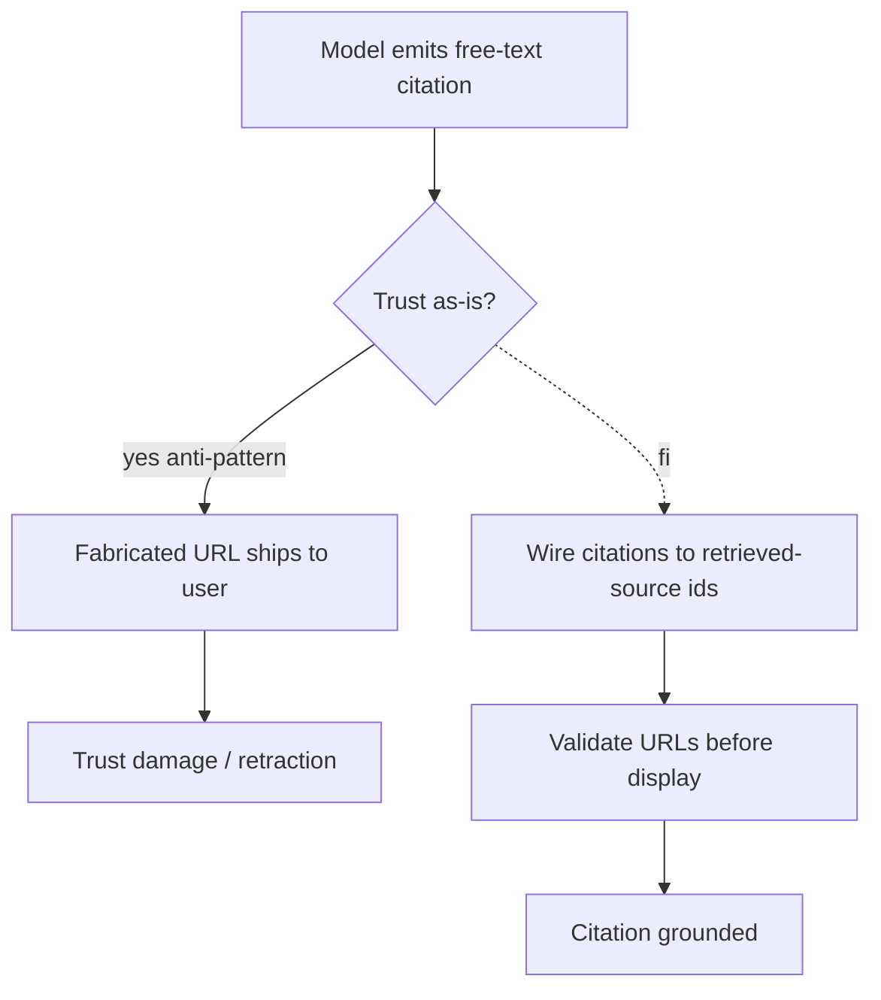

# Hallucinated Citations

**Also known as:** Fake URLs, Invented References

**Category:** Anti-Patterns  
**Status in practice:** deprecated

## Intent

Anti-pattern: let the model emit citations as free text and trust them.

## Context

A team builds a research, legal, medical, or general question-answering assistant that should back its claims with sources, and the easiest way to add citations is to ask the model to include them in its free-text answer. There is no retrieval pipeline that returns documents by stable identifier, or there is one but its results are not bound to the citations the model emits. Whatever URL, paper title, or case name the model writes in its answer is shipped to the user as-is.

## Problem

Language models trained on academic and legal text are particularly fluent at producing authoritative-looking references that do not exist — invented authors, plausible but wrong digital object identifiers, real-sounding case names that no court ever decided. The citations look correct until somebody clicks them, and end users routinely do not click. In regulated domains like law and medicine, a single hallucinated citation that reaches a customer can trigger sanctions, retractions, or loss of trust the product never recovers from.

## Forces

- Real citations require source ids and a retrieval pipeline.
- Models trained on academic text are particularly fluent at fabricating citations.
- End users do not check.

## Applicability

**Use when**

- Cite this entry when a system displays model-emitted references without checking them against retrieval results.
- You are already here if users report URLs or paper titles that do not exist.
- Bind citations to retrieved-source ids and validate before display (see citation-streaming, contextual-retrieval).

**Do not use when**

- Any production setting where users may rely on cited sources.
- Any setting where authoritative-looking but invented sources can mislead.
- Any audit or compliance setting requiring traceable provenance.

## Therefore

Therefore: bind every citation to a retrieved-source id and validate URLs against the retrieval result before rendering, so that the model cannot smuggle invented references into authoritative-looking output.

## Solution

Don't. Wire citations to retrieved-source ids. See citation-streaming, naive-rag, contextual-retrieval. Validate URLs before display.

## Example scenario

A legal-research assistant ships with a plausible-looking footnote feature: the model writes citations as free text. After launch, three customers report that quoted case names do not exist on Westlaw and one cited statute number is off by a digit. The team treats hallucinated-citations as the named anti-pattern they fell into: they rewire the assistant to cite only documents returned from the retrieval call by id, and add a URL-liveness check that strips any citation whose link 404s before the answer renders. Free-text citations are now banned at the prompt template level.

## Diagram

## Consequences

**Liabilities**

- Trust collapse on first user verification.
- Legal / regulatory exposure in regulated domains.

## What this pattern constrains

Avoiding it imposes a binding rule: a citation must not be emitted as free text; every reference shown to a user must resolve to a retrieved-source id validated before display.

## Known uses

- **Notable lawyer's brief incident, 2023 (filed hallucinated cases)** — *Available*

## Related patterns

- *alternative-to* → [citation-streaming](citation-streaming.md)
- *alternative-to* → [naive-rag](naive-rag.md)

**Tags:** anti-pattern, citation, hallucination
