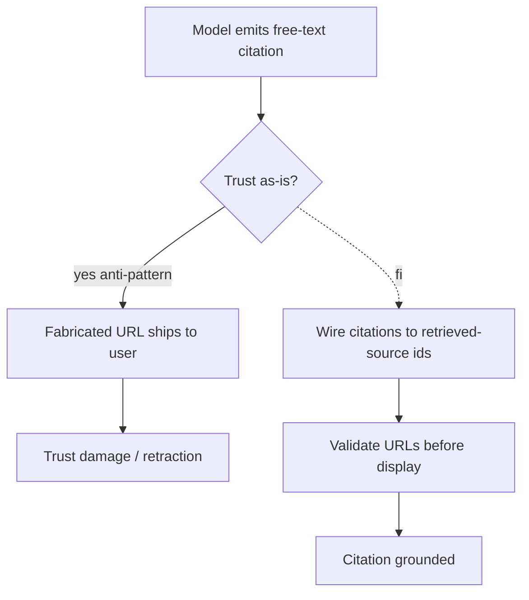

# Hallucinated Citations

**Also known as:** Fake URLs, Invented References

**Category:** Anti-Patterns  
**Status in practice:** deprecated

## Intent

Anti-pattern: let the model emit citations as free text and trust them.

## Context

An agent answers with citations but the citation pipeline is the model itself; no source-id discipline.

## Problem

The model invents URLs, paper titles, and author names. Hallucinated citations look authoritative until clicked.

## Forces

- Real citations require source ids and a retrieval pipeline.
- Models trained on academic text are particularly fluent at fabricating citations.
- End users do not check.

## Applicability

**Use when**

- Never use this; cite an example only to label the failure mode.
- Use citation-streaming, naive-rag, or contextual-retrieval to bind citations to retrieved-source ids.
- Validate URLs and titles against retrieval results before display.

**Do not use when**

- Any production setting where users may rely on cited sources.
- Any setting where authoritative-looking but invented sources can mislead.
- Any audit or compliance setting requiring traceable provenance.

## Solution

Don't. Wire citations to retrieved-source ids. See citation-streaming, naive-rag, contextual-retrieval. Validate URLs before display.

## Example scenario

A legal-research assistant ships with a plausible-looking footnote feature: the model writes citations as free text. After launch, three customers report that quoted case names do not exist on Westlaw and one cited statute number is off by a digit. The team treats hallucinated-citations as the named anti-pattern they fell into: they rewire the assistant to cite only documents returned from the retrieval call by id, and add a URL-liveness check that strips any citation whose link 404s before the answer renders. Free-text citations are now banned at the prompt template level.

## Diagram

## Consequences

**Liabilities**

- Trust collapse on first user verification.
- Legal / regulatory exposure in regulated domains.

## What this pattern constrains

By definition, this anti-pattern imposes no useful constraint; the missing constraint is the failure mode.

## Known uses

- **Notable lawyer's brief incident, 2023 (filed hallucinated cases)** — *Available*

## Related patterns

- *alternative-to* → [citation-streaming](citation-streaming.md)
- *alternative-to* → [naive-rag](naive-rag.md)

**Tags:** anti-pattern, citation, hallucination
