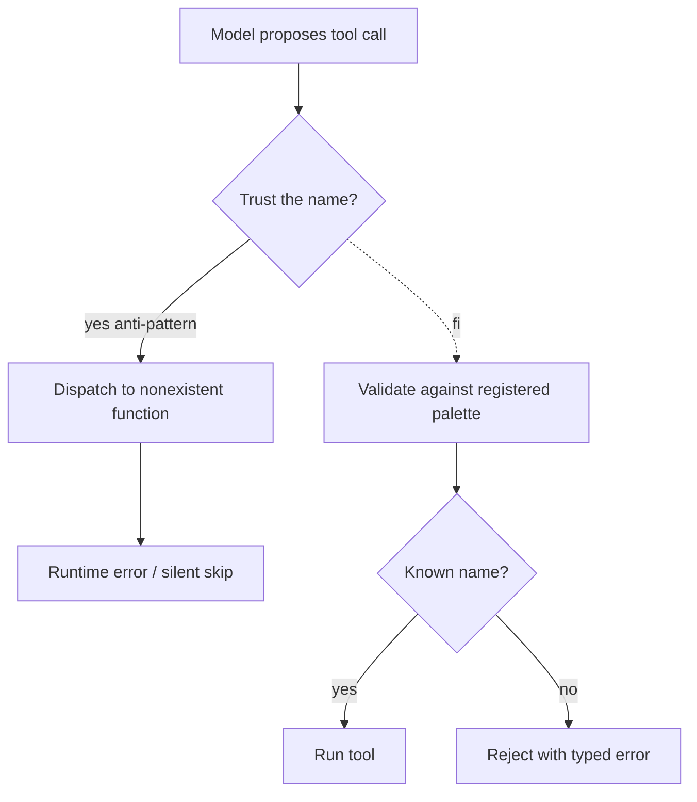

# Hallucinated Tools

**Also known as:** Phantom Tool Calls, Imagined Functions

**Category:** Anti-Patterns  
**Status in practice:** deprecated

## Intent

Anti-pattern: trust the model to invoke only the tools it has been given, then debug calls to functions that do not exist.

## Context

An agent is configured with a registered set of tools — a tool palette — that it is supposed to choose from on each turn. The host code that receives the model's tool call accepts whatever name and arguments the model emits and dispatches them without first checking that the name actually exists in the registered palette. The team assumes that because the model was shown the palette in the prompt, the model will only call tools from it.

## Problem

Models routinely invent tool names that look reasonable but are not registered — a slight rename, a pluralised version, an imagined helper that should logically exist. The unvalidated host then either crashes with an unhelpful error, silently drops the call, or, in the worst case, fuzzy-matches the invented name to a similar real tool and executes the wrong action with side effects. Without strict validation at the dispatch boundary, phantom calls become indistinguishable from legitimate ones in the logs.

## Forces

- Validation feels redundant when providers offer typed tool calls.
- Provider-side validation is not always strict.
- Logging fails to surface 'tool does not exist' as a first-class event.

## Applicability

**Use when**

- Never use this; treat any model-emitted tool name as untrusted input.
- Validate every tool call against the registered tool palette before dispatch (see tool-use, structured-output).
- Reject unknown tool names with a typed error the agent loop can react to.

**Do not use when**

- Any production agent loop with side-effecting tools.
- Any setting where silent drops or fuzzy-matched dispatch could cause harm.
- Any environment without a registered, enumerable tool palette.

## Therefore

Therefore: validate every model-emitted tool name against the registered palette before dispatch and reject unknowns with a typed error the agent loop can read on the next turn, so that phantom calls cannot silently fan out to similar-named real tools.

## Solution

Don't trust. Validate every tool call against the registered palette before dispatch. Reject unknown names with a typed error the agent can react to. See tool-use, structured-output.

## Example scenario

A coding agent in production starts logging mysterious errors: 'unknown function: search_repo_v2'. The model invented a tool name that almost matches a real one and the host quietly dispatched to the closest match, deleting a file. The team recognises hallucinated-tools as the underlying anti-pattern and adds a strict allowlist: every tool call is validated against the registered palette, unknown names return a typed error the agent reads on the next turn, and fuzzy matching is forbidden. The phantom calls disappear within a day.

## Diagram

## Consequences

**Liabilities**

- Silent failures.
- Wrong actions executed by similar-named tools.

## What this pattern constrains

By definition, this anti-pattern imposes no useful constraint; the missing constraint is the failure mode.

## Known uses

- **[Berkeley Function-Calling Leaderboard (relevance detection)](https://gorilla.cs.berkeley.edu/leaderboard.html)** — *Available* — The benchmark scores models on declining to call tools that do not exist — a metric that exists because production agents kept inventing tool names.

## Related patterns

- *alternative-to* → [tool-use](tool-use.md)
- *alternative-to* → [structured-output](structured-output.md)

**Tags:** anti-pattern, tool-use
