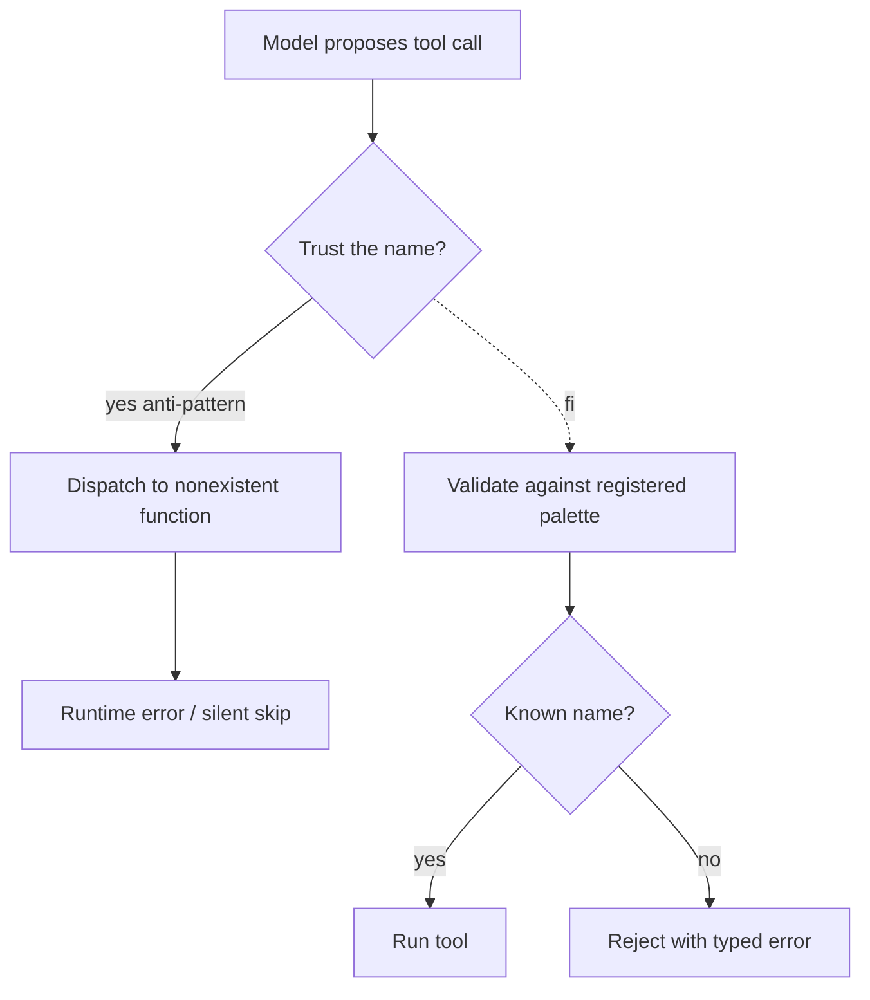

# Hallucinated Tools

**Also known as:** Phantom Tool Calls, Imagined Functions

**Category:** Anti-Patterns  
**Status in practice:** deprecated

## Intent

Anti-pattern: trust the model to invoke only the tools it has been given, then debug calls to functions that do not exist.

## Context

The agent is given a tool palette, but the host accepts whatever the model emits without validation.

## Problem

The model invents tool names. The host either crashes, silently drops the call, or worse, dispatches to a similar-named real tool.

## Forces

- Validation feels redundant when providers offer typed tool calls.
- Provider-side validation is not always strict.
- Logging fails to surface 'tool does not exist' as a first-class event.

## Applicability

**Use when**

- Never use this; treat any model-emitted tool name as untrusted input.
- Validate every tool call against the registered tool palette before dispatch (see tool-use, structured-output).
- Reject unknown tool names with a typed error the agent loop can react to.

**Do not use when**

- Any production agent loop with side-effecting tools.
- Any setting where silent drops or fuzzy-matched dispatch could cause harm.
- Any environment without a registered, enumerable tool palette.

## Therefore

Therefore: validate every model-emitted tool name against the registered palette before dispatch and reject unknowns with a typed error the agent loop can read on the next turn, so that phantom calls cannot silently fan out to similar-named real tools.

## Solution

Don't trust. Validate every tool call against the registered palette before dispatch. Reject unknown names with a typed error the agent can react to. See tool-use, structured-output.

## Example scenario

A coding agent in production starts logging mysterious errors: 'unknown function: search_repo_v2'. The model invented a tool name that almost matches a real one and the host quietly dispatched to the closest match, deleting a file. The team recognises hallucinated-tools as the underlying anti-pattern and adds a strict allowlist: every tool call is validated against the registered palette, unknown names return a typed error the agent reads on the next turn, and fuzzy matching is forbidden. The phantom calls disappear within a day.

## Diagram

## Consequences

**Liabilities**

- Silent failures.
- Wrong actions executed by similar-named tools.

## What this pattern constrains

By definition, this anti-pattern imposes no useful constraint; the missing constraint is the failure mode.

## Known uses

- **Common in pre-2024 agent integrations** — *Available*

## Related patterns

- *alternative-to* → [tool-use](tool-use.md)
- *alternative-to* → [structured-output](structured-output.md)

**Tags:** anti-pattern, tool-use
