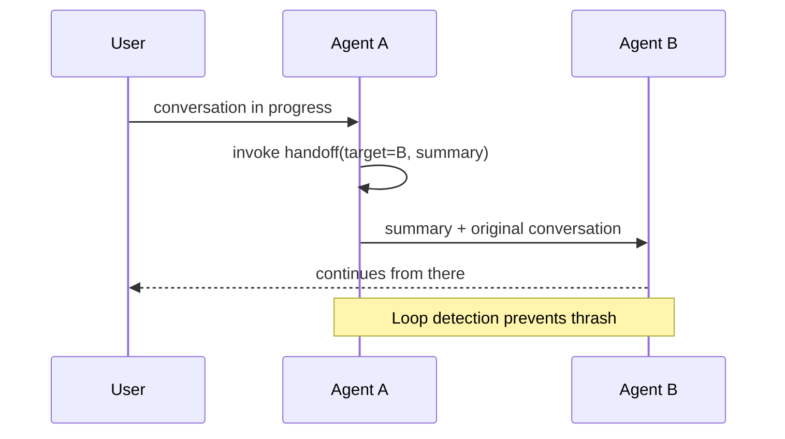

# Handoff

**Also known as:** Agent Handoff, Transfer, Routine Switch

**Category:** Multi-Agent  
**Status in practice:** emerging

## Intent

Transfer the active conversation from one agent to another, carrying context across the switch.

## Context

A specialist agent realises it is the wrong agent for the current request and needs to pass control to another specialist.

## Problem

Without a handoff primitive, mid-conversation reroutes either restart context or stay stuck with the wrong specialist.

## Forces

- Context transfer is lossy; what travels?
- Handoff loops (A→B→A→B) are a real failure.
- User experience must signal the change without disorienting.

## Applicability

**Use when**

- Mid-conversation routing must transfer context to a more appropriate specialist.
- Multiple specialised agents exist and not every conversation belongs to one.
- A summary plus the original conversation is enough for the target to continue.

**Do not use when**

- A single agent can handle the conversation without rerouting.
- Loop detection or thrash prevention cannot be implemented to bound handoffs.
- The cost of summarising and re-onboarding outweighs the specialisation benefit.

## Solution

Define a handoff tool. The current agent invokes it with target agent and a context summary. The target agent receives the summary plus the original conversation and continues from there. Loop detection prevents thrash.

## Example scenario

A customer-support bot answers tier-1 questions but keeps trying to bluff its way through billing disputes it cannot actually resolve. The team adds a handoff tool: when the conversation classifier detects a billing intent, the tier-1 agent calls handoff(target='billing-specialist', summary='customer disputes Sept invoice for $412, two prior tickets'), and the billing agent picks up with the summary plus the original transcript. Loop-detection refuses a re-handoff back to tier-1 within the same conversation. The customer no longer has to repeat themselves.

## Diagram

## Consequences

**Benefits**

- Specialisation without supervisor overhead on every turn.
- User-visible continuity.

**Liabilities**

- Context summary fidelity bounds quality.
- Loop detection is its own code path.

## What this pattern constrains

Handoffs happen only via the registered tool; out-of-band agent switches are forbidden.

## Known uses

- **[OpenAI Swarm primitives](https://github.com/openai/swarm)** — *Available*

## Related patterns

- *alternative-to* → [supervisor](supervisor.md)
- *complements* → [role-assignment](role-assignment.md)
- *composes-with* → [inter-agent-communication](inter-agent-communication.md)
- *generalises* → [conversation-handoff](conversation-handoff.md)
- *used-by* → [cross-domain-agent-network](cross-domain-agent-network.md)

## References

- (repo) *openai/swarm*, <https://github.com/openai/swarm>

**Tags:** multi-agent, handoff
