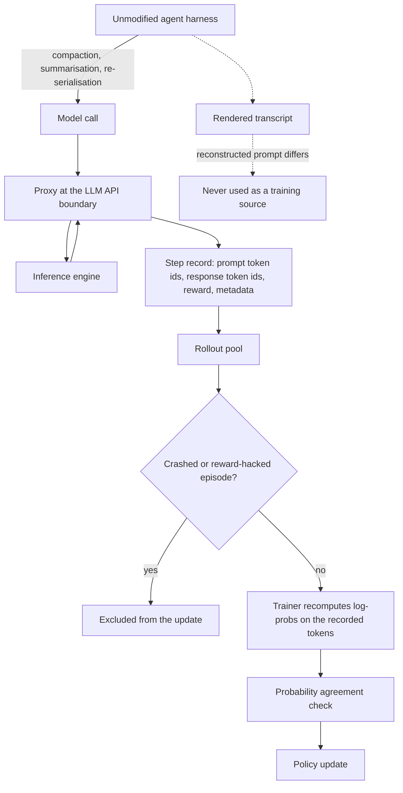

# Harness-Native Rollout Capture

**Also known as:** In-Process LLM Proxying, Gateway-Captured Rollout, Token-Level Rollout Provenance

**Category:** Governance & Observability  
**Status in practice:** emerging

## Intent

Capture reinforcement-learning rollouts by intercepting the model-call boundary inside the harness the agent already runs in, recording exact prompt and response token ids rather than reconstructing them from the transcript.

## Context

A team post-trains an agent with reinforcement learning. In production the agent runs inside a harness — a long-running loop that manages tool integration, repository context, execution feedback and its own context budget. Rollouts for training can come from two places: a training-only reimplementation of that loop inside the trainer, or the real harness itself. The harness rewrites the conversation between turns; it compacts older messages, summarises sub-trajectories, truncates tool output and re-serialises the message list before each call. What the trainer sees afterwards is the rendered transcript, not the byte sequence the model was handed.

## Problem

The prompt a trainer rebuilds from a transcript is not the prompt the model was asked. Harness-side compaction, summarisation and re-serialisation change which turns are present and how they are written, so the reconstructed token sequence diverges from the one that was generated against. Policy-gradient methods then recompute log-probabilities over tokens the model never saw, and the update is off-policy in a way no metric reports. The alternative — reimplementing the agent loop as a training-only environment — removes the mismatch by optimising a loop that is not the one shipped, so the two drift apart as the production harness evolves. Environmental crashes and reward hacking add a second corruption: a failed episode reaches the trainer as a low-reward rollout rather than as a discarded one.

## Forces

- The harness must keep rewriting the conversation to stay inside a context window, and every rewrite widens the gap between the transcript and what was actually sent.
- A training-only reimplementation of the loop is easy to instrument but optimises a policy for an environment that never serves a request, while the production harness is faithful but was not built to emit training data.
- Token ids are the only representation that survives re-serialisation; text survives it in appearance only, because a re-tokenisation can shift boundaries without changing a single visible character.
- Interception at the model-call boundary leaves the harness's control flow untouched, but it also inherits the harness's failures — a crashed or reward-hacked episode is recorded as faithfully as a good one.
- Rollouts are wanted as retained assets that can be resampled across runs, yet harnesses treat interaction traces as temporary runtime logs that are rotated away.

## Therefore

Therefore: generate rollouts in the unmodified harness and place a proxy at its model-call boundary that records every step as exact prompt token ids, exact response token ids, reward and metadata, then train from those recorded streams rather than from a rebuilt prompt.

## Solution

Leave the harness alone and tap it. A proxy sits at the single point where the harness reaches an inference endpoint, forwards the request unchanged, and writes one step record per generation: the exact prompt token ids that were sent, the exact response token ids that came back, the reward once it is known, and metadata such as episode id, step index, model version and sampling configuration. The proxy adds no control flow of its own, so the harness keeps compacting and summarising exactly as it does in production; whatever it decided to send is what gets stored. Step records are collected into a pool that outlives the run, so an episode can be resampled, filtered or re-weighted later instead of being consumed once and discarded. The trainer reads token ids straight from the record and recomputes log-probabilities over them, never rebuilding a prompt from rendered text. The agreement between those recomputed values and the ones the serving path recorded at generation time becomes the health metric for the capture itself: a reported rollout-training probability correlation above 0.99 says the tap is faithful, and a drop says something in the path has started to re-tokenise or reorder. A filtering stage sits between the pool and the update, marking episodes that ended in a harness crash or that scored through reward hacking so they are excluded rather than learned from. Because the tap is at an API boundary rather than inside the loop, the same capture works across unmodified third-party harnesses; one reported setup trains through three of them without patching any.

## Structure

```
Unmodified harness --model call--> proxy --forward--> inference engine. Proxy --> step record {prompt token ids, response token ids, reward, metadata} --> rollout pool --filter out crashed / reward-hacked episodes--> trainer recomputes log-probs on recorded tokens --> policy update. Rendered transcript is never a training source.
```

## Diagram



*The proxy records what the harness actually sent; the rendered transcript is kept for reading but never feeds the update.*

## Example scenario

A team fine-tunes a coding agent that runs inside an off-the-shelf harness. Halfway through a long task the harness compacts the older turns to stay inside the context window, so the transcript the trainer reads afterwards is not the prompt the model was handed. Gradients are computed against a prompt that never existed, and the reward curve climbs for a week while the deployed agent does not improve. Recording the token ids at the model-call boundary instead of rebuilding them removes the gap.

## Consequences

**Benefits**

- The tokens used for the update are the tokens the model was given, so harness-side compaction, summarisation and re-serialisation no longer decouple rollout behaviour from the gradient.
- Training runs against the harness that is actually shipped, so the policy is not tuned for a training-only reimplementation of the loop that drifts away from production.
- The correlation between trainer-recomputed and generation-time log-probabilities becomes a single number that reports whether the capture is still faithful; above 0.99 has been reported as the healthy range.
- Interaction traces become retained data assets organised as step-level records rather than runtime logs that are rotated away, so an episode can be resampled or re-weighted across runs.
- Because the tap is an API boundary and not a loop rewrite, third-party harnesses can be trained through without being modified.

**Liabilities**

- The proxy sees every prompt the harness assembles, including repository content and credentials pulled into context, so the rollout pool becomes a concentrated store of sensitive material with the harness's own access scope.
- Token-id records for long-horizon episodes are much larger than text transcripts, and retaining them for resampling multiplies that cost across runs.
- The proxy sits on the latency path of a live harness, so a slow or failing recorder degrades the agent it is meant to observe.
- A harness with no single model-call entry point, or one that offers no supported way to redirect its endpoint, has to be given one before the capture can be installed at all.
- The tap records failures as faithfully as successes, so a separate filtering stage for crashed and reward-hacked episodes is mandatory rather than optional.

## Failure modes

- The proxy records rendered text instead of token ids, a trainer-side re-tokenisation shifts token boundaries, and log-probabilities are computed against a sequence the model never generated.
- Harness compaction drops earlier turns from the live prompt while the stored transcript keeps them, so the reconstructed prompt is longer than the real one and every update is quietly off-policy.
- An episode that ended in a harness crash is scored as a zero-reward rollout rather than discarded, so the agent learns to avoid the tool that crashed instead of the behaviour that failed.
- The capture is installed on a forked, training-only copy of the harness that then diverges from the deployed one, reintroducing the mismatch the pattern exists to remove.
- Probability agreement is recorded but never alerted on, so a silent change in sampling configuration or precision degrades the correlation for weeks without anyone acting.

## What this pattern constrains

The trainer must not rebuild a prompt from the rendered transcript; only the token ids the proxy recorded at the model-call boundary may be consumed for a policy update, and the harness's control flow cannot be replaced by a training-only reimplementation of the loop.

## Applicability

**Use when**

- Rollouts are produced by a long-running harness that compacts, summarises, truncates or re-serialises the conversation between turns.
- The training target is the agent as it runs in production, and maintaining a separate training-only copy of the loop would let the two drift apart.
- The update method needs token-level alignment, such as a policy-gradient method that recomputes log-probabilities over the sampled tokens.
- The harness is third-party or otherwise not open to modification, but its inference endpoint can be redirected.

**Do not use when**

- The interaction is a single turn against a fixed prompt, where the transcript and the sent prompt are the same object.
- The harness exposes no model-call boundary and cannot be pointed at a proxy endpoint, so there is nothing to intercept without rewriting it.
- Traces are wanted only for debugging or regression scoring, where a rendered transcript is enough and replay tooling already covers the need.
- Prompts routinely carry material that must not be retained, and no redaction or retention control can be applied to the rollout pool.

## Components

- Model-call proxy — sits at the harness's inference endpoint, forwards each request unchanged and records the generation without altering the harness's control flow
- Step record — one model call stored as exact prompt token ids, exact response token ids, reward and metadata such as episode id, step index, model version and sampling configuration
- Rollout pool — organises step records into episodes that outlive the run so they can be resampled, filtered or re-weighted instead of consumed once
- Episode filter — marks rollouts corrupted by harness crashes or by reward hacking so they are excluded from the update rather than learned from
- Probability agreement check — recomputes trainer-side log-probabilities of the recorded response tokens and compares them with the values recorded at generation time
- Trainer — reads token ids directly from the record and computes the policy update without rebuilding a prompt from rendered text

## Tools

- Agent harness such as the OpenHands SDK, Claude Code or OpenCode — the unmodified loop that produces the rollouts
- Inference server such as vLLM or SGLang — emits the exact generated token ids and the generation-time log-probabilities the record needs
- Reinforcement-learning training library such as verl — consumes step records and recomputes log-probabilities over the stored tokens
- Object store or step-level data pool — retains episodes across runs so a rollout can be resampled rather than discarded after one update

## Evaluation metrics

- Rollout-training probability correlation — how closely trainer-recomputed log-probabilities match the values recorded at generation time; above 0.99 has been reported as the healthy range
- Capture completeness — share of the model calls in an episode that produced a step record, so a partially captured episode is not silently trained on
- Reconstruction divergence — token-level difference between the recorded prompt and one rebuilt from the transcript, which quantifies what the tap is buying
- Corrupted-episode rate — share of rollouts excluded for harness crashes or reward hacking before the update
- Capture overhead — added latency and stored bytes per model call attributable to the proxy

## Known uses

- **[LEGO-RL (in-process LLM proxying)](https://arxiv.org/abs/2608.17393)** _pure-future_ — Captures raw generation streams at the model-call boundary for token-level alignment under harness-side compaction or re-serialisation, and trains through three unmodified harnesses — the OpenHands SDK, Claude Code and OpenCode — reporting rollout-training probability correlation above 0.99 as the health metric for the capture.
- **[Claw-R1 Gateway Server and Data Pool](https://arxiv.org/abs/2606.09138)** _pure-future_ — A gateway at a unified LLM API entry point captures multi-turn interaction steps, and a data pool organises them into step-level records of prompt ids, response ids, rewards and other metadata, treating traces as managed data assets rather than temporary runtime logs.
- **[ClawGym II (black-box RL on agent harness)](https://arxiv.org/abs/2608.16798)** _pure-future_ — Trains through a complex harness without opening it up, treating the harness as the environment rather than reimplementing its coordination of agent-environment interaction for long-horizon tasks.
- **[verl](https://github.com/volcengine/verl)** _available_ — Open-source reinforcement-learning training library for large language models; supplies the trainer side that consumes recorded rollouts and recomputes log-probabilities over stored token ids.

## Related patterns

- _complements_ **Served-Policy Anchoring** — That pattern measures and corrects the numerical gap between the rollout engine and the training engine; this one governs where the rollout record comes from in the first place, and its probability-agreement check is the same measurement applied to the capture path.
- _complements_ **Journaled LLM Call** — Both record model calls at the same boundary, but the journal exists so a durable workflow can resume without re-invoking the model, while this record exists so a trainer can compute a gradient over the exact tokens.
- _complements_ **Replay / Time-Travel** — Replay consumes captured traces to debug or branch a run; this consumes them for a policy update, which is why the record has to carry token ids rather than rendered steps.
- _complements_ **Eval Harness** — An eval harness scores a checkpoint for regression; harness-native capture supplies the training signal, and the two read the same episodes for different purposes.
- _complements_ **Managed Agent Runtime** — That pattern makes the agent loop a managed platform primitive; this one says nothing about who operates the loop and only requires that whatever loop is already running expose a model-call boundary to tap.
- _complements_ **Context Folding** — Folding a sub-trajectory back into a shorter context is precisely the harness-side rewrite that makes a transcript-reconstructed prompt wrong, so a folding harness is the case that most needs token-level capture.
- _complements_ **Reward Hacking** — A faithful tap records a reward-hacked episode as faithfully as a good one, so the filtering stage between the pool and the update is what keeps the capture from turning specification gaming into training signal.

## References

- [LEGO-RL: Harness-Native Reinforcement Learning for Coding Agents](https://arxiv.org/abs/2608.17393) — 2026
- [Claw-R1: A Step-Level Data Middleware System for Agentic Reinforcement Learning](https://arxiv.org/abs/2606.09138) — 2026
- [ClawGym II: Exploring Black-Box RL on Agent Harness](https://arxiv.org/abs/2608.16798) — 2026
- [volcengine/verl — reinforcement-learning training library for LLMs](https://github.com/volcengine/verl)
