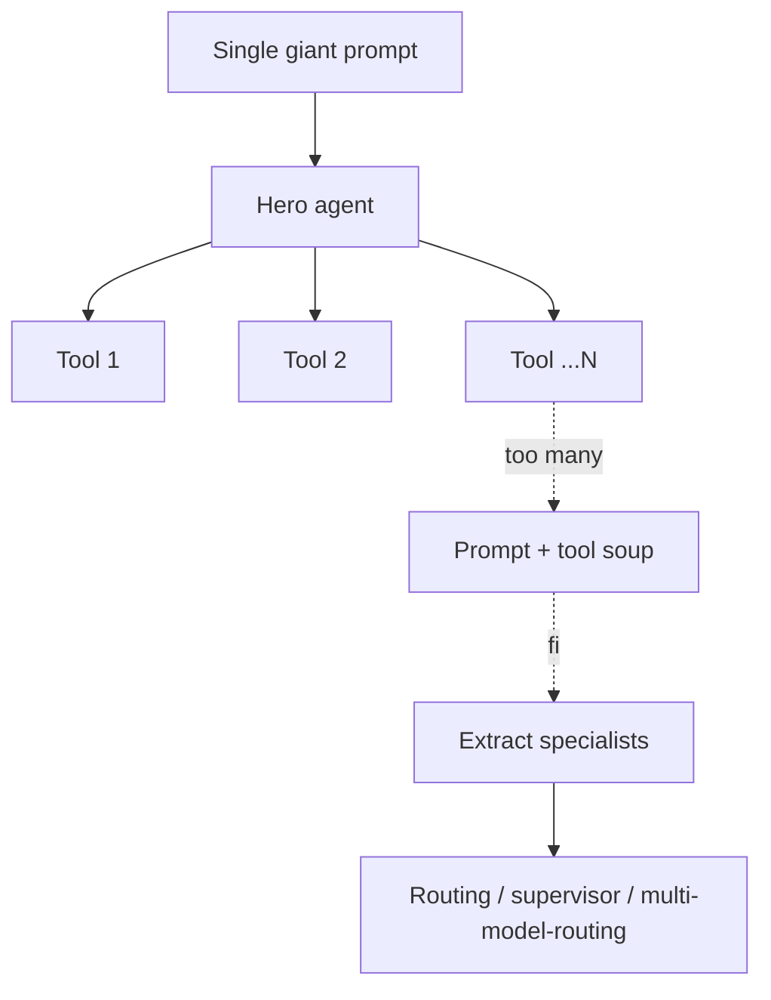

# Hero Agent

**Also known as:** Mega-Prompt Agent, God Agent

**Category:** Anti-Patterns  
**Status in practice:** deprecated

## Intent

Anti-pattern: stuff every capability into one agent with one giant prompt.

## Context

A team has a single agent that started small and is winning use cases. Each new capability — calendar handling, email, research, file editing — is added by appending more instructions to the system prompt and more entries to the tool list of that same agent. Splitting into specialists feels like premature optimisation, so the one agent keeps absorbing scope, often crossing a thousand prompt lines and dozens of registered tools.

## Problem

Past a certain size the single agent stops behaving like one coherent assistant and starts behaving like a confused junior who has been handed every job in the company. The model picks the wrong tool when two tools overlap, follows the wrong section of the prompt because two sections contradict each other, and the smallest user request now pays for the full giant prompt on every call. Latency, cost, and quality all regress together, and debugging which prompt fragment caused which behaviour becomes archaeological work.

## Forces

- Specialisation requires routing or multi-agent infrastructure that does not yet exist.
- Splitting feels like premature optimisation.
- One-prompt is fastest to ship and slowest to maintain.

## Applicability

**Use when**

- Cite this entry when every new capability lands in the same prompt and tool list.
- Warning signs: the system prompt has grown past a few hundred lines or the tool count past about a dozen, and regressions appear in unrelated features.
- Extract specialists via routing, supervisor, or multi-model-routing instead of growing the monolith.

**Do not use when**

- Any agent with more than a handful of distinct workflows.
- Any agent where cheap requests must not pay expensive prompt costs.
- Any team that needs independent ownership of separate capabilities.

## Therefore

Therefore: when the prompt passes a few hundred lines or the tool palette passes about a dozen, extract specialists behind a small router, so that cheap requests stop paying expensive prompts and capabilities stop colliding inside a single model.

## Solution

Don't. Once the prompt exceeds a few hundred lines or the tool count exceeds about a dozen, extract specialists. See routing, supervisor, multi-model-routing.

## Example scenario

A startup ships a single 'do-everything' assistant whose system prompt grew to 1800 lines and whose tool list passed forty entries. Latency triples, the model confuses calendar tools with email tools, and the cheapest 'what time is it' request now costs as much as a full research query. They diagnose hero-agent as the named anti-pattern and extract specialists: a small router up front, a calendar agent, a mail agent, a research agent. The monolith stays only as an escape hatch and the prompt shrinks by 80 percent.

## Diagram

## Consequences

**Liabilities**

- Quality regressions on each new capability.
- Cost ballooning.
- Debugging the agent becomes archaeology.

## What this pattern constrains

Avoiding it caps monolith growth: one agent must not accumulate every capability; past a few hundred prompt lines or about a dozen tools, specialists have to be extracted.

## Known uses

- **[Auto-GPT (2023)](https://github.com/Significant-Gravitas/AutoGPT)** — *Deprecated* — The canonical single do-everything agent: one prompt, every tool, publicly documented to loop and stall on real tasks — the failures that pushed the field toward scoped specialist agents.

## Related patterns

- *alternative-to* → [routing](routing.md)
- *alternative-to* → [supervisor](supervisor.md)
- *alternative-to* → [multi-model-routing](multi-model-routing.md)
- *complements* → [tool-explosion](tool-explosion.md)
- *complements* → [prompt-bloat](prompt-bloat.md)
- *alternative-to* → [sop-encoded-multi-agent](sop-encoded-multi-agent.md)
- *alternative-to* → [cross-domain-agent-network](cross-domain-agent-network.md)

## References

- (repo) *ai-standards/ai-design-patterns (Hero Agent)*, <https://github.com/ai-standards/ai-design-patterns>

**Tags:** anti-pattern, monolith
