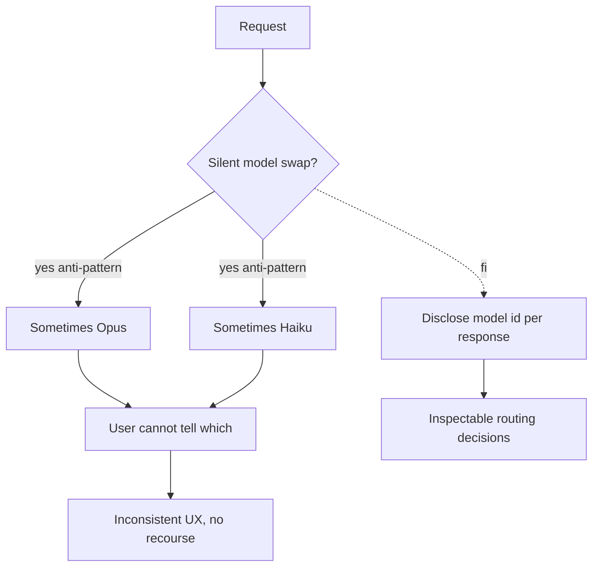

# Hidden Mode Switching

**Also known as:** Silent Model Swap, Undisclosed Routing

**Category:** Anti-Patterns  
**Status in practice:** deprecated

## Intent

Anti-pattern: silently swap the underlying model between requests without disclosing the change to users or operators.

## Context

A team operates an agent or chat product under real cost and capacity pressure, and the obvious lever is to route some traffic to a smaller, cheaper model and the rest to the flagship. The routing is implemented as a backend decision: nothing in the response, the user interface, or the trace tells the user which model actually produced a given answer. Operators may also lack a per-request record of the resolved model identity.

## Problem

When users compare runs over time, or compare two answers to the same prompt, they encounter quality differences they cannot explain — the agent feels sharper on Monday than on Saturday, code suggestions degrade overnight, and the same prompt produces different reasoning depth from one call to the next. They cannot reproduce results, cannot file a precise bug, and cannot trust evaluation numbers because the eval and the production traffic may have hit different models. Trust erodes faster than the cost savings accumulate.

## Forces

- Cost arbitrage feels too good to disclose.
- Per-request model disclosure adds UI complexity.
- Hidden routing complicates eval gates.

## Applicability

**Use when**

- Cite this entry when a router swaps the underlying model silently between requests.
- You are already here if users report quality shifts that operators cannot reproduce because traces omit model identity.
- Disclose model identity per response and make routing decisions inspectable (see multi-model-routing).

**Do not use when**

- Any user-facing product where quality must be diagnosable.
- Any audit or compliance setting requiring per-request model identity.
- Any environment where users compare outputs across runs.

## Therefore

Therefore: disclose the resolved model identity on every response and make the routing decision inspectable in traces, so that users can diagnose quality drift and reproduce results across runs.

## Solution

Don't. Disclose model identity per response. Use multi-model-routing transparently. Make routing decisions inspectable.

## Example scenario

A coding-agent vendor silently routes nights and weekends to a smaller model to save cost. Users start filing bug reports about 'the model getting dumber on Saturday morning' and cannot reproduce them on Monday. The team realises they have been doing hidden-mode-switching as an unacknowledged anti-pattern and starts including the resolved model id in every response header and in the agent's own status line. Routing rules are published; users can pin a model if they need consistency. Trust climbs back.

## Diagram

## Consequences

**Liabilities**

- Trust erosion when users discover the swap.
- Reproducibility broken across requests.
- Eval results become misleading.

## What this pattern constrains

Avoiding it imposes a disclosure rule: the serving model must not change between requests without the change being visible to users and operators; routing decisions have to be inspectable.

## Known uses

- **GPT-4 -> GPT-4o auto-router incident, 2024** — *Available*

## Related patterns

- *alternative-to* → [multi-model-routing](multi-model-routing.md)
- *alternative-to* → [lineage-tracking](lineage-tracking.md)
- *alternative-to* → [model-card](model-card.md)

**Tags:** anti-pattern, routing, disclosure
