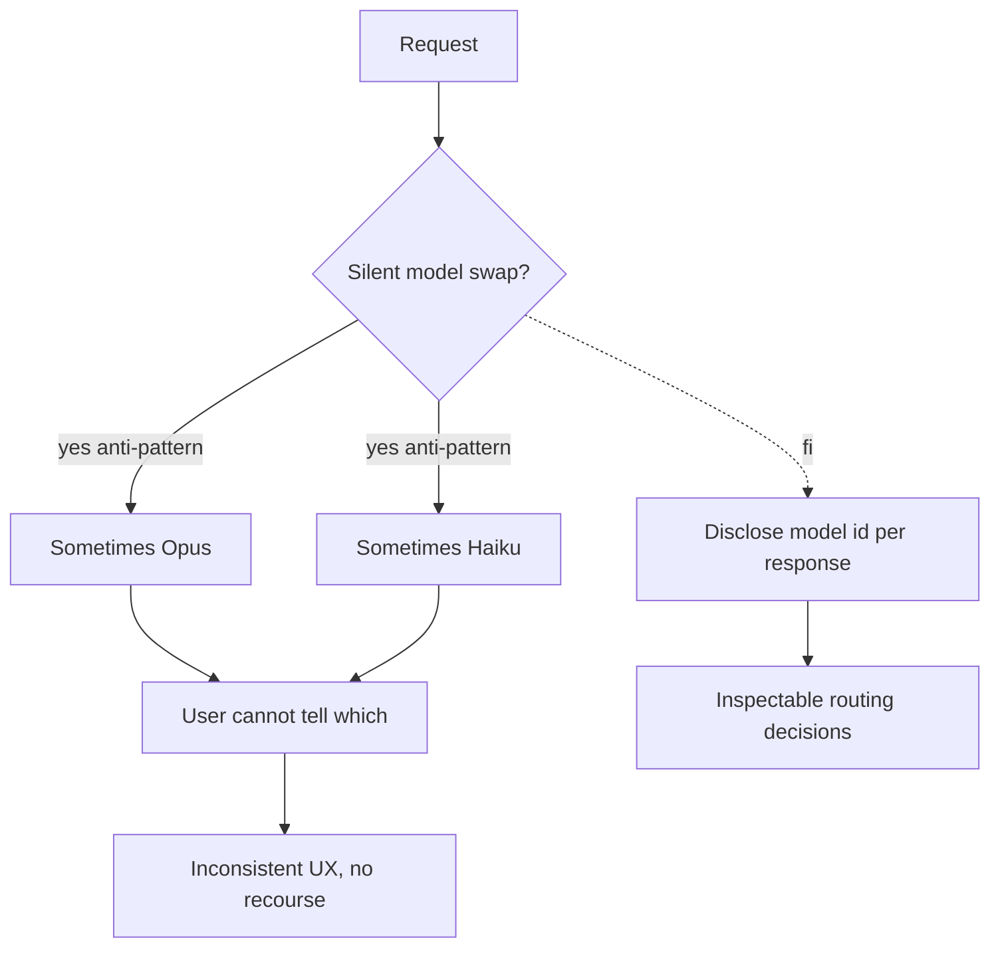

# Hidden Mode Switching

**Also known as:** Silent Model Swap, Undisclosed Routing

**Category:** Anti-Patterns  
**Status in practice:** deprecated

## Intent

Anti-pattern: silently swap the underlying model between requests without disclosing the change to users or operators.

## Context

Cost or capacity pressure pushes a product to route some requests to cheaper models; the routing is invisible.

## Problem

Reproducibility breaks; users notice quality changes they cannot diagnose; trust erodes.

## Forces

- Cost arbitrage feels too good to disclose.
- Per-request model disclosure adds UI complexity.
- Hidden routing complicates eval gates.

## Applicability

**Use when**

- Never use this; routing model changes silently undermines reproducibility and trust.
- Use multi-model-routing transparently with the chosen model disclosed per response.
- Make routing decisions inspectable in traces and operator dashboards.

**Do not use when**

- Any user-facing product where quality must be diagnosable.
- Any audit or compliance setting requiring per-request model identity.
- Any environment where users compare outputs across runs.

## Solution

Don't. Disclose model identity per response. Use multi-model-routing transparently. Make routing decisions inspectable.

## Example scenario

A coding-agent vendor silently routes nights and weekends to a smaller model to save cost. Users start filing bug reports about 'the model getting dumber on Saturday morning' and cannot reproduce them on Monday. The team realises they have been doing hidden-mode-switching as an unacknowledged anti-pattern and starts including the resolved model id in every response header and in the agent's own status line. Routing rules are published; users can pin a model if they need consistency. Trust climbs back.

## Diagram

## Consequences

**Liabilities**

- Trust erosion when users discover the swap.
- Reproducibility broken across requests.
- Eval results become misleading.

## What this pattern constrains

By definition, this anti-pattern imposes no useful constraint; the missing constraint is the failure mode.

## Known uses

- **GPT-4 -> GPT-4o auto-router incident, 2024** — *Available*

## Related patterns

- *alternative-to* → [multi-model-routing](multi-model-routing.md)
- *alternative-to* → [lineage-tracking](lineage-tracking.md)
- *alternative-to* → [model-card](model-card.md)

**Tags:** anti-pattern, routing, disclosure
