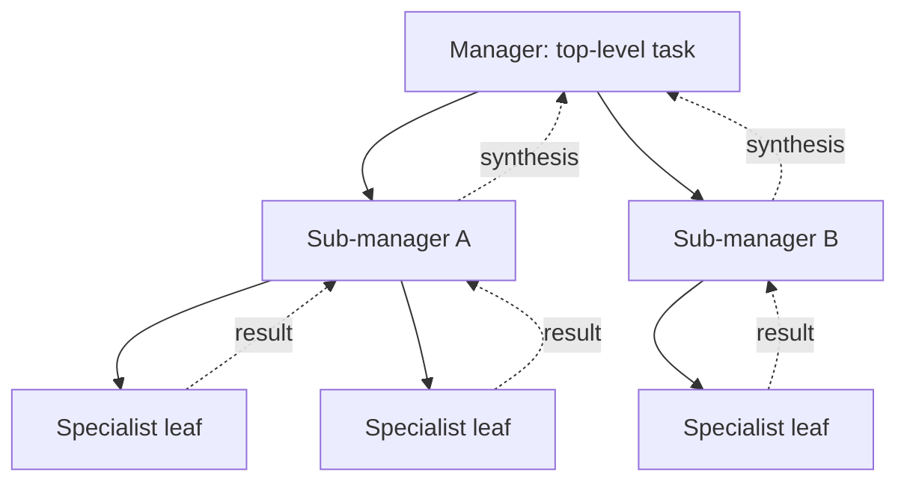

# Hierarchical Agents

**Also known as:** Manager-Worker Tree, Agent Hierarchy

**Category:** Multi-Agent  
**Status in practice:** mature

## Intent

Organise agents in a tree where higher-level agents decompose tasks for lower-level agents, recursively.

## Context

Tasks decomposable across multiple levels of granularity (project → epic → ticket → step); a flat supervisor would have too many direct reports.

## Problem

Flat supervisor patterns scale poorly: one supervisor with N specialists has prompt complexity that grows with N.

## Forces

- Tree depth trades latency for clarity.
- Inter-level communication needs a contract.
- Failure recovery: which level retries?

## Applicability

**Use when**

- Tasks decompose recursively and a single supervisor cannot cleanly orchestrate the breadth.
- Sub-tasks are themselves big enough to merit their own decomposition step.
- Bounded depth and breadth limits can be enforced to prevent runaway hierarchies.

**Do not use when**

- A flat supervisor over a small set of specialists already suffices.
- Bubbling synthesis up multiple levels is too lossy for the task.
- Latency and token cost of nested orchestration are unacceptable.

## Therefore

Therefore: organise agents as a tree where each non-leaf decomposes and dispatches downward and synthesises results upward, so that decomposition scales beyond what a flat supervisor's prompt complexity can hold.

## Solution

Each non-leaf agent receives a task, decomposes it, and dispatches sub-tasks to its children. Children may be specialists (leaves) or further managers. Results bubble up; each manager synthesises its children's outputs. Bounded depth and breadth prevent runaway hierarchies.

## Example scenario

A consulting firm builds a market-research agent with one supervisor and twenty specialist tools: data-fetch, summarise, compare, draw-chart, and so on. As they add specialists for new verticals, the supervisor prompt balloons and the agent starts forgetting which tool to call. They restructure as hierarchical-agents: a root research-manager dispatches to vertical managers (healthcare, fintech), each of whom dispatches to leaf specialists for their domain. Depth and breadth are both capped, and adding a new vertical no longer touches the root prompt.

## Diagram

## Consequences

**Benefits**

- Scales to deep decomposition.
- Each level has clear responsibility.

**Liabilities**

- Latency multiplies with depth.
- Coordination bugs become hard to localise.

## What this pattern constrains

An agent communicates only with its parent and children; cross-tree communication is forbidden.

## Known uses

- **AutoGen GroupChat with nested groups** — *Available*
- **CrewAI hierarchical processes** — *Available*

## Related patterns

- *generalises* → [supervisor](supervisor.md)
- *specialises* → [orchestrator-workers](orchestrator-workers.md)
- *complements* → [goal-decomposition](goal-decomposition.md)
- *generalises* → [agent-as-tool-embedding](agent-as-tool-embedding.md)

## References

- (doc) *AutoGen multi-agent docs*, <https://microsoft.github.io/autogen/>

**Tags:** multi-agent, hierarchy
