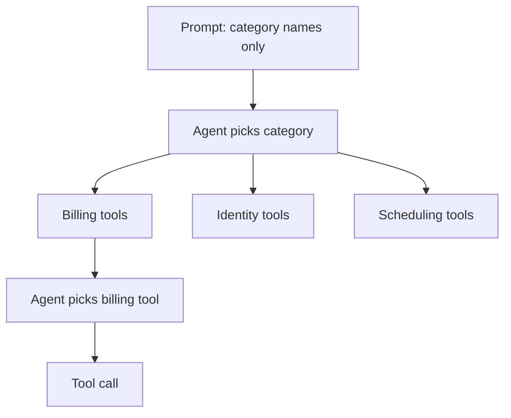

# Hierarchical Tool Selection

**Also known as:** Tool Tree, Categorised Tool Catalog, Two-Stage Tool Routing

**Category:** Tool Use & Environment  
**Status in practice:** emerging

## Intent

Organise tools into a tree of categories so the agent first picks a branch and then a specific tool within it.

## Context

An agent has access to dozens or hundreds of tools — every public API the company exposes, every micro-action across many domains (billing, identity, scheduling, search, code, files). Presenting them all in the system prompt blows up the context window and overloads the model's selection step.

## Problem

A flat tool list collapses in two ways past roughly 30 tools. Token cost grows linearly in description length × tool count. Selection error rises non-linearly as the model confuses similar tools or misses the right one entirely. Worse, permissions and ownership are flat too — there is no scope at which a team can say 'these are the billing tools, this team owns them'. The agent ends up either under-tooled (some tools dropped) or unreliable (the model picks wrong).

## Forces

- Token cost of tool descriptions scales with catalog size.
- Model selection accuracy degrades past a few dozen choices.
- Permissions, ownership, and audit naturally group by domain.
- The first-stage choice (category) must be cheap enough not to cost what was saved.

## Applicability

**Use when**

- Tool catalog exceeds roughly 30 tools.
- Tools naturally cluster into domain categories.
- Permissions or ownership can scope per category.

**Do not use when**

- Catalog is small enough to present flat.
- Tools span domains so heavily that categorisation is arbitrary.
- Latency budget cannot absorb the extra top-level decode.

## Therefore

Therefore: organise tools into a tree of categories and have the agent first pick a category, then pick a specific tool within it, so token cost and selection error scale sub-linearly with catalog size.

## Solution

Group tools into named categories (billing, identity, scheduling, search, code, files). At the top level the agent sees only the category names with one-line descriptions. After it picks a category, it sees the tools in that branch. Permissions can scope per branch (this user can read but not write billing tools). For very large catalogs nest the tree further. The cost is one extra decoding step at the top; the saving is paying full tool descriptions only for the chosen branch.

## Example scenario

An ops agent has 180 tools spanning eight domains. The system prompt presents only the eight category names. After picking 'billing' the agent receives the 24 billing tools. End-to-end latency is one extra decode at the top; total tokens drop ~80% on average and selection accuracy on a 200-trace eval rises from 64% to 91%.

## Diagram

## Consequences

**Benefits**

- Token cost stays bounded as the catalog grows.
- Selection accuracy improves because the model picks among few items at each level.
- Permissions and ownership map onto the tree naturally.

**Liabilities**

- An extra step per call adds latency and one more decoding decision.
- Categories that don't carve nature at the joints (a tool that spans two domains) need duplication or compromise.
- Wrong top-level pick produces a dead-end where the right tool is in a different branch.

## What this pattern constrains

A large tool catalog must not be presented as a flat list to the model; tools are organised into named categories and the agent first picks a category before seeing tool-level descriptions.

## Known uses

- **Building Applications with AI Agents (Albada) — Hierarchical Tool Selection** — *Available* — <https://www.oreilly.com/library/view/building-applications-with/9781098176495/ch04.html>
- **MCP-Zero hierarchical semantic routing (arXiv 2506.01056)** — *Available* — <https://arxiv.org/abs/2506.01056>

## Related patterns

- *complements* → [tool-use](tool-use.md)
- *complements* → [agent-skills](agent-skills.md)
- *complements* → [mcp](mcp.md)
- *complements* → [mcp-bidirectional-bridge](mcp-bidirectional-bridge.md)
- *complements* → [agent-computer-interface](agent-computer-interface.md)
- *composes-with* → [tool-transition-fusion](tool-transition-fusion.md)
- *alternative-to* → [one-tool-one-agent](one-tool-one-agent.md)

## References

- (book) *Building Applications with AI Agents*, Michael Albada, 2025, <https://www.oreilly.com/library/view/building-applications-with/9781098176495/ch04.html>
- (paper) *MCP-Zero: Active Tool Discovery for Autonomous LLM Agents*, 2025, <https://arxiv.org/abs/2506.01056>

**Tags:** tool-use, scaling, routing
