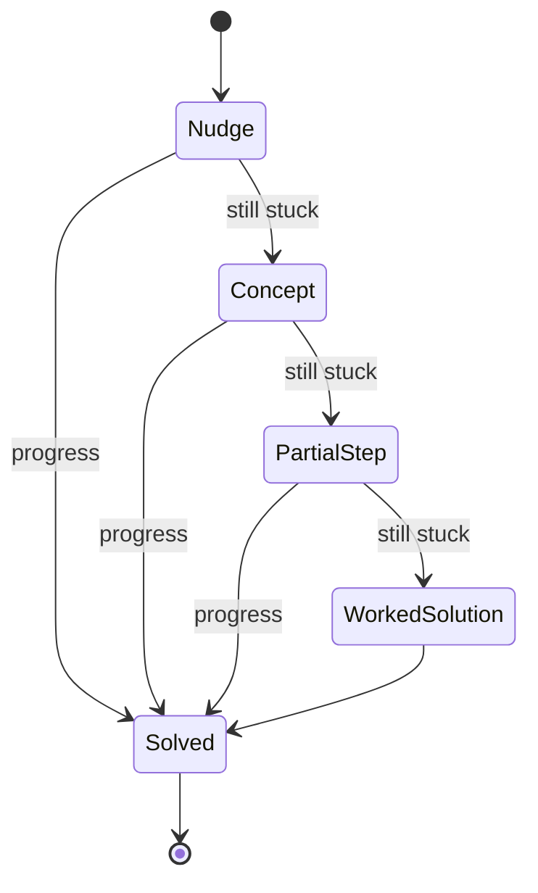

# Hint Ladder

**Also known as:** Graduated Scaffolding, Hint Sequence, Smallest-Nudge-First

**Category:** Safety & Control  
**Status in practice:** emerging

## Intent

Withhold the direct answer and release help along a graduated ladder, starting with the smallest abstract nudge and increasing specificity toward a worked solution only as the learner stays stuck.

## Context

A tutoring or coaching agent helps a learner work through problems they are meant to master, not just get past. The agent can produce the full solution instantly, and a learner who is stuck will often ask for exactly that. The pedagogical goal, though, is for the learner to do the cognitive work, so the agent's help has to support that work rather than replace it.

## Problem

An agent optimised for helpfulness answers the question it is asked, which for a stuck learner means handing over the solution. That resolves the immediate request but removes the productive struggle that produces durable learning, and it does so invisibly because the learner feels helped. The agent needs a way to give just enough help to keep the learner moving without giving so much that it does the thinking for them.

## Forces

- A stuck learner wants the answer now, but the answer now is what prevents the learning the session exists for.
- Too little help leaves the learner stuck and frustrated; too much help removes the struggle that builds the skill.
- The right amount of help depends on the learner's current state, which changes with each attempt and is only estimated, not known.
- Graduated help costs more turns and more judgement than simply answering, and a determined learner can still push for the full solution.

## Therefore

Therefore: order help by specificity, give the least specific hint that might unstick the learner, and step up the ladder toward a worked solution only when successive attempts show the smaller nudge was not enough.

## Solution

Define a ladder of help from least to most specific — an orienting nudge, a pointer to the relevant concept, a partial step, and finally a worked solution — and start at the bottom. After each hint the learner attempts the problem again; on a failed attempt the agent steps up one level, and on progress it holds or steps down. The level is keyed to an estimate of the learner's mastery and to the count of consecutive failures, so specificity rises just fast enough to keep the learner moving and no faster. The full solution sits at the top of the ladder as a last resort, reached only after the smaller nudges have been tried, rather than offered first.

## Structure

```
Stuck learner -> hint at rung k (least specific that may work) -> learner retries -> fail: rung k+1 / progress: hold or k-1 -> worked solution only at the top rung
```

## Diagram



*Help climbs from the least-specific nudge toward a worked solution only on repeated failure; progress exits the ladder early.*

## Example scenario

A student stuck on a recursion exercise asks the tutoring agent for the answer. Instead of printing the function, the agent first asks what the base case should be. The student tries and fails twice, so the agent steps up and names the missing base case, then on a third failure shows the one line that handles it — and only if the student is still stuck does it reveal the full function.

## Consequences

**Benefits**

- The learner does the cognitive work that produces durable learning, while still getting unstuck when genuinely blocked.
- Help is matched to need, so capable learners get a light touch and struggling ones get more, without a fixed one-size hint.
- The worked solution remains available as a last resort, so the ladder does not trap a learner who is truly stuck.

**Liabilities**

- Estimating learner state wrongly steps the ladder too fast or too slow, either over-helping or leaving the learner stranded.
- Graduated help is slower and chattier than answering outright, which can frustrate a learner who only wanted the answer.
- A determined learner can climb the ladder deliberately by failing on purpose to extract the full solution.

## Failure modes

- Ladder skipping — the agent jumps to a near-complete hint on the first failure, collapsing the ladder to answer-on-demand.
- Stuck at the bottom — the agent keeps giving vague nudges to a genuinely blocked learner who needed a concrete step.
- Mastery mis-estimate — a wrong read of the learner's state keys the starting rung too high or too low.
- Gaming — the learner fails deliberately to walk the ladder up to the worked solution.

## What this pattern constrains

The worked solution is never offered first; help must start at the least-specific rung that might unstick the learner, and specificity may rise only after an attempt shows the smaller nudge was insufficient.

## Applicability

**Use when**

- The learner is meant to build a skill, so getting unstuck matters less than doing the work.
- The agent can estimate whether the learner is progressing or stuck between attempts.
- Help can be decomposed into levels of increasing specificity up to a full solution.

**Do not use when**

- The user wants a direct answer for a real task rather than a learning exercise, where withholding it is obstruction.
- Time pressure or safety means the correct answer should be given immediately.
- No signal of learner progress is available, so the ladder cannot be stepped sensibly.

## Components

- Hint ladder — the ordered levels of help from least-specific nudge to full worked solution
- Mastery estimator — infers from attempts whether the learner is progressing or stuck
- Level controller — steps up on a failed attempt, holds or steps down on progress
- Attempt loop — returns the problem to the learner after each hint so they act before more help arrives
- Solution gate — keeps the worked solution at the top rung, reached only after lower rungs are tried

## Tools

- Tutoring LLM — generates each rung's hint at the chosen specificity
- Progress signal — test results, answer checks, or learner self-report that drive the level controller
- Mastery model — optional learner-state estimate that sets the starting rung

## Evaluation metrics

- Post-removal retention — learner performance once the agent's help is taken away, versus answer-on-demand
- Rung distribution — how often each level was used, showing whether the ladder collapses to top-rung help
- Unstick rate — fraction of stuck episodes the learner resolved without the worked solution
- Over-help incidents — count of sessions where the worked solution was given before lower rungs were tried

## Known uses

- **[JetBrains AI hints for online learning](https://blog.jetbrains.com/research/2025/07/ai-hints-for-online-learning/)** _available_ — Releases the smallest possible nudge first and only gives more explicit guidance once the learner is still stuck after attempting with lighter hints.
- **[Next-step hint generation for novice programmers](https://arxiv.org/pdf/2411.18151)** _pure-future_ — Human tutors give hint sequences that start abstract and refine toward the fully specified solution; studied for evaluating AI next-step hints.

## Related patterns

- _alternative-to_ **Socratic Questioning Agent** — Socratic questioning responds only in questions to surface the learner's own knowledge; the hint ladder releases help of rising specificity keyed to consecutive failures, and its rungs may be statements, not only questions.
- _complements_ **Dynamic Scaffolding** — Dynamic scaffolding injects scaffolds by task type; the hint ladder varies help specificity by the learner's per-attempt progress within one task.
- _complements_ **Disambiguation** — Both delay the direct answer: disambiguation asks to resolve ambiguity before acting, the hint ladder withholds the solution to preserve the learner's struggle.

## References

- [Helping Students Get Unstuck: AI-Based Hints for Online Learning](https://blog.jetbrains.com/research/2025/07/ai-hints-for-online-learning/) — 2025
- [Howzat? Appealing to Expert Judgement for Evaluating Human and AI Next-Step Hints for Novice Programmers](https://arxiv.org/pdf/2411.18151) — 2024
