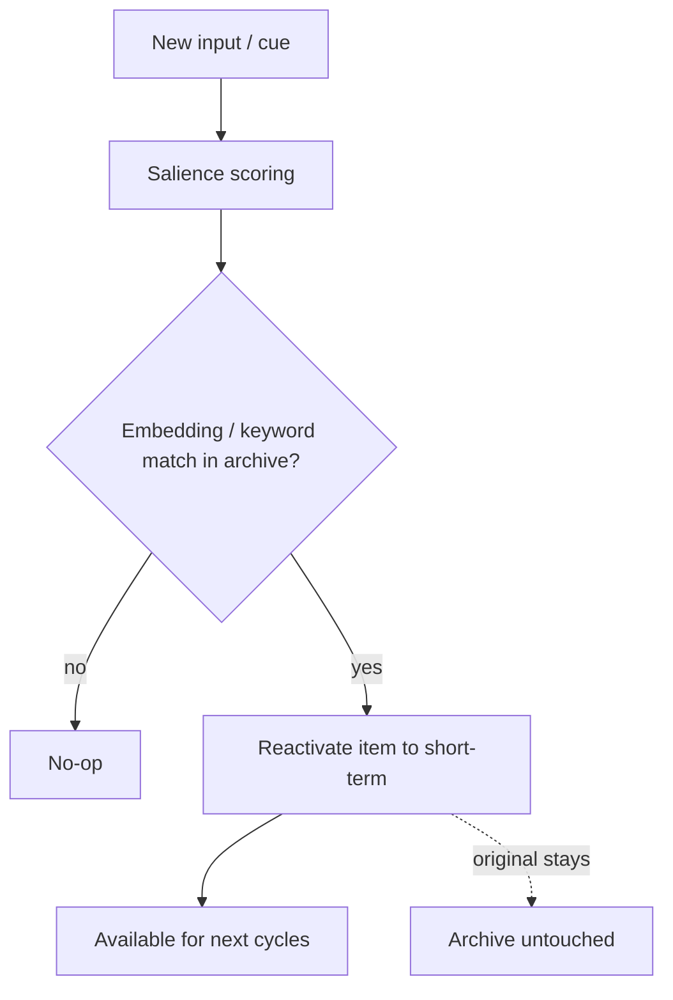

# Hippocampal Rehearsal

**Also known as:** Memory Reactivation, Lift-from-Archive

**Category:** Memory  
**Status in practice:** experimental

## Intent

Lift archived memory items back into short-term tiers when something re-attends to them.

## Context

A long-running agent has archived something that becomes relevant again; cold-storage retrieval is slow and out-of-band.

## Problem

Archived items might as well not exist if the agent never thinks about them again, even when current context makes them relevant.

## Forces

- Re-attention triggers must be cheap to evaluate.
- Lifting too aggressively floods the working tier.
- The lifted item is now a duplicate of the archive copy.

## Applicability

**Use when**

- Archived memory items become relevant again and must re-enter short-term context.
- A salience scorer can match current context against the archive reliably.
- Reactivation can be bounded so short-term memory does not flood.

**Do not use when**

- Memory is small enough that nothing needs to be archived in the first place.
- Salience scoring is unreliable and would surface noise rather than relevance.
- Short-term context cannot afford the additional reactivated tokens.

## Solution

When salience scoring matches against archived items (embedding similarity, keyword match, explicit reference), the matched item is reactivated into short-term memory for one or more cycles. The original archive copy stays untouched.

## Example scenario

A long-running personal agent archives anything older than seven days into cold storage. When the user mentions 'the dentist thing' six weeks later, the agent has no idea what they mean. The team adds hippocampal-rehearsal: the salience scorer also runs against archived items, and when the embedding similarity for 'dentist' clears the threshold, the original archived note ('molar crown, scheduled Nov 14') is reactivated into short-term memory for the next several cycles. The agent picks up the thread without the user explaining anything.

## Diagram

## Consequences

**Benefits**

- Long-tail relevance does not require the agent to remember to remember.
- Mimics the rehearsal step of biological memory consolidation.

**Liabilities**

- False rehearsals waste working-memory slots.
- Operationally complex; requires content-addressable storage.

## What this pattern constrains

Archived items become readable only after rehearsal lifts them; direct cold reads are not part of the agent's primary path.

## Known uses

- **Sparrot** — *Available*. Stage P5+ rehearsal step.

## Related patterns

- *used-by* → [five-tier-memory-cascade](five-tier-memory-cascade.md)

## References

- (paper) *Memory consolidation through hippocampal-cortical replay (review)*, 2017

**Tags:** memory, rehearsal
