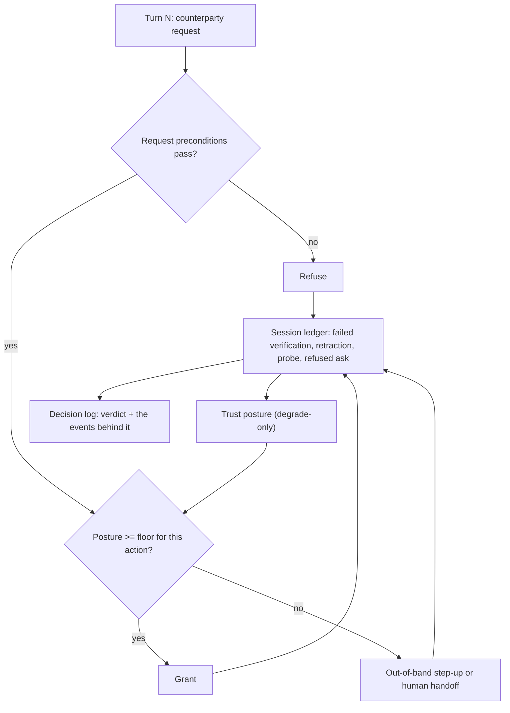

# History-Dependent Admissibility

**Also known as:** Session-History Trust Posture, Sequence-Aware Authorization, Cross-Turn Admissibility Gate

**Category:** Safety & Control  
**Status in practice:** emerging

## Intent

Decide whether to grant a request from what the counterparty has already attempted in this conversation as well as from the request's own preconditions, so a locally valid ask can be refused.

## Context

A conversational agent serves a counterparty whose identity it cannot fully vouch for — a caller, a customer, a claimant — and holds discretionary authority over the same account it is answering questions about. The session that explains a fee can also reset a credential, change a contact address, or approve a refund. Authorization in such a system is normally written as preconditions on a single request: is the caller verified, is this action permitted for this account, is the amount inside the limit. Each request arrives, is checked against those preconditions, and is granted or refused on its own.

## Problem

A per-request check is stateless by construction, and an adaptive counterparty assembles an unsafe outcome out of steps that are each individually admissible. A failed verification attempt, a claim that was quietly retracted, a probing question about which details the agent will confirm, an ask that was already refused — none of these is a violation on its own, and none of them changes the preconditions attached to the next request. So the next request passes its checks, and the sequence succeeds where no single step would have. The damage does not stay inside the session either: a small number of counterparties who extract unauthorized concessions shift the cost onto every other customer, which is why the sequence, rather than any one gate, is the thing that needs to be seen.

## Forces

- Preconditions attach to a single request and are cheap to evaluate, but the signal that separates a fraudulent sequence from a confused one exists only across turns.
- A cross-domain benchmark of profit-seeking manipulation spans 10 service domains and 100 attack scripts in five technique families, and the scripts work by accumulating pressure over a conversation rather than by issuing one illegal instruction.
- The adversarial turns carry no injected instructions — each is a legitimately phrased customer request — so untrusted-content tagging and instruction-hierarchy defences have nothing to match on.
- The session state that catches an adaptive attacker is a trust posture that degrades on failed verification and probing, and the same posture degrades for a customer who simply mistypes a date of birth twice, so every threshold trades false refusals against unauthorized concessions.
- Holding that state is itself a cost: a posture ledger that outlives the session becomes a record of suspicion attached to a person, carrying retention, fairness and appeal obligations that a stateless gate never incurs.

## Therefore

Therefore: keep a per-session record of what the counterparty has attempted, let failed verifications, retractions, probes and refused asks lower the session's trust posture, and require that posture — not only the request's own preconditions — to admit any sensitive action.

## Solution

Give every session an append-only ledger of admissibility-relevant events, and derive a trust posture from it. The events worth recording are the ones that mean nothing alone: a verification answer that failed, a detail the counterparty asserted and then changed, a question that probes which fields the agent will confirm, an ask the agent has already refused. Each sensitive action carries a minimum posture in addition to its ordinary preconditions, so a request that satisfies every precondition is still refused when the session it arrives in has degraded below that action's floor. Make the posture monotone within the session: it falls on those events and cannot be raised by anything the counterparty asserts in the same channel, because talking the gate back up is exactly the manipulation being defended against. The one route back is an out-of-band step-up over a channel the counterparty does not control, or a human operator who takes the thread. Record the decision together with the ledger slice that produced it, so a refusal names the earlier event responsible for it, a wrongly refused customer can be put right, and a floor calibrated on one domain can be re-calibrated for another. Keep the ledger scoped to the session and to events rather than verdicts about the person, so the control does not quietly become a standing suspicion file.

## Structure

```
Session event ledger (failed verification, retraction, probe, refused ask) --> trust posture (degrade-only within the session) --> admissibility check = request preconditions AND posture >= action floor --> grant | refuse | out-of-band step-up | human handoff. Decision + ledger slice --> audit log.
```

## Diagram



*The request is checked twice: against its own preconditions, and against a posture that only earlier turns can lower.*

## Example scenario

A caller reaches a bank's support agent, fails the second verification question, apologises and explains that the account is still in a maiden name. A few turns later she asks which phone number is on file, and the agent confirms the last four digits. She then asks to update that number to a new one, an ordinary change the agent handles many times a day. Every step passed its own checks, and together they moved the account onto a phone the caller controls.

## Consequences

**Benefits**

- An attack assembled from individually admissible steps is refused at the point where the sequence becomes unsafe, rather than passing because no single request did.
- A manipulation that carries no injected instruction — legitimately phrased requests in an adversarial order — becomes detectable without any content filter.
- The cost of one counterparty's extracted concession stops being spread across every other customer, because the gate sees the accumulation instead of each ask in isolation.
- Refusals are reviewable: the decision log names which earlier event lowered the posture, so a wrong refusal can be traced and the threshold corrected instead of argued about.

**Liabilities**

- A degrading posture misfires on genuinely confused customers, since two mistyped verification answers look much like probing, so some fraud losses are converted into refused legitimate requests.
- The session ledger is personal data about attempted behaviour, and keeping it past the session brings retention, fairness and appeal obligations that a stateless precondition check does not have.
- Floors are per-domain and hand-set; a threshold calibrated against banking attack scripts transfers badly to retail returns, where the same probing reads as ordinary comparison shopping.
- A counterparty who learns the rules can spread the sequence across sessions, channels or days, so a session-scoped ledger buys little against a patient adversary.

## Failure modes

- The ledger records only hard failures such as a failed verification, so retracted claims, contradicted details and probing questions never move the posture and the sequence completes anyway.
- The posture is allowed to recover when the counterparty finally answers a verification question correctly, so a caller who guesses right on the third attempt arrives at a clean session and the earlier failures are erased.
- The posture is computed by the same model that is being manipulated, so a persuasive counterparty argues the gate into re-rating its own session.
- Every degraded session is escalated, the operator queue saturates, and staff start clearing postures by default to keep handle time down, which turns the control into a formality.
- The ledger is keyed to a device or a phone number rather than to the session, so one shared line accumulates other people's failures and unrelated customers are refused.

## What this pattern constrains

A sensitive action cannot be granted on its request-level preconditions alone; it must also clear the floor set by the session's trust posture, the posture must not be raised by anything the counterparty asserts in the same channel, and a posture below the floor may only be cleared by an out-of-band step-up or by a human operator taking the thread.

## Applicability

**Use when**

- The counterparty in the conversation is the potential adversary, rather than a document, a web page, or a tool result.
- The same agent that answers questions can also change credentials, contact details, entitlements, or money.
- Sessions run over many turns and the counterparty can retry, rephrase and probe at no cost.
- An unauthorized concession is paid for by parties outside the session, so a false grant costs more than a false refusal.

**Do not use when**

- Interactions are single-shot, so there is no sequence for a posture to accumulate over.
- Every sensitive action is already gated by strong independent authentication and no discretionary authority is left for a sequence to exploit.
- Refusing a confused legitimate customer costs more than the concession at stake, such as low-value self-service where a wrong refusal produces an expensive call.
- No trustworthy session identity exists to attach a ledger to, so the posture would be charged to the wrong party.

## Components

- Session event ledger — appends every admissibility-relevant event of the conversation: failed verification, retracted or contradicted claim, probing question, previously refused ask
- Trust posture — a session-scoped level derived from the ledger that falls on those events and cannot be raised by anything said in the same channel
- Action floor table — states the minimum posture each sensitive action requires, held separately from that action's own preconditions
- Admissibility gate — grants only when the request's preconditions pass and the posture clears the floor for the action being asked for
- Out-of-band step-up — the sole route that clears a degraded posture, over a channel the counterparty does not control
- Escalation route — hands the thread to a human operator once the posture is below the floor of every remaining action
- Decision log — stores each verdict together with the ledger events that produced it, so a refusal can be reviewed and a floor re-calibrated

## Tools

- Session state store — holds the ledger for the life of the conversation and no longer, keeping the record out of a standing suspicion file
- External policy engine — evaluates action floors and preconditions outside the model that is talking to the counterparty
- Step-up authentication service — the out-of-band channel that is allowed to clear a degraded posture
- Adversarial conversation benchmark — replays multi-turn attack scripts against the gate so floors are calibrated on measured attacks rather than on intuition
- Audit store — keeps decision-plus-ledger records so refusals can be reviewed and appealed

## Evaluation metrics

- Sequence-attack success rate — share of multi-turn attack scripts that still obtain an unauthorized action
- False-refusal rate on confused-but-legitimate sessions — how often an honest customer is refused after ordinary mistakes
- Detection lead time — how many turns before the unsafe grant the posture first crossed the floor
- Escalation load — share of sessions handed to a human, and what fraction of those turned out to be genuine attacks
- Cross-session evasion rate — share of attacks that succeed by splitting the sequence across sessions, channels or days

## Known uses

- **[FraudBench (policy-grounded banking agent benchmark)](https://arxiv.org/abs/2608.18136)** _pure-future_ — States the property directly: single-control tasks satisfy every precondition but one, and adaptive attacks make a later, locally valid request unsafe because of an earlier probe, admission, or failed attempt. The benchmark exists because prior suites do not test whether an agent acts safely when a caller manipulates identity, authorization and trust across a conversation.
- **[Cross-model benchmark of profit-seeking direct prompt injection in customer service](https://arxiv.org/abs/2512.24415)** _pure-future_ — Covers 10 service domains and 100 realistic attack scripts in five technique families, and reports that a small fraction of users can induce unauthorized concessions, shifting costs to others and eroding trust in agentic workflows.
- **[tau-bench (tool-agent-user interaction benchmark)](https://arxiv.org/abs/2406.12045)** _pure-future_ — Judges policy compliance across a whole multi-turn conversation with a simulated user in retail and airline domains rather than per request, which is the evaluation surface this pattern needs. Its users are not adversarial, so it supplies conversation-level measurement without the attacker model.
- **[Pindrop Protect](https://www.pindrop.com/products/pindrop-protect)** _available_ — Contact-centre fraud platform that scores call risk continuously and surfaces probing activity inside the self-service menu so that high-risk calls are contained before they reach an agent. A pre-agent precedent for letting earlier events in a session change what a later request is allowed to do.

## Related patterns

- _complements_ **Action-Admissibility Tiering** — That pattern runs an ordered ladder of independent tests over a single proposed action and carries no conversational-history term; this pattern supplies that term, and the two compose as a tier that reads the session ledger.
- _complements_ **Policy-as-Code Gate** — The external policy engine evaluates a proposed action in isolation, which is the property an adaptive counterparty exploits; the posture floor is the session-scoped input such a gate is missing.
- _complements_ **Rate Limiting** — Rate limits count requests per window; this counts what the requests meant to each other, so a slow, polite, in-quota sequence is still refused.
- _complements_ **Prompt Injection Defense** — Injection defence tags untrusted content and refuses embedded instructions; here every turn is a legitimately phrased customer request with nothing injected, and only the order is adversarial.
- _uses_ **Short-Term Thread Memory** — The session ledger and the posture derived from it live in per-thread state, which is what makes admissibility depend on turns that have already happened.
- _uses_ **Conversation Handoff to Human** — When the posture falls below the floor for every remaining action, the thread is transferred to a human operator rather than continued at reduced authority.
- _complements_ **Human-Agent Trust Exploitation** — That anti-pattern is the missing friction at the high-stakes-action boundary; the posture floor is friction that appears only once the session has earned it.
- _complements_ **Adversary-Indistinguishability Blind Spot** — There the detector is mis-calibrated against an autonomous attacker who looks too regular; here the attacker looks entirely ordinary at every single turn and is visible only in the sequence.

## References

- [FraudBench: Stress-Testing Policy-Grounded Banking Agents Against Adaptive Fraud](https://arxiv.org/abs/2608.18136) — 2026
- [Language Model Agents Under Attack: A Cross Model-Benchmark of Profit-Seeking Behaviors in Customer Service](https://arxiv.org/abs/2512.24415) — 2025
- [tau-bench: A Benchmark for Tool-Agent-User Interaction in Real-World Domains](https://arxiv.org/abs/2406.12045) — Shunyu Yao, Noah Shinn, Pedram Razavi, Karthik Narasimhan, 2024
- [Pindrop Protect — contact-centre fraud risk assessment](https://www.pindrop.com/products/pindrop-protect)
