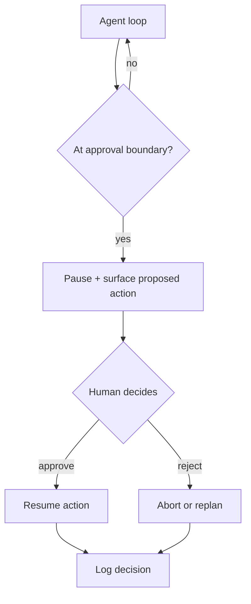

# Human-in-the-Loop

**Also known as:** HITL, Approval Gate, Confirmation Step, Risky Action Gate, Destructive Action Confirmation, Ask Before Risky Action

**Category:** Safety & Control  
**Status in practice:** mature

## Intent

Require explicit human approval at defined points before the agent performs an action.

## Context

A team runs an agent that can take consequential actions on the user's behalf — moving money, deleting files, sending public messages, deploying code, changing production configuration. The agent is correct most of the time but the cost of being wrong on certain action classes (an irreversible payment, a public broadcast, a destructive write) is much higher than the cost of pausing for a human to confirm. Some of those action classes also carry regulatory weight: the operator must be able to show that a human approved the step.

## Problem

If the agent acts fully autonomously across all action classes, then any moment of model overconfidence becomes a real-world incident: a typo-squatted vendor gets paid, the wrong customer gets emailed, the production database loses a table. If the agent gates every action behind human approval, users get approval-fatigued, start clicking through prompts without reading them, and the gating stops protecting anyone. Without a way to single out the small set of action classes that genuinely warrant a pause, the team has to choose between unsafe autonomy and unusable friction.

## Forces

- Where to place the gate trades latency and friction for safety.
- Approval-fatigue: too many gates train users to click through.
- Asynchronous approval stalls the loop.

## Applicability

**Use when**

- Action consequences at a defined boundary are too costly to leave to the model alone.
- A human reviewer is reachable within the latency budget the workflow allows.
- Approve, reject, and resume semantics can be expressed cleanly in the agent loop.

**Do not use when**

- Decisions must be made in unattended or sub-second autonomous settings.
- Volume is too high for human review to keep up without becoming a rubber stamp.
- Risk per action is small enough that automated guardrails are sufficient.

## Therefore

Therefore: pause the loop at a defined risk boundary and require an explicit approve or reject from a human before the action runs, so that consequence and confidence are decoupled at the moments that matter.

## Solution

Identify the boundary. Pause the loop. Surface the proposed action with enough context for the human to decide. Require an explicit approve/reject. Resume on approve; abort or replan on reject. Log the decision.

## Example scenario

A finance ops agent automates supplier payments end to end. After an incident where it paid $42k to a typo-squatted vendor domain, the team installs human-in-the-loop at the payment-execution boundary: the agent prepares the full payment proposal, surfaces vendor name, amount, IBAN, and the source invoice, then pauses for an explicit approve or reject from the on-call operator. Reject sends the proposal back for replan. The decision and the operator id are logged. Auto-payments resume but the bad-vendor class of incident stops.

## Diagram

## Consequences

**Benefits**

- Risk drops to a level the system can defend.
- Decision log captures human judgement that can later train an automated gate.

**Liabilities**

- User experience friction.
- Synchronous gates break async agents.

## What this pattern constrains

The defined action class cannot proceed without an affirmative approval signal.

## Known uses

- **Knitting-DSL Pipeline (Stash2Go)** — *Available*. Opt-in fixer: user clicks to invoke.
- **Bobbin (Stash2Go)** — *Planned*. On destructive writes (project create, queue add, stash subtract).

## Related patterns

- *complements* → [step-budget](step-budget.md)
- *generalises* → [cost-gating](cost-gating.md)
- *generalises* → [approval-queue](approval-queue.md)
- *generalises* → [disambiguation](disambiguation.md)
- *complements* → [compensating-action](compensating-action.md)
- *alternative-to* → [conversation-handoff](conversation-handoff.md)
- *alternative-to* → [communicative-dehallucination](communicative-dehallucination.md)

## References

- (doc) *LangGraph: Human-in-the-Loop*, <https://langchain-ai.github.io/langgraph/concepts/human_in_the_loop/>
- (paper) Yue Liu, Sin Kit Lo, Qinghua Lu, Liming Zhu, Dehai Zhao, Xiwei Xu, Stefan Harrer, Jon Whittle, *Agent design pattern catalogue: A collection of architectural patterns for foundation model based agents* (2025) — https://doi.org/10.1016/j.jss.2024.112278

**Tags:** safety, approval, hitl
