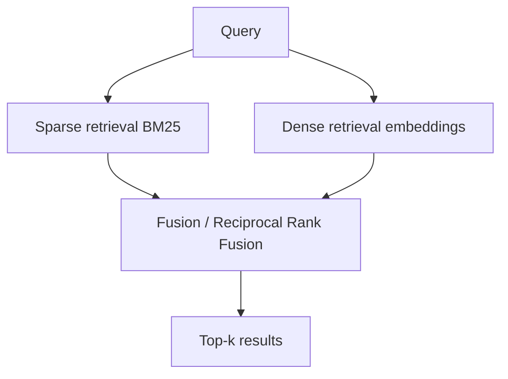

# Hybrid Search

**Also known as:** BM25 + Dense, Lexical + Semantic Retrieval

**Category:** Retrieval & RAG  
**Status in practice:** mature

## Intent

Combine sparse lexical retrieval (BM25) with dense vector retrieval and fuse the results.

## Context

A team is running a retrieval pipeline over a corpus where the user queries fall into two very different shapes. Some queries are short and exact, hinging on matching specific identifiers, product codes, person names, or technical terms verbatim. Other queries are longer and rely on semantic similarity between paraphrased ideas, where the surface vocabulary may differ between query and source. A single retrieval method serves only one of these well.

## Problem

Dense vector retrieval handles paraphrase and semantic similarity but misses queries that hinge on an exact identifier the embedding has flattened away. Sparse keyword retrieval — BM25 and similar lexical methods — handles exact terms but misses paraphrased queries whose vocabulary does not overlap with the source text. Picking either method alone means leaving recall on the table for whichever query shape was not chosen, and no downstream re-ranking stage can rescue a chunk that was never retrieved in the first place.

## Forces

- Score fusion (RRF, weighted sum, learned) is a design choice.
- Two indexes mean two pipelines to maintain.
- Tuning fusion weights is empirical and corpus-specific.

## Therefore

Therefore: index the corpus both lexically and semantically and fuse the rankings, so that exact-match recall and semantic recall both contribute to the final top-N.

## Solution

Index the corpus twice: BM25 for sparse, dense embeddings for semantic. At query time, retrieve top-k from each, fuse with Reciprocal Rank Fusion or weighted aggregation. Pass the fused top-N forward (typically into a reranker). Do not weight raw scores directly; use rank-based fusion (RRF) or score-normalised aggregation, since BM25 and dense scores live on incompatible scales.

## Applicability

**Use when**

- Queries mix semantic intent with rare tokens (codes, IDs, proper nouns) that embeddings miss.
- The corpus is heterogeneous enough that one retriever loses recall on part of it.
- Latency budget tolerates two retrievers plus a fusion step.

**Do not use when**

- The corpus is uniformly conceptual; dense alone is enough.
- The corpus is uniformly keyword-driven; BM25 alone is enough.
- Sub-50ms p95 retrieval is required and the second retriever blows the budget.

## Example scenario

A coding-assistant searches its codebase for 'how do we authenticate with Stripe?' Pure semantic search misses files that mention 'stripe-api-key' verbatim; pure keyword search misses files that talk about 'payment processor authentication'. Hybrid search runs both at once: a keyword scorer catches the exact tokens, an embedding scorer catches the conceptual matches, and a fusion step blends the two ranked lists.

## Diagram

## Consequences

**Benefits**

- Recall improvement over either alone, especially for mixed-vocabulary corpora.
- Robust to embedding model weaknesses on rare terms.

**Liabilities**

- Two indexes to keep in sync.
- Fusion tuning is empirical.

## What this pattern constrains

The retrieval set is the fusion of sparse and dense top-k; neither alone is the input to downstream stages.

## Known uses

- **Anthropic Contextual Retrieval** — *Available*
- **Most production RAG (Pinecone, Weaviate, Elastic Hybrid)** — *Available*

## Related patterns

- *specialises* → [naive-rag](naive-rag.md)
- *composes-with* → [cross-encoder-reranking](cross-encoder-reranking.md)
- *composes-with* → [contextual-retrieval](contextual-retrieval.md)

## References

- (paper) Cormack, Clarke, Buettcher, *Reciprocal Rank Fusion outperforms Condorcet and individual Rank Learning Methods*, 2009

**Tags:** rag, hybrid, bm25
