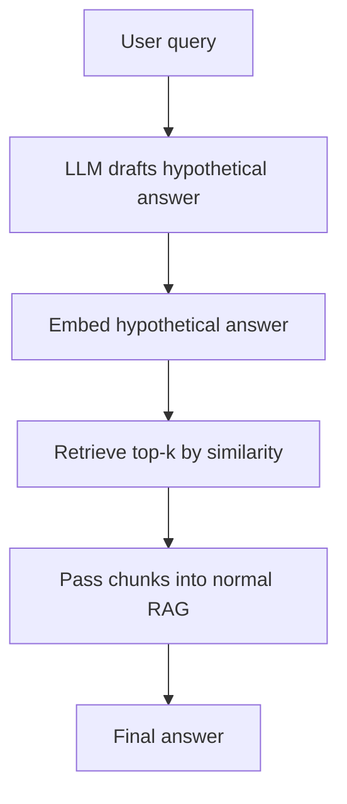

# HyDE

**Also known as:** Hypothetical Document Embeddings

**Category:** Retrieval & RAG  
**Status in practice:** emerging

## Intent

Have the LLM write a hypothetical answer document, embed it, and use it as the retrieval query.

## Context

Short or underspecified queries embed far from long-form passages in dense vector space; supervised relevance data is absent.

## Problem

Query-document length and style asymmetry hurts dense retrieval recall on short queries.

## Forces

- Hallucinated documents that miss the topic redirect retrieval badly.
- Adds an LLM call per query.
- Often paired with reranking to recover from off-topic hallucinations.

## Applicability

**Use when**

- Short user queries underperform on dense retrieval against long documents.
- An LLM call to draft a hypothetical answer fits the latency and cost budget.
- Recall on the first stage of RAG is the current bottleneck.

**Do not use when**

- Naive query embedding already retrieves the right chunks.
- Drafting hypothetical answers introduces unacceptable latency.
- The corpus or query distribution makes hallucinated drafts misleading anchors.

## Therefore

Therefore: have the LLM draft a hypothetical answer first and retrieve against its embedding, so that retrieval matches answer-shape, not just question-shape.

## Solution

On query: prompt the LLM to draft a hypothetical answer to the query. Embed the hypothetical answer. Retrieve top-k by similarity to that embedding (not the original query). Pass the retrieved chunks into normal RAG.

## Variants

- **Single-draft HyDE** — Generate one hypothetical answer and use its embedding as the query.
- **Multi-draft HyDE** — Generate N hypothetical answers, embed each, and average or take the union of their top-k retrievals.
- **Hybrid HyDE** — Average the hypothetical-answer embedding with the original query embedding to hedge against off-topic drafts.

## Diagram

## Example scenario

A documentation-search agent for a developer platform keeps missing relevant pages because users type three-word queries like 'rate limit auth' while the docs are written in long prose. The team adds HyDE: the LLM first drafts a hypothetical answer paragraph to the query, that paragraph is embedded, and retrieval runs against the answer-shaped embedding instead of the bare query. Recall on short queries jumps without changing the index, the encoder, or the docs.

## Consequences

**Benefits**

- Zero-shot improvement; no encoder fine-tuning.
- Particularly strong on short, underspecified queries.

**Liabilities**

- Off-topic hallucinations cause retrieval drift.
- One extra LLM call per query.

## What this pattern constrains

Retrieval queries the index with the hypothetical answer's embedding, not the user query's embedding.

## Known uses

- **LangChain HyDE retriever** — *Available*

## Related patterns

- *specialises* → [naive-rag](naive-rag.md)
- *composes-with* → [cross-encoder-reranking](cross-encoder-reranking.md)

## References

- (paper) Gao, Ma, Lin, Callan, *Precise Zero-Shot Dense Retrieval without Relevance Labels*, 2022, <https://arxiv.org/abs/2212.10496>

**Tags:** rag, retrieval, embedding
