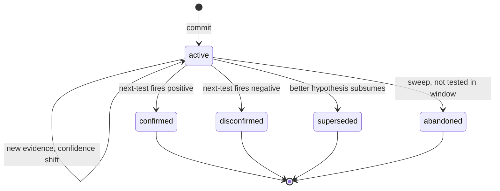

# Hypothesis Tracking

**Also known as:** Hypothesis Ledger, Provisional-Answer Store

**Category:** Cognition & Introspection
**Status in practice:** experimental

## Intent

Persist the agent's candidate provisional answers as a typed ledger of records carrying summary, confidence, status, and next-test, so guesses survive sessions and stay distinguishable from open questions.

## Context

A long-running agent maintains an open-question ledger (unresolved pulls of curiosity) and observes patterns of evidence that point toward provisional answers. As the agent commits enough weight to a guess to act on it, that guess stops being a question and becomes a hypothesis — something it would defend until disconfirmed. Without a place to put hypotheses they live only in the current prompt window and dissolve at the end of the turn.

## Problem

An agent that holds candidate answers only implicitly is forced to re-derive them each time the topic resurfaces, with no continuity of confidence: a guess held with strength one session evaporates by the next, and a guess that was once disconfirmed quietly re-emerges as if it were new. Storing hypotheses under the same surface as open questions is no better — the ledger conflates 'still wondering' with 'tentatively believes', and the agent loses the move that actually matters for inquiry: comparing yesterday's provisional answer against today's new evidence.

## Forces

- Hypotheses are different from questions: questions pull, hypotheses commit.
- Confidence must be a graded scalar, not a binary, because the agent revises rather than flipping.
- Each hypothesis needs a falsifiable next-test or it rots into untestable belief.
- Hypothesis state must survive across sessions, because evidence accumulates over weeks.
- Status transitions (active → confirmed | disconfirmed | superseded | abandoned) must be cheap and visible.

## Therefore

Therefore: store each candidate provisional answer as its own typed record with summary, confidence, status, a next-test field, and a small evidence list, separate from the open-question store, so the agent can carry provisional answers across sessions and revise them against incoming evidence rather than re-derive them.

## Solution

Maintain a hypothesis store keyed by short id. Each record has: a one-line summary; a numeric confidence (0..1); a status drawn from {active, confirmed, disconfirmed, superseded, abandoned}; a next-test sentence stating what observation would move the confidence; and an evidence list of short notes with sources. When the agent commits a guess, write a new record at active. When evidence arrives, append it and adjust confidence; if the next-test fires, transition to confirmed or disconfirmed; if a better hypothesis subsumes it, transition to superseded. Render the active records into the agent's daily working context so it sees what it currently believes.

## Example scenario

An agent maintains a small store of open questions ("why does request latency spike between 02:00 and 04:00 UTC?"). After a week of incidents, the agent commits to a guess: "the spike is correlated with a vendor's scheduled embedding-index rebuild." It opens a hypothesis with confidence 0.6, status active, next-test "observe whether the next spike correlates with the vendor's announced rebuild window." Two weeks later the test fires positive; the hypothesis transitions to confirmed and the question is closed. A separate guess about GC pauses, which had reached confidence 0.4, transitions to superseded.

## Diagram

*Hypothesis lifecycle: commit at active, transition once a next-test fires or another hypothesis subsumes.*

## Consequences

**Benefits**

- Provisional answers survive across sessions with a continuity of confidence.
- Disconfirmed hypotheses leave a paper trail rather than being silently re-spawned.
- Next-test fields keep hypotheses falsifiable rather than free-floating belief.

**Liabilities**

- Two-store discipline (questions vs hypotheses) is harder than one undifferentiated note pile.
- Confidence numbers are seductive; the temperature is the agent's, not the world's.
- Hypothesis stores grow if abandonment is not periodically swept.

## What this pattern constrains

The agent cannot store provisional answers in the same surface as open questions; conflating the two ledgers is forbidden because the moves they support — pulling for inquiry vs revising belief — are different.

## Applicability

**Use when**

- The agent runs over weeks and accumulates partial evidence about persistent questions.
- Provisional answers need to be defensible and revisable, not just remembered.
- An existing open-question store already separates pulls of curiosity from commitments.

**Do not use when**

- The agent is short-lived and never re-encounters the same question.
- The product has no surface for the agent to render its own belief state.
- Confidence numbers will be read as authoritative by downstream consumers without context.

## Known uses

- **Long-running personal agent loops (private deployment)** — *Available*

## Related patterns

- *complements* → [open-question-tension-store](open-question-tension-store.md)
- *complements* → [confidence-reporting](confidence-reporting.md)
- *complements* → [chain-of-verification](chain-of-verification.md)
- *complements* → [self-archaeology](self-archaeology.md)

## References

- (book) *Logik der Forschung (The Logic of Scientific Discovery)*, 1934, <https://www.routledge.com/The-Logic-of-Scientific-Discovery/Popper/p/book/9780415278447>
- (paper) *Hypothesis Search: Inductive Reasoning with Language Models*, 2024, <https://arxiv.org/abs/2309.05660>

**Tags:** cognition, memory, epistemics, falsifiability
