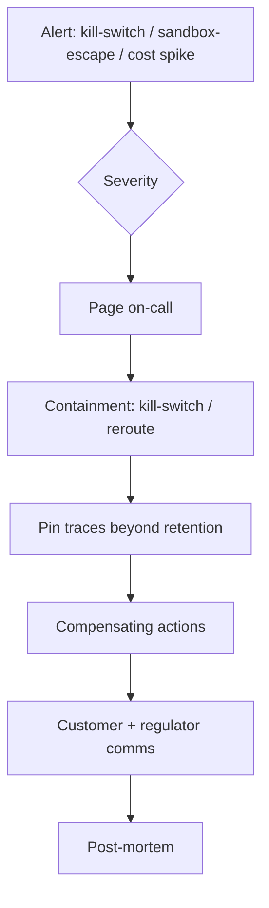

# Incident Response Runbook

**Also known as:** IR Runbook, Agent Failure Playbook, Agent Incident Procedure

**Category:** Governance & Observability  
**Status in practice:** mature

## Intent

Maintain pre-written response procedures for agent failures (PII leak, tool exploit, mass false action) so detected incidents trigger known steps.

## Context

A team runs an agent in production where things can go badly wrong: leaking personally identifiable information across tenants, exploiting a tool with side effects in the real world, or triggering a large number of incorrect actions before anyone notices. The platform already has detection mechanisms such as a kill-switch, monitoring on sandbox-boundary violations, and a provenance ledger of actions. There may also be regulatory clocks attached, for example a 72-hour breach notification window under GDPR or a serious-incident report under the EU AI Act.

## Problem

When an alert fires at 02:14 with no pre-written procedure, the on-call engineer wakes up to arguments about whether to kill the service, no clear path to preserve forensic traces beyond normal retention, no template for telling affected customers, and no idea who notifies the regulator. The first hour of the incident vanishes into improvisation while damage continues. The team is forced to choose between writing the runbook calmly in advance or writing it under pressure during the worst possible moment.

## Forces

- Severity classification must be agreed upfront.
- Containment vs forensic preservation tension.
- Communication clocks for regulators (GDPR 72h, EU AI Act serious incident) constrain runbook latency.

## Applicability

**Use when**

- An agent is in production where PII leaks, tool exploits, or mass false actions are possible.
- Detection signals exist but no coordinated response procedure does.
- Regulatory or customer obligations require documented containment and notification steps.

**Do not use when**

- The agent is purely experimental with no production blast radius.
- No alerting infrastructure exists yet to trigger runbook entries.
- Severity, on-call, and forensic responsibilities are not yet assignable to anyone.

## Therefore

Therefore: pre-write severity-tiered procedures covering containment, forensic preservation, customer comms, and regulator notification, and bind them to existing alert sources, so that a detected incident triggers known steps within the regulatory clock instead of improvised ones.

## Solution

Maintain a runbook covering: severity levels, on-call paths, containment steps (kill-switch invocation, traffic rerouting), forensic preservation (pin traces beyond normal retention), compensating actions, customer communication templates, regulator notification procedures, and post-mortem template. Tie alerts from kill-switch/sandbox-escape-monitoring/cost-observability to runbook entries.

## Example scenario

A multi-tenant chat platform discovers at 02:14 that an agent has been emailing one customer's support transcripts to another customer's address for the past nine hours. The on-call has alerts but no plan, and the first hour goes to arguing about whether to kill the service. After the post-mortem the team writes an incident-response-runbook covering severity levels, kill-switch invocation, trace pinning beyond normal retention, customer-notification templates, and regulator timelines. The next incident is contained in eight minutes.

## Diagram

## Consequences

**Benefits**

- Detection produces coordinated response, not panic.
- Regulator timelines are met.

**Liabilities**

- Runbook drift: scenarios evolve faster than the doc.
- Runbook fatigue if drilled too rarely or too often.

## What this pattern constrains

Detected incidents must trigger a documented runbook step; ad-hoc response without runbook is a process failure to be flagged in post-mortem.

## Known uses

- **Standard SRE practice transferred to agent platforms** — *Available*
- **Frontier-lab safety teams** — *Available*

## Related patterns

- *complements* → [kill-switch](kill-switch.md)
- *complements* → [sandbox-escape-monitoring](sandbox-escape-monitoring.md)
- *uses* → [provenance-ledger](provenance-ledger.md)
- *uses* → [compensating-action](compensating-action.md)

## References

- (book) *Site Reliability Engineering (Google, ch. 14 Managing Incidents)*, 2016
- (book) *Site Reliability Engineering (Google) — Managing Incidents*, 2016, <https://sre.google/sre-book/managing-incidents/>

**Tags:** governance, incident-response, safety
