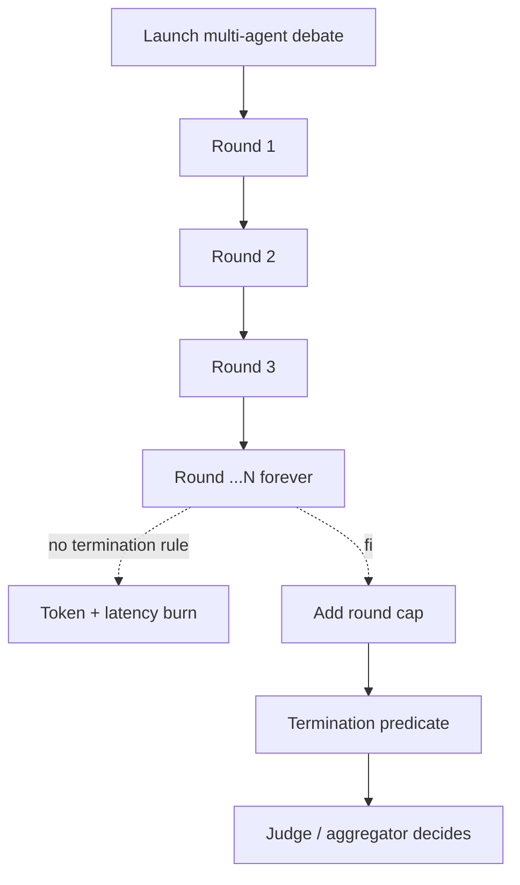

# Infinite Debate

**Also known as:** Stuck Multi-Agent, Convergence Failure, Agents Stuck Talking, Multi-Agent Loop

**Category:** Anti-Patterns  
**Status in practice:** deprecated

## Intent

Anti-pattern: launch multi-agent debate without a termination rule and watch the agents loop forever.

## Context

Debate or consensus patterns are added without explicit halt conditions; the agents argue until the cost cap kicks in.

## Problem

Debate without termination converges only by accident. Real cost grows linearly while progress stalls.

## Forces

- Consensus heuristics are easy to game.
- Round caps cut off legitimate convergence.
- Judge agents become the new bottleneck.

## Applicability

**Use when**

- Never use this; multi-agent debate without a termination rule loops indefinitely.
- Use debate together with a round cap and an explicit termination predicate.
- Pair debate with a judge or aggregator (see debate, step-budget, the-stop-hook).

**Do not use when**

- Any production setting with latency or cost SLOs.
- Any debate setup that lacks a judge or stop condition.
- Any task where progress cannot be measured between rounds.

## Solution

Don't. Add a round cap and a termination predicate. Pair debate with a judge or aggregator. See debate, step-budget, the-stop-hook.

## Example scenario

A research team sets up a three-agent debate to answer policy questions: a proponent, a skeptic, and a synthesiser. They forget to add a termination rule. The first run burns through 90 minutes and $34 of tokens with the proponent and skeptic still circling each other when an engineer kills the process. They name the failure infinite-debate and add a round cap of six exchanges plus a judge that emits 'agreement', 'irreducible-disagreement', or 'continue', with continue allowed at most once. Cost becomes predictable.

## Diagram

## Consequences

**Liabilities**

- Cost blow-up.
- User-visible non-termination.

## What this pattern constrains

By definition, this anti-pattern imposes no useful constraint; the missing constraint is the failure mode.

## Known uses

- **Early multi-agent demos in 2023-2024** — *Available*

## Related patterns

- *alternative-to* → [debate](debate.md)
- *alternative-to* → [step-budget](step-budget.md)
- *alternative-to* → [stop-hook](stop-hook.md)
- *conflicts-with* → [communicative-dehallucination](communicative-dehallucination.md)

## References

- (repo) *ai-standards/ai-design-patterns (Infinite Debate)*, <https://github.com/ai-standards/ai-design-patterns>

**Tags:** anti-pattern, multi-agent, termination
