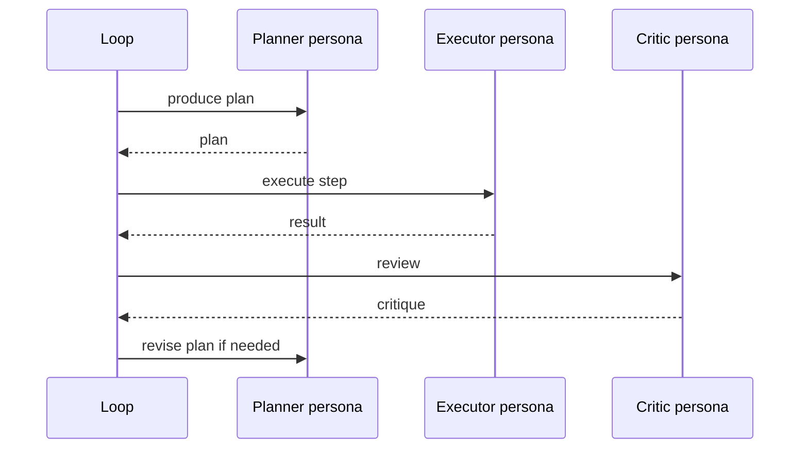

# Inner Committee

**Also known as:** Multi-Persona Single Model, Self-as-Multiple-Roles

**Category:** Multi-Agent  
**Status in practice:** emerging

## Intent

Run one model under several distinct personas (executor, critic, planner) within a single agent loop.

## Context

A team is running a single agent on a task where planning, executing, and critiquing the result all matter — a coding agent that should think through a change, write the patch, and then check the patch against the requirements. Standing up two or three separate agents with their own model instances is more machinery than the task needs, but doing all three roles in one prompt is producing muddled output.

## Problem

When one prompt is asked to plan, execute, and self-critique at the same time, the model conflates the roles and emits something that is partly a plan, partly an attempt, and partly a half-hearted critique that mostly agrees with the attempt. The plan never gets sharp, the execution never gets focused, and the critique never seriously challenges anything. Without explicit role separation, the team gets the cost of a complex agent and the quality of a confused one.

## Forces

- Persona switching costs a prompt and a context reset.
- The model has the same blind spots in each persona; true diversity is limited.
- Persona drift in long conversations dilutes the role separation.

## Applicability

**Use when**

- A single persona produces muddled outputs that are neither plan, critique, nor execution.
- Distinct personas (planner, executor, critic) can be defined with non-overlapping inputs.
- The agent loop can step through personas at fixed, deterministic points.

**Do not use when**

- Mono-persona prompts already produce clean role-separated outputs.
- Multiple model calls per step are not affordable.
- Personas would share so much context that role separation has no effect.

## Therefore

Therefore: run the same model under explicit, role-scoped personas that step in a fixed order, each seeing only the inputs its role needs, so that planning, execution, and critique stay separated without spinning up multiple model instances.

## Solution

Define explicit personas (system prompts) for each role: planner, executor, critic. The agent loop steps through personas at fixed points. Each persona sees only the inputs its role needs, not the full context of the others.

## Example scenario

A coding agent that handles refactor requests keeps producing patches that compile but miss the actual intent, because one prompt is being asked to plan, write, and self-critique in the same breath. The team rebuilds it as an inner-committee: the same model is invoked as Planner (sees the request and codebase summary), Executor (sees only the plan and writes the diff), and Critic (sees only the diff and the acceptance criteria). The personas run in fixed order and each sees only what its role needs.

## Diagram

## Consequences

**Benefits**

- Cheaper than running multiple model instances.
- Surprisingly effective for self-critique and self-modification gating.

**Liabilities**

- Same model means correlated errors; reflexion suffers from this.
- Persona prompts add up to a non-trivial token budget.

## What this pattern constrains

Each persona may only act within its declared role; cross-persona reasoning is forbidden in a single prompt.

## Known uses

- **Long-running personal agent loops (private deployment)** — *Available*
- **[Sparrot](https://marco-nissen.com/sparrot/)** — *Available* — A committee of internal voices deliberates within a tick before a single decision is emitted.

## Related patterns

- *specialises* → [inner-critic](inner-critic.md)
- *alternative-to* → [debate](debate.md)
- *alternative-to* → [role-assignment](role-assignment.md)

## References

- (blog) *Marco Nissen, Working with the models*, 2026

**Tags:** multi-persona, single-model
