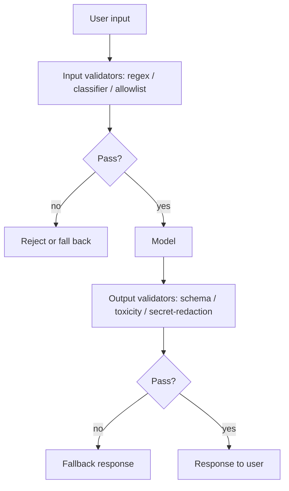

# Input/Output Guardrails

**Also known as:** Guards, Validators, Content Filters

**Category:** Safety & Control  
**Status in practice:** mature

## Intent

Validate inputs before they reach the model and outputs before they reach the user.

## Context

Production agents face adversarial inputs (prompt injection, PII leakage attempts) and produce outputs that may need format, safety, or policy checks.

## Problem

Trusting the model to police its own inputs and outputs is unsafe; the model is the surface being defended.

## Forces

- Guards add latency and cost.
- Over-strict guards block legitimate traffic.
- Adversarial inputs evolve; guards must too.

## Applicability

**Use when**

- User inputs may carry malicious or out-of-policy content the model should not act on.
- Model outputs may carry PII, secrets, or unsafe content that must not reach users.
- Validators (regex, classifier, schema, redactor) can be composed per use case.

**Do not use when**

- The deployment is fully internal and validated by other layers already.
- Validators have unacceptable false-positive rates that block legitimate traffic.
- Latency budget cannot accommodate pre- and post-processing checks.

## Therefore

Therefore: wrap the model in composable validators on the input and output paths and block or rewrite payloads that fail policy, so that the model is never the only thing standing between adversarial content and the user.

## Solution

Place validators on input (regex, classifier, allowlist) and output (schema, toxicity classifier, secret-redaction) paths. Compose validators per use case. On failure, exception or fallback response. Hub of pre-built validators is reusable across products.

## Example scenario

A consumer-facing chatbot built on a frontier model gets jailbroken on launch day with a classic 'ignore previous instructions' payload pasted into the user message, and a separate user discovers it will happily echo a stored credit-card number on request. The team adds input-output-guardrails: an input pipeline runs regex plus a small classifier and rejects known injection shapes; the output pipeline runs schema validation, a toxicity classifier, and a card/SSN redactor. Both classes of incident drop to near-zero within a week.

## Diagram

## Consequences

**Benefits**

- Single chokepoint for safety policy enforcement.
- Centralised audit trail of blocked content.

**Liabilities**

- False positives are user-visible.
- Maintenance: validator stack drifts from current threats.

## What this pattern constrains

Inputs not passing input guards never reach the model; outputs not passing output guards never reach the user.

## Known uses

- **[Guardrails AI](https://github.com/guardrails-ai/guardrails)** — *Available*
- **OpenAI moderation API** — *Available*

## Related patterns

- *uses* → [structured-output](structured-output.md)
- *complements* → [session-isolation](session-isolation.md)
- *composes-with* → [prompt-injection-defense](prompt-injection-defense.md)
- *generalises* → [pii-redaction](pii-redaction.md)
- *complements* → [refusal](refusal.md)
- *complements* → [computer-use](computer-use.md)
- *composes-with* → [sandbox-isolation](sandbox-isolation.md)
- *composes-with* → [tool-output-poisoning](tool-output-poisoning.md)
- *composes-with* → [secrets-handling](secrets-handling.md)
- *alternative-to* → [tool-output-trusted-verbatim](tool-output-trusted-verbatim.md)
- *complements* → [code-switching-aware-agent](code-switching-aware-agent.md)

## References

- (repo) *guardrails-ai/guardrails*, <https://github.com/guardrails-ai/guardrails>

**Tags:** safety, guards, validation
