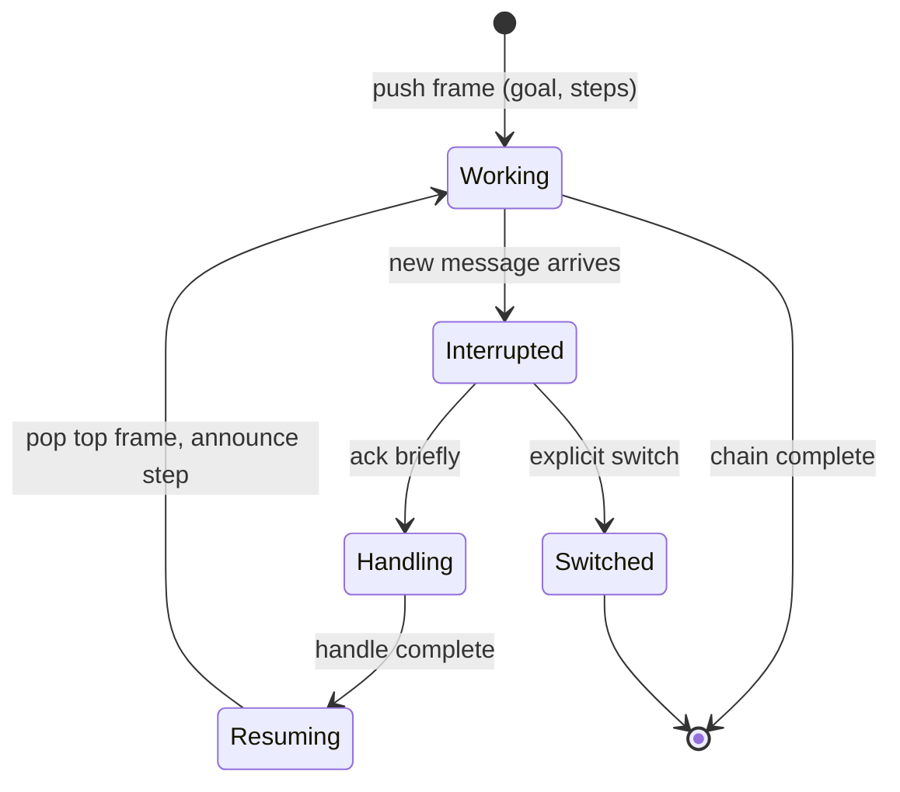

# Interrupt-Resumable Thought

**Also known as:** Pausable Thought Stream, Continuation-Preserving Interrupt, Suspendable Cognition

**Category:** Planning & Control Flow
**Status in practice:** experimental

## Intent

Preserve multi-step reasoning across interrupts by supporting paused-and-resumed thought frames so a new message handles cleanly without clobbering in-flight work.

## Context

Long-running cognitive agents whose thinking spans multiple turns or ticks, where external messages (user input, system notifications, scheduled notes) can arrive mid-thought. Without explicit continuation support, every interrupt clobbers in-flight work.

## Problem

Coherent multi-step thinking that takes longer than a single turn is fragile. A new user message during step 3 of a 6-step thought either gets ignored (rude) or replaces the thought entirely (lossy). The agent has no notion of 'hold this, handle that, then come back', so longer reasoning fragments into shards.

## Forces

- Latency: humans expect quick acknowledgement of new input.
- Context capacity: holding a paused thought costs tokens.
- Resume reliability: returning to a paused thought without distortion is hard.
- Priority: not every interrupt deserves to suspend work; some are themselves interruptable.

## Therefore

Therefore: push a named thought-frame onto a bounded stack at the start of a multi-step chain and require any interrupt to acknowledge, handle, and pop-then-resume the top frame, so that incoming messages neither clobber in-flight reasoning nor disappear into it.

## Solution

Introduce an explicit thought-frame: when starting a multi-step chain, push a frame onto a stack with the goal, the steps completed, and the next step. On interrupt: acknowledge briefly ('hold on — finishing X first' or 'switching: Y'), handle the interrupt, then look at the top frame and explicitly resume ('back to X — I was at step 3 / 6'). Cap stack depth to prevent infinite suspension. Frames older than a configurable window expire (the agent admits the resume would be reconstruction, not continuation).

## Example scenario

A research agent is on step 4 of a 7-step literature synthesis when the user fires off 'oh, also, what was that paper from Tuesday?'. The current agent either ignores the interrupt and looks rude, or starts answering it and loses the synthesis state. The team adds interrupt-resumable-thought: the synthesis pushes a thought-frame onto a stack, the agent acknowledges the interrupt with 'one sec — finishing the synthesis section, then I'll grab Tuesday's paper', completes the step, then pops the frame and resumes. Long thinking survives mid-flight questions.

## Consequences

**Benefits**

- Coherent long-form work survives interruptions.
- Human gets quick acknowledgement without losing depth.
- Failure mode (forgetting to resume) is observable as a stack with un-popped frames.

**Liabilities**

- Stack management adds complexity to the agent loop.
- Token cost of holding paused frames in context.
- Resume distortion over long pauses is a real failure.

## What this pattern constrains

Interrupts cannot silently discard in-flight multi-step reasoning; all paused chains must be visibly tracked, named in the next reply, and either resumed or explicitly abandoned.

## Applicability

**Use when**

- The agent supports incoming interrupts (new user messages) while it is mid-reasoning.
- Multi-step reasoning chains are common enough that losing one is a meaningful regression.
- The transport allows the agent to expose paused chains to subsequent turns.

**Do not use when**

- The agent is strictly request-response with no interruptible loops.
- Reasoning chains are short enough that restarting them is cheaper than paging them out.
- The user expects every new message to fully reset the agent's working state.

## Variants

### Frame stack

Push the current reasoning frame onto an explicit stack on interrupt; pop and resume after the new turn finishes.

*Distinguishing factor:* LIFO discipline

*When to use:* Default. Maps cleanly to nested reasoning.

### Named pause register

Each paused chain gets a name; the agent or user can choose which to resume.

*Distinguishing factor:* user-addressable

*When to use:* When multiple long-running threads coexist and the user steers between them.

### Persisted resume token

Pause writes the chain state to durable storage with a token; a future run can resume from the token even after restart.

*Distinguishing factor:* durability

*When to use:* When agent processes are not long-lived but reasoning chains span process boundaries.

## Diagram

## Known uses

- **Self-observed in long-running cognitive agents** — *Available*

## Related patterns

- *complements* → [agent-resumption](agent-resumption.md)
- *complements* → [conversation-handoff](conversation-handoff.md)
- *complements* → [decision-log](decision-log.md)
- *complements* → [append-only-thought-stream](append-only-thought-stream.md)
- *uses* → [short-term-memory](short-term-memory.md)

## References

- (doc) *LangGraph — interrupts and human-in-the-loop*, 2025, <https://langchain-ai.github.io/langgraph/concepts/human_in_the_loop/>

**Tags:** interruption, continuation, tick-loop, context
