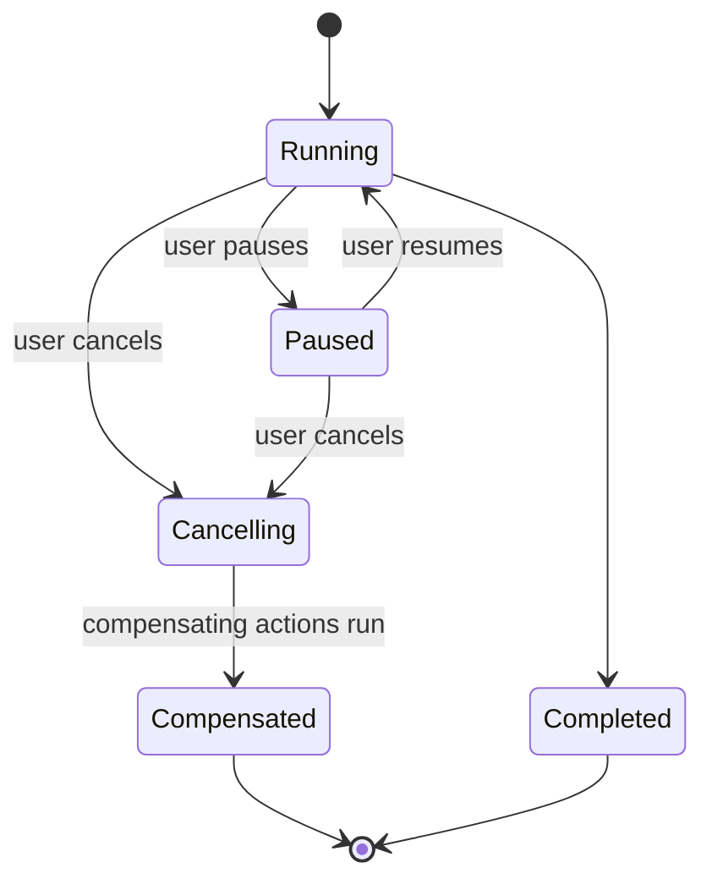

# Interruptible Agent Execution

**Also known as:** Pause/Resume/Cancel Control Surface, User-Interruptible Agent

**Category:** Safety & Control  
**Status in practice:** emerging

## Intent

Treat pause, resume, and cancel as a first-class control surface on every long-running agent so users can halt expensive or off-track trajectories mid-task while state is preserved for resumption.

## Context

An agent runs for minutes, hours, or longer on a single user task — a deep-research loop, a code-agent session, an autonomous browser flow. The user is watching it work and forms a judgment mid-run: it has gone off-track, it is burning tokens unnecessarily, or the task is no longer wanted. The user expects to stop it like any other long-running application — pause and inspect, cancel cleanly, or resume after a check.

## Problem

Most agent runtimes only expose 'start' and (sometimes) a brutal kill. Pause is not implemented, so the user must wait for the agent to finish or kill the process. Cancel loses any partial work and any chance to run compensating actions. Resume is impossible because nothing snapshotted state. Without an interruption surface, autonomous loops produce a binary 'let it finish or lose everything' experience that destroys user trust in long-running agents.

## Forces

- Pause must propagate to the model call and the tool call, not just the orchestrator loop.
- Resume must restore state without re-doing the in-flight tool call.
- Cancel must run compensating actions on in-flight side effects.
- All three must be exposed in the UX, not hidden as ops-only controls.

## Applicability

**Use when**

- Agent runs are long enough that users will form mid-run judgments.
- In-flight side effects can be compensated cleanly.
- State is small enough to snapshot at step boundaries without prohibitive cost.

**Do not use when**

- Runs are seconds-long; the interruption surface is wasted UI.
- Tools have no idempotency or compensation hooks — pause cannot be safe.
- The agent is fully embedded in another product whose UX owns the controls.

## Therefore

Therefore: surface pause, resume, and cancel as first-class controls in the agent's UX and runtime; on pause snapshot state, on resume rehydrate it, on cancel run compensating actions on in-flight effects.

## Solution

Build the runtime so each step boundary is a snapshot point: state is durable across pause/resume. Pause stops further model and tool calls without killing the process. Resume rehydrates from the snapshot. Cancel runs compensating actions on in-flight side effects (mark drafts as discarded, release locks, end provider sessions) before tearing down. Expose all three as visible UX, not hidden APIs. Distinct from a kill-switch, which is an operator-level emergency halt.

## Example scenario

A research agent has spent 12 minutes browsing sources and is starting to repeat searches. The user clicks Pause. The runtime snapshots state at the next step boundary and stops further calls. The user reviews the work-in-progress notes, decides the agent had enough material 8 minutes ago, and clicks Resume with an instruction to summarise and stop rather than search further. The agent picks up from the snapshot and finishes.

## Diagram

## Consequences

**Benefits**

- User trust survives long-running runs because the user retains control.
- Pause-and-inspect becomes a debugging affordance during development.
- Cancel with compensating actions limits blast radius of mistakes.

**Liabilities**

- Implementing snapshot at every step boundary is invasive across the runtime.
- In-flight tool calls without idempotency hooks make pause and cancel unsafe.
- Resume from a stale snapshot can produce a Frankenstein run if the external world has moved on.

## What this pattern constrains

A long-running agent must not expose only 'start' and 'kill'; pause, resume, and cancel are first-class controls and state is preserved across them.

## Known uses

- **Designing Multi-Agent Systems (Dibia) — Interruptibility UX principle** — *Available* — <https://newsletter.victordibia.com/p/4-ux-design-principles-for-multi>
- **Claude Code session pause/resume** — *Available*
- **OpenAI Codex/Operator and other long-running agent products** — *Available*

## Related patterns

- *uses* → [agent-resumption](agent-resumption.md)
- *uses* → [durable-workflow-snapshot](durable-workflow-snapshot.md)
- *complements* → [kill-switch](kill-switch.md) — Kill is operator-level emergency; this is user-level pause/cancel.
- *uses* → [compensating-action](compensating-action.md)
- *complements* → [interrupt-resumable-thought](interrupt-resumable-thought.md)
- *composes-with* → [composable-termination-conditions](composable-termination-conditions.md)
- *complements* → [approval-queue](approval-queue.md)

## References

- (blog) *4 UX Design Principles for Multi-Agent Systems*, Victor Dibia, 2025, <https://newsletter.victordibia.com/p/4-ux-design-principles-for-multi>
- (book) *Designing Multi-Agent Systems*, Victor Dibia, 2025, <https://www.oreilly.com/library/view/designing-multi-agent-systems/9781098150495/>

**Tags:** safety, interruptibility, ux
