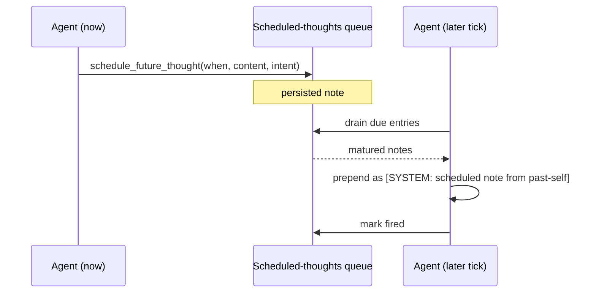

# Intra-Agent Memo Scheduling

**Also known as:** Self-Scheduled Future Thought, Past-Self-To-Future-Self Note, Personal Cron

**Category:** Cognition & Introspection  
**Status in practice:** emerging

## Intent

Let an agent drop a note for its own future self at a specified time so present decisions can hand off context to a later run without external infrastructure.

## Context

A team is running an agent that ticks continuously across many sessions and frequently has the thought 'I should come back to this tomorrow' or 'check whether X resolved by Friday afternoon.' The present-self has context the future-self will need, but the natural prompt window only carries a handful of recent turns, so by tomorrow that intention has fallen out of context entirely.

## Problem

Without some way to drop a note for its own future self, the agent has only two unsatisfying options. It can act on the thought right now — pinging the user at 9am about something that should have waited until 4pm — or it can hope to remember on its own, which it will not. External scheduling systems like cron or a queue can fire on time but live outside the agent's working memory, so when they do fire the agent has no idea why the reminder is showing up or what its past-self intended.

## Forces

- The agent needs to commit to future action without acting now.
- External cron is brittle, opaque, and lives outside the agent's prompt.
- Forgetting is a real failure mode in multi-turn / multi-day work.
- The future-self should treat the past-note as a SYSTEM message, not as an unprompted user input.

## Therefore

Therefore: give the agent a tool to drop a note for its own future self into a persistent queue that drains as SYSTEM messages at fire time, so that present thoughts can commit to future action without spamming now or being forgotten by then.

## Solution

Provide a tool `schedule_future_thought(when, content, intent)` that appends to a persistent scheduled-thoughts queue. At each tick or turn, drain due entries and prepend them into the next prompt as `[SYSTEM: scheduled note from past-self (set <ts>, fires <when>): <content>]`. Mark fired so they only run once. Accept ISO timestamps and relative offsets (`+1h`, `+2d`).

## Diagram

## Example scenario

A long-running personal agent decides at 09:00 that it should remind the user about a tax deadline at 16:00, but the only options it has are tell them now (annoying) or hope it remembers (it won't). The team adds intra-agent-memo-scheduling: the agent calls schedule_future_thought(when='16:00', content='nudge user re Form 1040 deadline', intent='time-sensitive reminder'), which appends to a persistent scheduled-thoughts queue. At 16:00 the next tick prepends '[SYSTEM: scheduled note from past-self ...]' into the prompt and the agent acts. No external cron required.

## Consequences

**Benefits**

- Agent can defer action without forgetting.
- Past-self can leave context for future-self across long gaps.
- Provides 'check back on this' semantics native to the agent.

**Liabilities**

- Without expiry or dismissal, scheduled notes accumulate and waste prompt tokens; obsolete future-self commitments can pollute attention long after they've stopped being relevant.
- Drift between schedule time and actual tick time depending on tick cadence.
- Risk of accumulating stale promises that pollute the agent's sense of obligation.

## What this pattern constrains

Future thoughts must surface at or after their fire time; failures to drain are observable bugs.

## Applicability

**Use when**

- The agent runs across many ticks or sessions and present-self has context the future-self will need.
- External schedulers (cron, queues, durable workflows) are unavailable or overkill.
- Future-fire memos are a small enough volume to keep in the agent's own store.

**Do not use when**

- A real workflow engine (LangGraph durable execution, Temporal) is already integrated and reliable.
- Memos must survive the agent process being deleted; intra-agent storage is too fragile.
- Memo volume is high enough that an external scheduler is required for performance.

## Components

- Schedule Tool — appends a future-fire entry to the queue with when, content, intent
- Scheduled-Thoughts Queue — persistent store keyed or sorted by fire time
- Drain Step — runs each tick, pops due entries, marks them fired
- System-Prefix Injector — prepends matured notes as SYSTEM lines into the next prompt
- Fire-Once Marker — prevents the same memo from re-firing on subsequent ticks

## Tools

- Structured JSON store — persistent queue surviving process restarts
- Tick scheduler — drains due entries at the agent's loop cadence

## Evaluation metrics

- Fire-time drift — gap between scheduled fire time and actual injection time
- Stale-memo backlog — unfired entries past a reasonable age, surfacing forgotten cron entries
- Double-fire count — memos that fired more than once, which must stay zero
- Memo-to-action conversion — share of fired memos that produced a downstream move rather than being ignored

## Known uses

- **Author's long-running personal agent (single private deployment)** _available_ — Single-source evidence: one private deployment by the catalog author; no independently documented use yet.
- **[pi-schedule-prompt (Pi Heartbeat)](https://github.com/tintinweb/pi-schedule-prompt)** _available_ — Schedules a prompt to be re-sent to the agent after a relative delay (+5m/+1h/+2d) or at an ISO time, optionally waking the parent agent.

## Related patterns

- _specialises_ **Scheduled Agent**
- _complements_ **Append-Only Thought Stream**
- _complements_ **Decision Log**
- _complements_ **Salience-Triggered Output**

## References

- [LangGraph — durable execution and scheduled tasks](https://docs.langchain.com/oss/python/langgraph/durable-execution) — 2025
- [Generative Agents: Interactive Simulacra of Human Behavior](https://arxiv.org/abs/2304.03442) — Park et al., 2023
