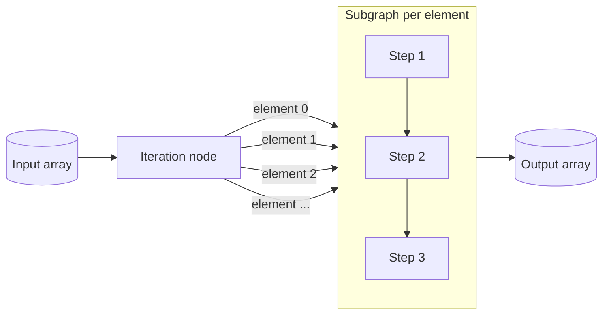

# Iteration Node

**Also known as:** Map-Over-Collection Node, For-Each Sub-Workflow, Bounded Workflow Loop

**Category:** Planning & Control Flow  
**Status in practice:** mature

## Intent

Express map-over-collection inside a visual workflow as an explicit Iteration node that runs a subgraph once per element of an input array, with bounded, deterministic, observable execution.

## Context

Visual workflow platforms where a portion of work must be applied to every element of a list (every retrieved chunk, every search result, every uploaded file) and the iteration must be inspectable per element.

## Problem

An LLM-driven loop (loop in the agentic loop's sense) is non-deterministic and hard to bound; collapsing the iteration into a single LLM call hides per-element failures; expressing the loop as a procedural script outside the workflow loses the visual debug surface.

## Forces

- Iteration must be deterministic and bounded by the array length, not by an LLM stopping condition.
- Per-element results need to be inspectable to find the one element that failed.
- Sequential vs parallel execution within the Iteration changes latency and rate-limit behaviour.
- Sub-workflow state must not leak across iterations.
- Iteration depth should be capped — nested Iteration nodes can blow up step counts.

## Applicability

**Use when**

- Work must be applied to every element of a list and bounded by the list length.
- Per-element failures need to be inspectable.
- The surrounding workflow is visual and the iteration should remain visual.
- Sequential or bounded-parallel execution suffices.

**Do not use when**

- The number of iterations is decided by the model rather than by data length.
- The subgraph would mutate shared variables that other branches read.
- The input array is unbounded — pair with step-budget or refuse the input.

## Therefore

Therefore: model the iteration as a structural node — array in, subgraph applied per element, array out — so that iteration is bounded by data, deterministic, and inspectable per element.

## Solution

Define an Iteration node with an input array, an inner subgraph that runs once per element with the element bound to a parameter, and an output array of per-element results. The runtime may execute elements sequentially or in parallel up to a configured concurrency. Each iteration is logged with its index; failures surface per-element rather than collapsing the whole node. Pair with map-reduce (the algorithmic shape it instantiates), visual-workflow-graph (the surrounding canvas), and parallelization (when concurrency matters).

## Structure

[Input array] → Iteration node { for each element: subgraph(element) → result } → [Output array].

## Example scenario

A document-processing workflow receives a list of uploaded PDFs. The team needs to extract metadata from each, run a quality check, and emit a per-document summary. They wrap the extract-check-summarise sequence in an Iteration node bound to the input list. The node runs per element with a concurrency cap of four; when one PDF errors out, the iteration logs the failed index and continues. The output array preserves order so the consumer can join back to the original list.

## Diagram

## Consequences

**Benefits**

- Iteration is structural and bounded — no LLM stopping condition required.
- Per-element failures and timings are visible.
- Sequential vs parallel execution is a node parameter, not a code change.
- Iteration nests cleanly inside larger visual workflows.

**Liabilities**

- Large input arrays multiply token cost linearly.
- Nested iteration without a cap can blow up step counts.
- Per-element sub-workflow state can creep into shared variables if not scoped carefully.
- Parallel execution can hit upstream rate limits.

## What this pattern constrains

The inner subgraph must operate per element with element-scoped state; it is not allowed to mutate variables outside its scope, and the number of iterations is bounded by the input array length rather than by a model decision.

## Known uses

- **Dify (Iteration node)** — Dify workflows expose an Iteration node that runs the same workflow steps on each element of an array, sequentially or in parallel. *Available* — [link](https://github.com/langgenius/dify-docs/blob/main/en/use-dify/nodes/iteration.mdx)
- **Coze (Loop / Iteration node)** — Coze workflows ship an iteration construct for per-element subgraph execution. *Available* — [link](https://www.coze.com/docs)
- **n8n (Split-in-Batches / Loop Over Items)** — n8n's per-item execution model is a structural iteration over the workflow's incoming items. *Available* — [link](https://docs.n8n.io/)

## Related patterns

- *uses* → [map-reduce](map-reduce.md)
- *complements* → [visual-workflow-graph](visual-workflow-graph.md)
- *complements* → [parallelization](parallelization.md)
- *complements* → [step-budget](step-budget.md)

## References

- *doc*: [Dify — Iteration node](https://github.com/langgenius/dify-docs/blob/main/en/use-dify/nodes/iteration.mdx) — LangGenius

**Tags:** planning-control-flow, iteration, visual-workflow, dify, coze, n8n
