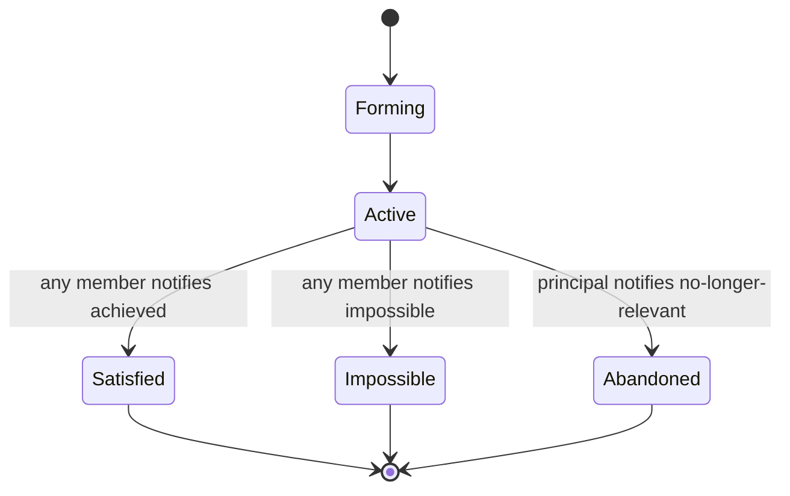

# Joint Commitment Team

**Also known as:** Joint Intentions Team, Cohen-Levesque Team, Notification-Bound Team

**Category:** Multi-Agent  
**Status in practice:** experimental

## Intent

A team of agents adopts a shared goal plus the meta-commitment that each member will notify the others as soon as it believes the goal is achieved, impossible, or no longer relevant.

## Context

Multiple agents coordinate on a shared task — a research collective, a delivery team, a multi-step pipeline crossing agents. Each agent has a partial view of progress. When one agent learns the goal is satisfied, infeasible, or no longer wanted, the others continue working unless explicitly told.

## Problem

Silent abandonment is the recurring failure. Agent A discovers the goal is impossible (the data the team was going to analyse doesn't exist) and stops, but Agent B keeps preparing analysis tooling for the missing data. Agent C learns the goal has been satisfied by an external event but doesn't tell Agent D, who keeps running expensive computations. Without an explicit meta-commitment that team members notify each other on these state changes, joint tasks waste effort and produce stale outputs.

## Forces

- Each member has a partial view; goal-state insights are not automatically shared.
- Notification has cost but small compared to wasted work.
- The meta-commitment must be enforceable, not advisory.
- Notification semantics differ for 'achieved' vs 'impossible' vs 'no longer relevant'.

## Applicability

**Use when**

- Multi-agent teams on shared goals with multi-step or multi-day runtime.
- Goal-state changes (satisfaction, infeasibility, abandonment) are realistic.
- Operators need an audit trail of when and why a team stopped.

**Do not use when**

- Single-agent task — no team to notify.
- Team runtime is too short for notification overhead to pay back.
- Members are unreliable observers of goal state — notifications would be noise.

## Therefore

Therefore: every agent in the team commits not only to the shared goal but to notifying the team when it believes the goal is achieved, impossible, or no longer relevant, so the team's effort tracks the goal's actual state.

## Solution

Following Cohen & Levesque's joint intentions framework: when agents form a team around a shared goal G, each agent commits to (a) pursue G as long as G is believed achievable, wanted, and unachieved, and (b) notify the rest as soon as it believes G is achieved, impossible, or no longer relevant. Notification is part of the contract, not extra-credit. The team's lifecycle has explicit transitions: forming, active, satisfied (notified by any member that G holds), impossible (notified by any member), abandoned (notified by the principal that G is no longer wanted).

## Example scenario

A research-collective of three agents commits to 'produce a market analysis for product X by Friday'. Agent A discovers Wednesday that the underlying dataset is corrupted; it broadcasts an 'impossible' notification. Without the joint-commitment contract Agents B and C would have kept generating charts and outlines all of Thursday. With the contract, the team transitions to 'impossible' state and either replans or stands down.

## Diagram

## Consequences

**Benefits**

- Wasted work after goal-state change collapses.
- Team lifecycle has explicit named states.
- Notification messages produce an audit trail.

**Liabilities**

- Notification protocol adds overhead on long-running teams.
- Members can disagree about whether the goal is achieved/impossible — needs a reconciliation rule.
- False notifications (one member wrongly concludes 'impossible') can tear down the team prematurely.

## What this pattern constrains

A team member must not silently abandon a shared goal; notification of belief that the goal is achieved, impossible, or no longer relevant is part of the team contract.

## Known uses

- **Cohen & Levesque — Teamwork / Joint Intentions framework** — *Available* — <https://philpapers.org/rec/COHT>
- **Multiagent Systems (Weiss) — Joint commitment treatment** — *Available* — <https://mitpress.mit.edu/9780262731317/multiagent-systems/>

## Related patterns

- *complements* → [commitment-tracking](commitment-tracking.md)
- *composes-with* → [coalition-formation](coalition-formation.md)
- *composes-with* → [bdi-agent](bdi-agent.md)
- *alternative-to* → [supervisor](supervisor.md)
- *complements* → [world-model-as-tool](world-model-as-tool.md)
- *alternative-to* → [stigmergic-coordination](stigmergic-coordination.md)
- *complements* → [partial-global-planning](partial-global-planning.md)

## References

- (book) *Multiagent Systems, 2nd ed.*, Gerhard Weiss (ed.), 2013, <https://mitpress.mit.edu/9780262731317/multiagent-systems/>
- (paper) *Teamwork*, Philip Cohen, Hector Levesque, <https://philpapers.org/rec/COHT>

**Tags:** multi-agent, commitment, coordination
