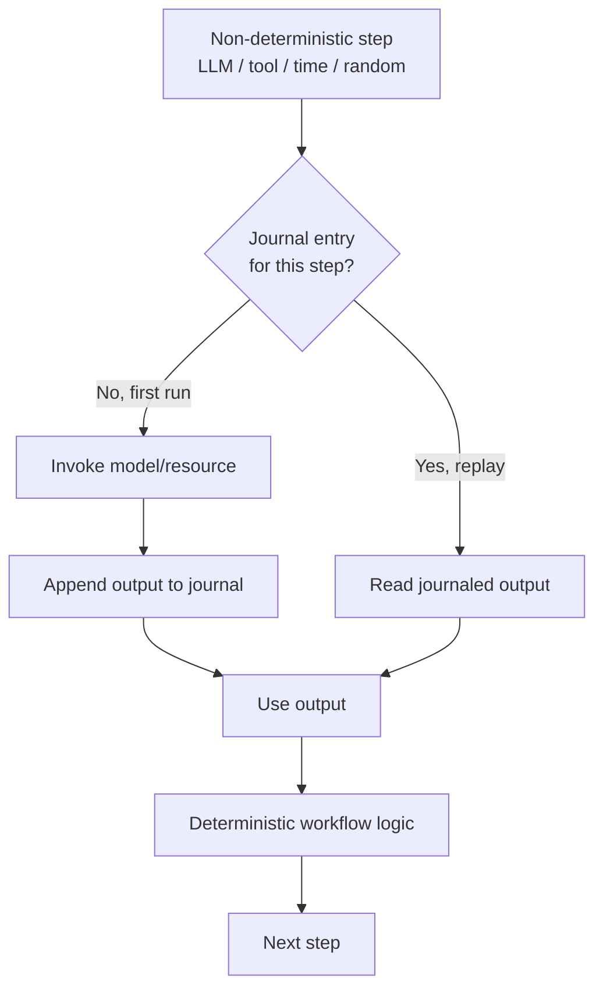

# Journaled LLM Call

**Category:** Governance & Observability  
**Status in practice:** emerging

## Intent

Record the output of every non-deterministic step on first execution and replay that recorded value during crash-recovery instead of re-invoking the model.

## Context

A team runs an agent on a durable-execution engine that survives crashes by replaying the workflow from a recorded history. The workflow drives non-deterministic steps: LLM calls, tool results, timestamps, and random draws. The engine reconstructs in-memory state after a restart by re-running the workflow code up to the point it died, then resuming. For that reconstruction to be correct, every step the workflow code re-executes during replay must yield the same value it produced on the original run.

## Problem

An LLM call is not a pure function: the same prompt returns a different completion on the next invocation, and a timestamp or random draw changes every time. If the durable engine re-invokes the model during replay, the recovered run diverges from the original — a tool gets called with arguments the first run never produced, a branch is taken that never happened, and the workflow history no longer matches reality. This replay divergence corrupts state silently and is hard to detect, because each individual call looks valid. Re-invoking also pays the model cost and latency a second time for work that already completed.

## Forces

- Replay correctness demands that re-executed steps return identical values, but model calls are non-deterministic by construction.
- A recorded LLM response may be stale relative to the world, yet a fresh response breaks determinism.
- Re-invoking the model on every recovery doubles token cost and latency for work already done.
- Journaling adds storage and a write on the hot path of each non-deterministic step.

## Applicability

**Use when**

- The agent runs on a durable-execution engine that recovers by replaying workflow code from a recorded history.
- The workflow contains non-deterministic steps — LLM calls, tool results, timestamps, or random draws.
- A recovered run must follow the same path the original took, and re-invoking the model on recovery is unacceptable on cost or correctness grounds.

**Do not use when**

- The agent keeps no durable history and simply restarts from scratch on failure.
- Every step is already deterministic and pure, so replay is naturally faithful.
- Replay deliberately wants fresh model outputs, as in trace re-runs with modified inputs.

## Therefore

Therefore: wrap each non-deterministic step as a recorded side-effect — execute it once, persist its output to the workflow journal, and on every subsequent replay return the journaled value without calling the model, clock, or RNG again.

## Solution

Classify every step as deterministic workflow logic or non-deterministic effect. Run each effect — LLM call, tool invocation, timestamp read, random draw — exactly once and append its result to an append-only journal keyed by step position. On crash-recovery the engine replays the workflow code from the start; deterministic logic recomputes freely, but each effect call short-circuits to its journaled output instead of re-invoking the underlying resource. The model is queried only the first time a given step is reached; thereafter the recorded response stands in for it. This trades a possibly-stale recorded answer for deterministic, fault-tolerant replay and avoids paying the call cost twice.

## Example scenario

A durable research agent calls an LLM to pick a search query, runs the search as a tool, then summarises. The worker crashes after the summary tool call but before persisting the next step. On recovery the engine replays the workflow: without journaling it would re-prompt the model, get a different query, and summarise the wrong results. With journaled calls the engine returns the original query and search result from the journal, recomputes only the deterministic control flow, and resumes exactly where it left off.

## Diagram

## Consequences

**Benefits**

- Replay is deterministic: recovered runs follow the identical path the original took.
- Each model call is paid for once; recovery reuses the recorded output instead of re-billing.
- The journal doubles as an audit trail of every non-deterministic decision the workflow made.

**Liabilities**

- A journaled response can be stale: replay reuses a value the world has since changed.
- Forgetting to wrap one non-deterministic step reintroduces divergence that is hard to spot.
- The append-only journal grows with every effect and must be stored and garbage-collected.
- Changing workflow code between original run and replay can invalidate journaled step positions.

## What this pattern constrains

On replay the workflow must not re-invoke the model, clock, or RNG; the journaled output is replayed in place of a fresh call.

## Known uses

- **[Temporal](https://docs.temporal.io/workflow-definition)** — *Available* — Non-deterministic work runs in Activities whose results are written to event history and reused when the workflow replays.
- **Restate** — *Available*
- **[DBOS](https://docs.dbos.dev/architecture)** — *Available* — Step outputs are checkpointed to a database; on recovery a step with a checkpoint returns the recorded output instead of executing.
- **Inngest** — *Available*
- **LangGraph** — *Available*

## Related patterns

- *complements* → [durable-workflow-snapshot](durable-workflow-snapshot.md)
- *complements* → [agent-resumption](agent-resumption.md)
- *alternative-to* → [replay-time-travel](replay-time-travel.md)

## References

- (blog) *Agent Workflows Are Rediscovering Durable Execution*, <https://nittikkin.medium.com/agent-workflows-are-rediscovering-durable-execution-be110661ed8c>
- (blog) *Trustworthy AI Agents: Deterministic Replay*, <https://www.sakurasky.com/blog/missing-primitives-for-trustworthy-ai-part-8/>
- (doc) *Temporal: Workflow Definition and Determinism*, <https://docs.temporal.io/workflow-definition>
- (doc) *DBOS Architecture: Steps and Checkpointing*, <https://docs.dbos.dev/architecture>

**Tags:** durable-execution, determinism, replay, fault-tolerance, observability
