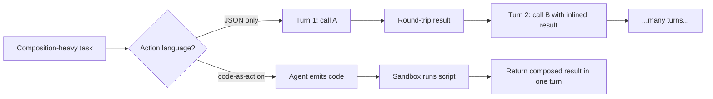

# JSON-Only Action Schema

**Also known as:** JSON-Dict Tool Calls Only, No Code-as-Action, Function-Argument JSON as Action Language

**Category:** Anti-Patterns  
**Status in practice:** deprecated

## Intent

Anti-pattern: restrict the agent's action language to JSON tool-call dictionaries even for tasks where code-as-action (functions composing, loops, conditionals over results) would be the natural shape.

## Context

Agent frameworks that standardised on the function-calling JSON contract and never reconsidered when tasks grew to need step nesting, intermediate variables, or local reductions over tool outputs.

## Problem

JSON tool calls express one action per turn with flat arguments; expressing a loop, a conditional over an intermediate result, or a reuse of one tool's output as another tool's argument requires unrolling into many turns and re-shipping intermediate state through the model. Composability, object handling, and generality suffer.

## Forces

- JSON tool calls are the dominant industry contract and the easiest to log, validate, and rate-limit.
- Code-as-action requires a sandboxed interpreter (Python, JS) with its own security envelope.
- Multiple papers (Executable Code Actions Elicit Better LLM Agents; CodeAct) report that LLMs solve composition-heavy tasks better when allowed to emit code.
- Code is over-represented in LLM training corpora compared to JSON tool-call traces.

## Applicability

**Use when**

- Never as the default. JSON-only is fine for narrow one-tool-per-turn flows; declare that scope explicitly.
- If the task needs nesting, conditionals, or reuse of intermediate results, switch to code-as-action.
- Pair code-as-action with sandbox-isolation; the sandbox is the new security envelope.

**Do not use when**

- The task is composition-heavy (data wrangling, multi-tool reductions, conditional branching over results).
- Tools return rich objects (images, frames, structured records) that should not be serialised through the model.
- Token cost and turn count are constrained — code-as-action collapses many turns into one.

## Therefore

Therefore: when tasks demand nesting, intermediate variables, or local reductions over tool outputs, let the agent emit code that calls tools as functions, so that composability is expressed in the action language rather than unrolled across many turns.

## Solution

Don't insist on JSON-only when the task needs composition. For composition-heavy work, swap to code-as-action: expose tools as ordinary functions in a sandboxed interpreter and let the agent write the glue. Keep JSON for simple one-tool one-arg actions where the contract genuinely fits. See code-as-action, agent-computer-interface, sandbox-isolation.

## Example scenario

A data-investigation agent has tools for query, transform, and chart. Under JSON-only it must call query, return the rows as a JSON blob through the model, call transform with that blob inlined, return another blob, then call chart. Token cost is dominated by the round-tripped tables; latency is dominated by turn count. The team switches to code-as-action: tools are exposed as Python functions, the agent writes a five-line script that pipes query into transform into chart, the interpreter executes it, and the agent receives the chart object back. One turn replaces five.

## Diagram

## Consequences

**Liabilities**

- Nesting, loops, and conditionals get unrolled into many turns, multiplying tokens.
- Intermediate objects (images, data frames, structured returns) round-trip through the model as strings.
- Tasks that would be one code snippet become many turns of state passing.
- The action language is further from the LLM's training distribution than code.

## What this pattern constrains

By definition, this anti-pattern imposes no useful constraint; the JSON-only restriction is itself the failure when composition is needed.

## Known uses

- **smolagents (named as a deliberate design rejection)** — smolagents documents JSON tool-calling as the industry default it explicitly rejects in favour of code-as-action; the docs cite three research papers in support. *Available* — [link](https://huggingface.co/docs/smolagents/tutorials/secure_code_execution)
- **Hugging Face Transformers Agents (ReactCodeAgent)** — Same family — code-as-action is preferred over JSON-only. *Available* — [link](https://huggingface.co/docs/transformers/v4.47.1/agents_advanced)

## Related patterns

- *alternative-to* → [code-as-action](code-as-action.md)
- *alternative-to* → [tool-use](tool-use.md)
- *complements* → [sandbox-isolation](sandbox-isolation.md)
- *complements* → [agent-computer-interface](agent-computer-interface.md)

## References

- *doc*: [smolagents — Secure code execution](https://huggingface.co/docs/smolagents/tutorials/secure_code_execution) — Hugging Face
- *paper*: [Executable Code Actions Elicit Better LLM Agents (CodeAct)](https://arxiv.org/abs/2402.01030) — Wang et al., 2024

**Tags:** anti-pattern, tool-use, code-as-action, smolagents
