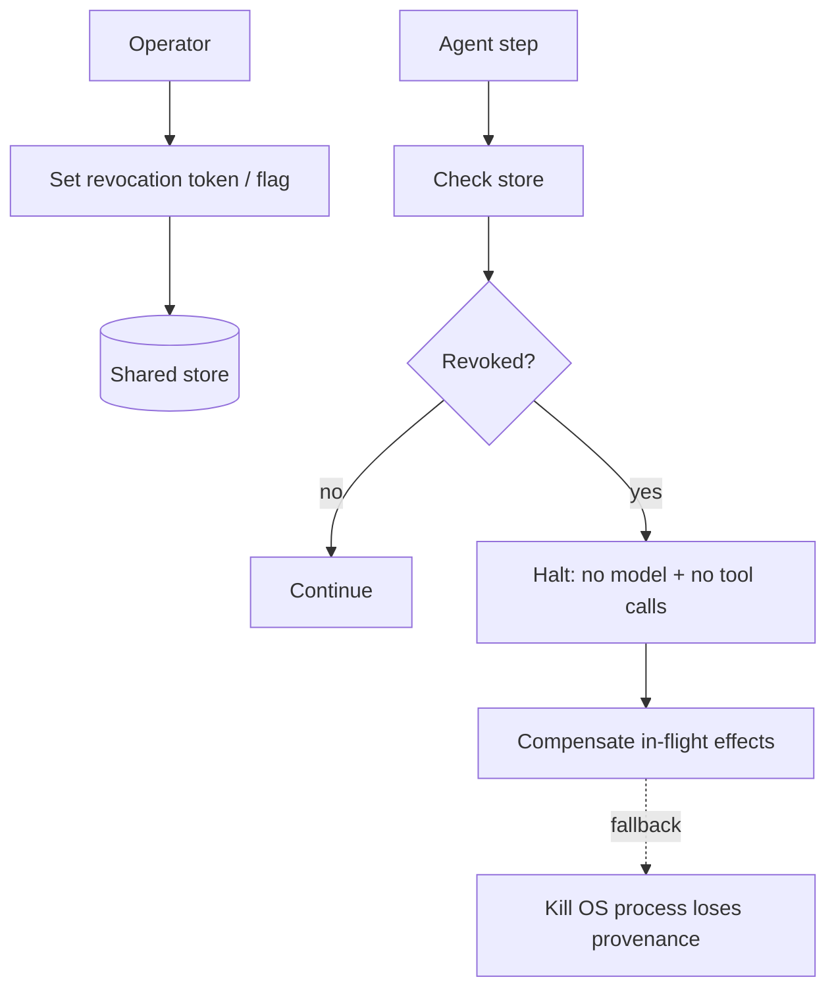

# Kill Switch

**Also known as:** Out-of-Band Stop, Emergency Halt, Killbit, Halt All Agents, Stop Every Running Agent

**Category:** Safety & Control  
**Status in practice:** emerging

## Intent

Provide an out-of-band control plane to halt running agent instances without redeploy.

## Context

A team runs production agents that the operator may suddenly need to stop — a PII leak was discovered, the agent is hammering a third-party API after a cease-and-desist, a runaway cost spike just tripped an alarm, or a mass-action error is unfolding across customer accounts. Stopping has to happen now, not at the end of the current step, and it has to apply to every running instance regardless of which tool it is in the middle of.

## Problem

An in-band stop hook that the agent's own loop checks at the start of each iteration only works if the agent's loop is still alive and cooperating. If the model is wedged inside a long tool call, infinite-looping on a degenerate state, or running tools that ignore process signals, the in-band stop never fires. Killing the operating-system process is a brutal fallback that loses provenance and any chance to run compensating actions. Without a stop primitive outside the agent's own control flow, operator authority disappears the moment the agent stops checking in.

## Forces

- False trips lose user work.
- Out-of-band signals must propagate to all agent surfaces (model calls, tools, sub-agents).
- Compensating actions on halt are non-trivial.

## Applicability

**Use when**

- An agent runs tools or model calls that can cause real harm if it goes wedged.
- Out-of-band halt must be guaranteed even when the agent loop ignores in-band signals.
- A signed revocation token or feature flag can be checked from a store the runtime cannot bypass.

**Do not use when**

- The agent has no side effects and no unbounded loop risk.
- No shared revocation store is available to the agent runtime.
- Killing the OS process is acceptable as the only stop primitive (and provenance loss is fine).

## Therefore

Therefore: check a signed revocation token from a shared store before every model and tool call in the runtime (not the agent loop), so that operator authority survives a wedged or runaway agent.

## Solution

Signed revocation token or feature flag checked on every step from a shared store the agent runtime cannot bypass. On revocation, the agent halts: no further model calls, no further tool calls; in-flight effects are compensated where possible. Killing the OS process is the fallback, but loses provenance.

## Example scenario

An autonomous trading-research agent is running a multi-hour backtest loop when ops notices it is hammering a third-party data API that just sent a cease-and-desist email. The in-band stop hook is checked by the agent's own loop and the agent is wedged on a long tool call. The team adds an out-of-band kill-switch: a signed revocation token in a shared store that the runtime, not the agent, checks before every step and tool call. Flip the token and every running instance halts within one step. The OS-kill fallback is only there for true emergencies.

## Diagram

## Consequences

**Benefits**

- Operator authority survives wedged loops.
- Pairs naturally with rate-limiting and circuit-breaker.

**Liabilities**

- Implementation cuts across the whole runtime.
- Wrong-time halts lose work.

## What this pattern constrains

When the kill-switch fires, no further model or tool calls may proceed regardless of agent state.

## Known uses

- **Production AI gateway kill-switches (Portkey, Helicone)** — *Available*
- **Internal feature-flag-driven halt at frontier labs** — *Available*

## Related patterns

- *complements* → [stop-hook](stop-hook.md)
- *composes-with* → [circuit-breaker](circuit-breaker.md)
- *complements* → [rate-limiting](rate-limiting.md)
- *uses* → [compensating-action](compensating-action.md)
- *composes-with* → [sandbox-escape-monitoring](sandbox-escape-monitoring.md)

## References

- (doc) *Portkey AI Gateway*, <https://portkey.ai/docs>

**Tags:** safety, kill-switch, emergency
