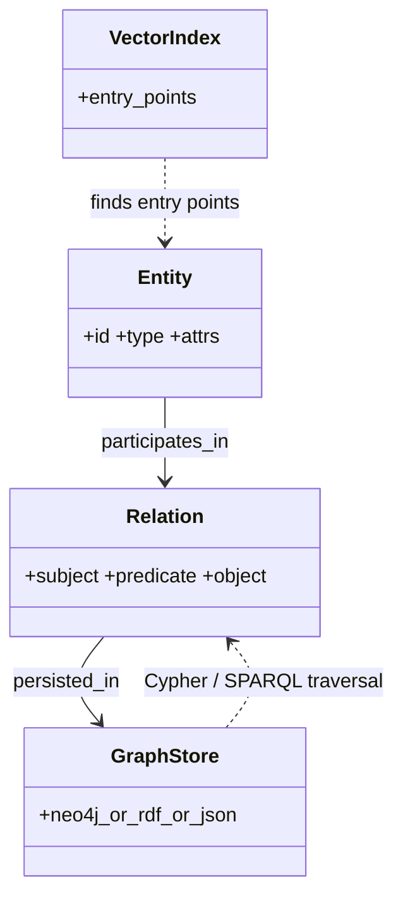

# Knowledge Graph Memory

**Also known as:** Triple Store Memory, Symbolic Memory

**Category:** Memory  
**Status in practice:** emerging

## Intent

Persist agent memory as entities and relations in a structured graph so symbolic queries (path, neighbour, type) become possible.

## Context

Tasks where structured queries over relationships beat semantic similarity (organisation charts, code call graphs, family trees, knowledge bases).

## Problem

Vector memory cannot answer 'who reports to whom' or 'what depends on X' queries; symbolic structure is lost.

## Forces

- Entity and relation extraction is itself a model task with errors.
- Schema design for the graph is a separate engineering effort.
- Updates and deletions need referential integrity.

## Applicability

**Use when**

- The agent must answer relational queries (path, neighbour, type) over remembered entities.
- Observations cleanly yield entities and relations worth persisting symbolically.
- Hybrid retrieval (vector entry + graph traversal) is feasible and useful.

**Do not use when**

- Memory is unstructured text where vector search is sufficient.
- Entity and relation extraction quality is too low to populate the graph reliably.
- Operating a graph store adds complexity disproportionate to the query volume.

## Solution

Extract entities and relations from observations into a graph store (Neo4j, RDF, simple JSON). Queries traverse the graph (Cypher/SPARQL or programmatic). Combine with vector memory for hybrid retrieval (vector finds entry points; graph traverses).

## Example scenario

An ops agent for a 400-person company is asked 'who would approve a $5k purchase in the design org?' Vector memory returns three semantically similar past tickets but cannot answer the structural question. The team adds knowledge-graph-memory: people, roles, reporting lines, and approval thresholds are extracted from the HRIS and intranet into a Neo4j graph. The agent now answers via a Cypher traversal — 'design-org → manager → director with approval ≥ $5k' — and combines that with vector recall of past similar approvals.

## Diagram

## Consequences

**Benefits**

- Structured queries over relationships.
- Inspectable, editable, debuggable knowledge.

**Liabilities**

- Extraction quality bounds graph quality.
- Schema rigidity vs flexibility tension.

## What this pattern constrains

Memory queries that require traversal must use graph operations; ad-hoc text matching over the graph is not the supported access path.

## Known uses

- **Microsoft GraphRAG (graph as memory + retrieval)** — *Available*
- **Zep memory (hybrid)** — *Available*

## Related patterns

- *alternative-to* → [vector-memory](vector-memory.md)
- *composes-with* → [graphrag](graphrag.md)

## References

- (paper) Edge et al., *From Local to Global: A Graph RAG Approach to Query-Focused Summarization*, 2024, <https://arxiv.org/abs/2404.16130>
- (repo) *microsoft/graphrag*, <https://github.com/microsoft/graphrag>

**Tags:** memory, graph, knowledge
