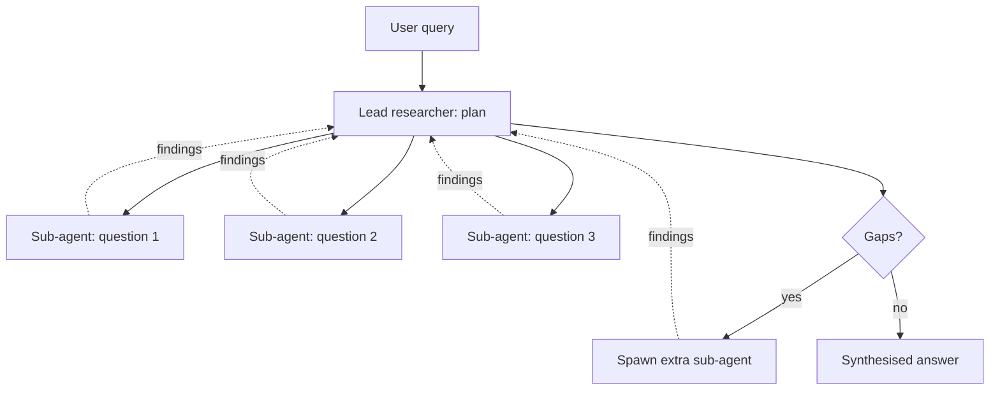

# Lead Researcher

**Also known as:** Research Orchestrator, Lead-and-Subagents

**Category:** Multi-Agent  
**Status in practice:** mature

## Intent

A lead agent writes a research plan and dispatches parallel sub-agents that fan out for breadth-first information gathering, then merges results.

## Context

Open-ended research tasks where breadth-first exploration across many sources beats depth-first single-thread reasoning.

## Problem

Single-agent research is bottlenecked on serial token generation; generic orchestrator-workers under-specifies how to handle research-shaped tasks (parallelism, source diversity, synthesis).

## Forces

- Sub-agent count vs cost.
- Synthesis quality bounded by lead agent's reasoning over fragmented results.
- Information overlap across sub-agents is wasted compute.

## Applicability

**Use when**

- Research-shaped tasks benefit from breadth-first parallel sub-agents.
- A lead can plan, dispatch, and synthesise findings rather than execute serially.
- Source diversity matters and a single agent's serial search would be a bottleneck.

**Do not use when**

- The query is narrow enough that a single agent answers it cheaply.
- Generic orchestrator-workers fits the task without the research-specific structure.
- Synthesis effort would dominate and erase the parallelism gains.

## Solution

Lead agent receives the user query, plans a set of parallel research questions, and dispatches each to a sub-agent. Each sub-agent searches independently and returns structured findings to the lead. The lead reads the returned findings and synthesises the answer; if synthesis reveals gaps, the lead spawns additional sub-agents.

## Example scenario

An investment research firm asks an agent to write a brief on a niche industrial-equipment market by Friday. A single agent takes hours and misses half the relevant sources. They restructure as lead-researcher: the lead reads the brief, plans five parallel research questions (market size, top vendors, regulatory landscape, recent M&A, customer reviews), and dispatches each to a sub-agent that searches independently. Findings come back as structured records; the lead synthesises them and dispatches a follow-up sub-agent for one gap it spots. Wall-clock time drops from hours to twenty minutes.

## Diagram

## Consequences

**Benefits**

- Breadth-first parallelism cuts wall-clock time.
- Inspectable scratchpad makes the research auditable.

**Liabilities**

- Sub-agent overlap and redundancy.
- Synthesis is the new bottleneck.

## What this pattern constrains

Sub-agents return findings only to the lead; peer-to-peer communication is forbidden.

## Known uses

- **[Anthropic Multi-Agent Research](https://www.anthropic.com/engineering/multi-agent-research-system)** — *Available*
- **OpenAI Deep Research** — *Available*

## Related patterns

- *specialises* → [orchestrator-workers](orchestrator-workers.md)
- *uses* → [parallelization](parallelization.md)
- *specialises* → [supervisor](supervisor.md)

## References

- (blog) Anthropic, *How we built our multi-agent research system*, 2025, <https://www.anthropic.com/engineering/multi-agent-research-system>

**Tags:** multi-agent, research, lead-subagent
