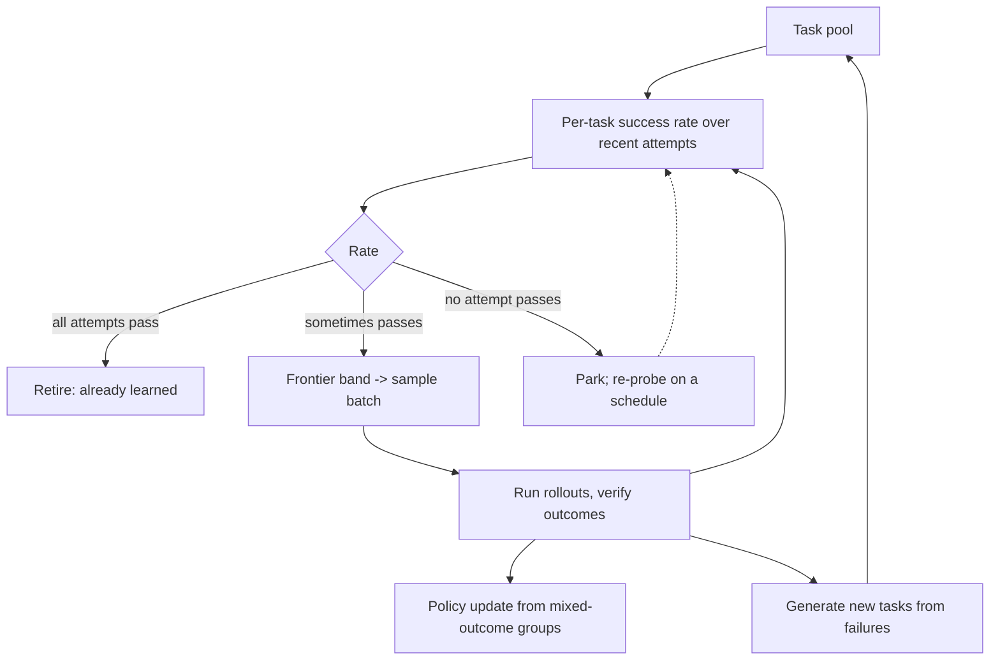

# Learnability-Frontier Task Sampling

**Also known as:** Sampling for Learnability, Success-Variance Curriculum, Self-Evolving Curriculum

**Category:** Reasoning  
**Status in practice:** emerging

## Intent

Spend the training rollout budget on tasks the agent currently solves sometimes, dropping tasks that every attempt solves and tasks that no attempt solves because both yield a zero-variance group and no gradient.

## Context

An agent is being improved by reinforcement learning against a pool of tasks with automatic outcome checking. The trainer samples a task, runs several attempts, and turns the spread of outcomes within that group into an update. In agent settings a single attempt is not a short completion but a multi-minute episode inside a sandbox, with tool calls, a browser or a shell, so the number of attempts a run can afford is small and fixed in advance. The task pool is usually inherited whole from a benchmark or a scrape and sampled uniformly.

## Problem

Most of an inherited pool carries no training signal at any given moment. Measurements across two optimisation algorithms and two widely used datasets found that many questions are solved by every attempt, meaning the skill is already learned, or by none, meaning no attempt reaches a reward at all. When every attempt in a group shares the same outcome, a group-relative advantage is zero for every member, so the update contributed by that group is nothing. Uniform sampling therefore spends most of an expensive rollout budget re-confirming what the agent already does and hammering tasks it cannot yet reach, and the fraction of wasted budget grows as training proceeds and more of the pool becomes solved.

## Forces

- A fixed pool is cheapest to sample uniformly, but under group-relative advantage a task whose attempts all agree contributes exactly zero to the update, so uniform sampling converts most of the budget into no gradient.
- Success variance is the signal that identifies an informative task, yet estimating it costs the same rollouts the selection is meant to conserve.
- The informative band moves during training: a task at the frontier this round is fully solved a few rounds later, so any curriculum fixed in advance decays into the uniform case it replaced.
- In agent training a rollout is a multi-minute sandboxed episode rather than a token completion, so the price of an uninformative sample is orders of magnitude higher than in ordinary preference training.
- Dropping tasks that nobody solves protects the budget but also removes exactly the tasks whose capability is missing, so an aggressive filter can park a difficulty step the agent then never practises.

## Therefore

Therefore: keep a running per-task success rate, admit to each batch only tasks whose rate sits strictly between all-fail and all-pass, re-measure the rate every round, and regenerate fresh tasks from recent failures so the pool follows the frontier as it moves.

## Solution

Treat the task pool as a scheduled resource rather than a fixed dataset. Each task carries a running success rate estimated from its recent attempts, and a batch is drawn only from the band where that rate is neither zero nor one — the tasks the agent solves sometimes, whose groups still produce a non-zero advantage. Tasks above the band are retired as learned; tasks below it are parked rather than deleted, and a small share of each round re-probes the parked set so a difficulty step that later becomes reachable is picked up instead of lost. Because the frontier moves as the policy improves, the band is recomputed every round and new tasks are generated from recent unsuccessful attempts, which keeps supply in the band once the inherited pool has been exhausted. A curation step prunes redundant or low-utility items under a cost-aware objective so the pool does not grow without bound. The selector reads only outcomes the same verifier produced for the same served policy, so the band describes the model actually being trained.

## Structure

```
Task pool -> per-task success estimator (running rate over recent attempts) -> band selector {rate == 1 -> retired, 0 < rate < 1 -> batch, rate == 0 -> parked}. Batch -> rollout runner -> verifier -> outcomes feed back to the estimator. Failures -> task generator -> pool. Parked set -> periodic re-probe -> estimator.
```

## Diagram



*Tasks are routed by measured success rate: solved ones retire, unreachable ones are parked for later re-probing, and only the sometimes-solved band is sampled — with failures regenerated into new tasks as the frontier moves.*

## Example scenario

A team trains a browsing agent on two thousand scraped web tasks, and each attempt takes several minutes inside a sandboxed browser. After two rounds they check the per-task numbers and find that a third of the pool is solved by every attempt and about half by none, so roughly four in five episodes changed nothing. They restrict the next batches to the tasks that succeed some of the time and start generating replacement tasks from the failures, and the same nightly budget begins to move the score again.

## Consequences

**Benefits**

- Rollout budget is spent on groups with mixed outcomes, which are the only groups a group-relative estimator turns into a non-zero update.
- Prioritising questions with high success variance was reported to improve on uniform sampling under both optimisation algorithms and both datasets it was measured on.
- The per-task success rate is a progress read-out for free: the band's composition over time shows which skills have been learned and which are still out of reach.
- Generating new tasks from unsuccessful attempts keeps the informative band supplied after the inherited pool has been mined out, which is what makes the curriculum survive policy drift.

**Liabilities**

- Estimating the success rate consumes rollouts that produce no update unless those same attempts are reused as training data.
- A band that is too narrow starves the batch and a band that is too wide degenerates into uniform sampling, so the two bounds become hyper-parameters that need tuning per task family.
- Parking every task that no attempt solves can strand a capability step permanently if the re-probe schedule is dropped for cost reasons.
- Variance caused by a noisy verifier is indistinguishable from variance caused by genuine partial competence, so an unreliable grader pulls the curriculum toward tasks it cannot score rather than tasks worth learning.
- The scheduler adds per-task state that has to be persisted, versioned and reconciled across distributed rollout workers.

## Failure modes

- Success rates are refreshed too rarely, so the band is computed from a policy several rounds old and the batch fills with tasks the agent has since learned.
- Task regeneration draws only from the most recent failures and collapses onto one narrow failure family, so the band narrows to a single skill while the rest of the capability surface stops being trained.
- The success rate is measured under different decoding or serving settings than the rollouts use, so the band describes a policy that is not the one being updated.
- Parked tasks are deleted rather than held, and the pool loses every task above the current frontier, which caps the run at the difficulty it started with.
- The band is filled by tasks whose verifier is flaky, and the run optimises against grader noise instead of the intended capability.

## What this pattern constrains

A training batch must not be drawn uniformly from the task pool: a task whose recent attempts all succeeded or all failed cannot enter the batch until its measured success rate re-enters the frontier band, and no task may be admitted without a current per-task success estimate produced by the same verifier and the same served policy configuration as the rollouts.

## Applicability

**Use when**

- The agent is trained with a group-relative outcome objective where a uniform-outcome group produces no gradient.
- A single rollout is expensive enough that the choice of task materially changes what the run learns per hour.
- The task pool is large and inherited, so its difficulty distribution was never matched to the current policy.
- Automatic outcome checking is reliable enough that a per-task success rate means competence rather than grader noise.

**Do not use when**

- The verifier is noisy or partially subjective, in which case measured variance reflects grading instability and the band fills with unscoreable tasks.
- The pool is small enough to sample exhaustively each round, where the bookkeeping costs more than it saves.
- The reward is dense and shaped, so even a task no attempt completes still returns a usable gradient and does not need to be parked.
- Training is supervised fine-tuning on fixed demonstrations rather than sampled attempts, since there is no per-task success rate to estimate.

## Components

- Task pool — the inherited and generated set of candidate training tasks, each with persistent per-task state
- Per-task success estimator — maintains a running pass rate over the task's most recent attempts
- Frontier band selector — admits a task to the batch only while its rate lies strictly between all-fail and all-pass
- Parked-task re-probe scheduler — periodically re-tests tasks below the band so a newly reachable difficulty step is not lost
- Failure-driven task generator — synthesises new tasks from recent unsuccessful attempts to keep the band supplied
- Cost-aware pruner — removes redundant or low-utility items so the pool does not grow without bound
- Rollout runner — executes the sandboxed episodes for the selected batch and returns verified outcomes

## Tools

- Group-relative policy optimisation trainer — the consumer whose advantage collapses to zero on a uniform-outcome group
- Sandboxed episode runner — executes the multi-minute browser, shell or tool episode that constitutes one attempt
- Outcome reward model or executable verifier — produces the per-attempt pass or fail that the success estimator aggregates
- Experiment tracker or task database — persists per-task success history across rounds and across distributed rollout workers
- Task synthesis prompt or generator model — turns recorded failures into new tasks of comparable difficulty

## Evaluation metrics

- Informative-batch fraction — share of sampled tasks whose attempt group had mixed outcomes and therefore produced a non-zero advantage
- Score gain per rollout hour — whether the selection actually converts the saved budget into capability
- Band occupancy over time — how many tasks sit in the frontier band each round, which shows when the pool has been mined out
- Retired and parked counts — how much of the pool has been learned versus placed out of reach, which exposes stranding
- Held-out task success rate — confirms the curriculum improved general capability rather than fitting the sampled band
- Verifier agreement rate — separates variance that comes from partial competence from variance that comes from an unstable grader

## Known uses

- **[WebRL (self-evolving online curriculum for web agents)](https://github.com/THUDM/WebRL)** _available_ — Addresses task scarcity and policy distribution drift with a self-evolving curriculum that generates new tasks from unsuccessful attempts, paired with an outcome-supervised reward model; code released.
- **[Sampling-for-learnability curriculum in reasoning post-training](https://arxiv.org/abs/2502.12272)** _pure-future_ — Reports that under two optimisation algorithms on two widely used datasets many questions are solved by all attempts or by none, and prioritises questions with high variance of success instead.
- **[TRUSTEE (adaptive curriculum for tool-calling agents)](https://arxiv.org/abs/2604.17739)** _pure-future_ — Trains tool-calling agents against fully simulated environments and uses an adaptive curriculum learning mechanism that controls task difficulty during training.
- **[CurateEvo (data-curation evolution for agentic post-training)](https://arxiv.org/abs/2607.06140)** _pure-future_ — Diagnoses recurring failure modes to augment, filter or refine the training set, then prunes redundant or low-utility turns under a cost-aware objective, treating curation as a loop rather than a preprocessing step.

## Related patterns

- _complements_ **ReST-EM** — ReST-EM filters generated samples by correctness and fine-tunes on the ones that passed; this pattern filters tasks by outcome variance before the rollouts are spent, and a task every attempt solves is exactly what ReST-EM keeps and what this drops.
- _alternative-to_ **Checklist Partial-Credit Scoring** — Two ways to recover signal from a task no attempt fully solves: graded checkpoints keep the task and give it dense partial credit, whereas this pattern parks it until the frontier reaches it.
- _complements_ **Mirrored Tool Environment** — A mirrored environment makes episode difficulty controllable and cheap to run; this pattern decides which difficulty the next batch should actually sample.
- _complements_ **Harness-Native Rollout Capture** — Capture supplies the rollouts and their exact token ids; this pattern decides which tasks those expensive rollouts are spent on.
- _complements_ **Served-Policy Anchoring** — The frontier band is only meaningful if the success rates were measured on the policy the serving engine actually runs, which is what anchoring enforces.
- _complements_ **Simulated-User Rollout Evaluation** — Repeating each task and reporting a consistency figure produces precisely the per-task success rate this pattern's selector consumes.
- _complements_ **Bayesian Bandit Experimentation** — The same allocation reasoning at a different layer: the bandit reallocates production traffic across agent variants, while here one policy reallocates rollout budget across training tasks.

## References

- [Learning to Reason at the Frontier of Learnability](https://arxiv.org/abs/2502.12272) — 2025
- [WebRL: Training LLM Web Agents via Self-Evolving Online Curriculum Reinforcement Learning](https://arxiv.org/abs/2411.02337) — 2024
- [Democratizing Tool Learning with Environments Fully Simulated by a Free 8B Language Model](https://arxiv.org/abs/2604.17739) — 2026
- [CurateEvo: Data-Curation Evolving for Agentic Post-Training](https://arxiv.org/abs/2607.06140) — 2026
- [THUDM/WebRL](https://github.com/THUDM/WebRL)
