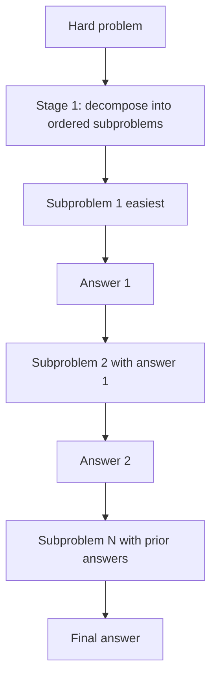

# Least-to-Most Prompting

**Also known as:** L2M, Easy-First Decomposition

**Category:** Reasoning  
**Status in practice:** emerging

## Intent

Decompose a hard problem into an ordered list of easier subproblems, then solve them sequentially with each answer feeding the next.

## Context

A team is using a model on a task class where short, training-style examples work fine but longer or more complex instances fail. For example, the model can handle two-step word problems but starts losing pieces on five-step ones, or it follows two-clause instructions but drops information when there are seven. Plain chain-of-thought reasoning closes some of this gap but still breaks down at the hard end of the distribution.

## Problem

Even with chain-of-thought, the model is still trying to span the whole problem in a single reasoning trace. As the problem grows, the trace gets long and the model loses track partway through, makes a wrong commitment early, and never recovers. Without an explicit way to break a hard instance into ordered, simpler subproblems and have the model see each one in turn with the prior answers in hand, accuracy collapses on exactly the cases where the technique was supposed to help.

## Forces

- Decomposition prompts are themselves a design problem.
- Two stages double minimum cost.
- Errors in the decomposition cascade.

## Therefore

Therefore: decompose the problem into an ordered list of easier subproblems and solve them sequentially with each answer feeding the next, so that the model never has to leap from problem to answer in one step.

## Solution

Two-stage prompt. Stage 1 (decomposition): prompt the model to list subproblems from easiest to hardest. Stage 2 (sequential solve): for each subproblem in order, prompt the model with the original question, prior subproblem answers, and the current subproblem.

## Diagram

## Example scenario

A maths-tutoring agent is asked a multi-step word problem that combines unit conversion, percentage, and ratio. Plain chain-of-thought gets the unit conversion right but loses the ratio. The team adds least-to-most: stage one prompts the model to list subproblems easiest-first ('1: convert km to m, 2: compute percentage, 3: apply ratio'); stage two solves each in order, feeding prior answers forward. Accuracy on the hard end of the eval set jumps because each step starts from a clean, simpler frame.

## Consequences

**Benefits**

- Strong length and complexity generalisation.
- Subproblem answers are inspectable.

**Liabilities**

- Decomposition prompt design is task-specific.
- Two-stage pipeline; ambiguity in stage 1 propagates.

## What this pattern constrains

Subproblems must be solved in the listed order; out-of-order solving is forbidden.

## Applicability

**Use when**

- Hard problems benefit from explicit decomposition into ordered easier subproblems.
- Each subproblem's answer is genuinely useful as input to the next.
- Plain chain-of-thought generalises poorly to the target distribution.

**Do not use when**

- The model already solves the task with chain-of-thought alone.
- Subproblems cannot be ordered easiest-to-hardest reliably.
- Sequential prompting cost is prohibitive for the workload.

## Components

- Decomposer LLM call — stage-one prompt that lists subproblems from easiest to hardest
- Sequential solver LLM call — stage-two prompt that solves the next subproblem given the original question and prior answers
- Subproblem queue — ordered list of subproblems with their resolved answers
- Answer composer — assembles the final answer from the last subproblem result

## Tools

- LLM API — at least one decomposition call plus one call per subproblem
- Optional tool runtime — calculator, search, or domain solver invoked inside a subproblem step

## Evaluation metrics

- Length-generalisation accuracy — solve rate on instances longer than the training distribution
- Decomposition validity rate — fraction of stage-one plans whose subproblems are well-ordered and complete
- Stage-one error cascade rate — share of failures whose root cause is a bad decomposition rather than a bad solve
- Subproblem count distribution — typical depth required per task class
- Cost vs single-stage CoT — total token spend across both stages relative to one-shot reasoning

## Known uses

- **L2M paper benchmarks (last letter, SCAN, math)** _available_
- **[LLM Reasoners (maitrix-org)](https://github.com/maitrix-org/llm-reasoners)** _available_ — Ships a Least-to-most prompting algorithm/example among its reasoning methods.

## Related patterns

- _alternative-to_ **Chain of Thought**
- _complements_ **Self-Ask**
- _complements_ **Plan-and-Execute**
- _complements_ **Goal Decomposition**
- _alternative-to_ **Query-Decomposition Agent**

## References

- [Least-to-Most Prompting Enables Complex Reasoning in Large Language Models](https://arxiv.org/abs/2205.10625) — Zhou, Schärli, Hou, Wei, Scales, Wang, Schuurmans, Cui, Bousquet, Le, Chi, 2022
