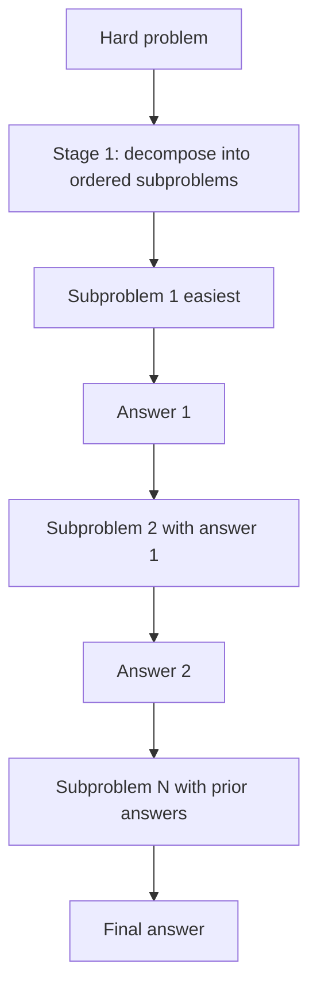

# Least-to-Most Prompting

**Also known as:** L2M, Easy-First Decomposition

**Category:** Reasoning  
**Status in practice:** emerging

## Intent

Decompose a hard problem into an ordered list of easier subproblems, then solve them sequentially with each answer feeding the next.

## Context

Tasks with poor length or complexity generalisation: the model handles the easy training-style cases but fails on harder, longer instances.

## Problem

CoT generalises poorly out of distribution; the model needs explicit scaffolding for harder instances.

## Forces

- Decomposition prompts are themselves a design problem.
- Two stages double minimum cost.
- Errors in the decomposition cascade.

## Applicability

**Use when**

- Hard problems benefit from explicit decomposition into ordered easier subproblems.
- Each subproblem's answer is genuinely useful as input to the next.
- Plain chain-of-thought generalises poorly to the target distribution.

**Do not use when**

- The model already solves the task with chain-of-thought alone.
- Subproblems cannot be ordered easiest-to-hardest reliably.
- Sequential prompting cost is prohibitive for the workload.

## Therefore

Therefore: decompose the problem into an ordered list of easier subproblems and solve them sequentially with each answer feeding the next, so that the model never has to leap from problem to answer in one step.

## Solution

Two-stage prompt. Stage 1 (decomposition): prompt the model to list subproblems from easiest to hardest. Stage 2 (sequential solve): for each subproblem in order, prompt the model with the original question, prior subproblem answers, and the current subproblem.

## Variants

- **Static decomposition L2M** — Subproblems are produced once up front and then solved in order without revisiting the plan.
- **Dynamic decomposition L2M** — After each subproblem is answered, the model may revise the remaining subproblem list before continuing.
- **Tool-augmented L2M** — Each subproblem step may call a tool (calculator, search) instead of being answered by the model alone.

## Diagram

## Example scenario

A maths-tutoring agent is asked a multi-step word problem that combines unit conversion, percentage, and ratio. Plain chain-of-thought gets the unit conversion right but loses the ratio. The team adds least-to-most: stage one prompts the model to list subproblems easiest-first ('1: convert km to m, 2: compute percentage, 3: apply ratio'); stage two solves each in order, feeding prior answers forward. Accuracy on the hard end of the eval set jumps because each step starts from a clean, simpler frame.

## Consequences

**Benefits**

- Strong length and complexity generalisation.
- Subproblem answers are inspectable.

**Liabilities**

- Decomposition prompt design is task-specific.
- Two-stage pipeline; ambiguity in stage 1 propagates.

## What this pattern constrains

Subproblems must be solved in the listed order; out-of-order solving is forbidden.

## Known uses

- **L2M paper benchmarks (last letter, SCAN, math)** — *Available*

## Related patterns

- *alternative-to* → [chain-of-thought](chain-of-thought.md)
- *complements* → [self-ask](self-ask.md)
- *complements* → [plan-and-execute](plan-and-execute.md)
- *complements* → [goal-decomposition](goal-decomposition.md) — least-to-most is the prompting tactic; goal-decomposition is the planner architecture. Both can be used together.

## References

- (paper) Zhou, Schärli, Hou, Wei, Scales, Wang, Schuurmans, Cui, Bousquet, Le, Chi, *Least-to-Most Prompting Enables Complex Reasoning in Large Language Models*, 2022, <https://arxiv.org/abs/2205.10625>

**Tags:** reasoning, decomposition
