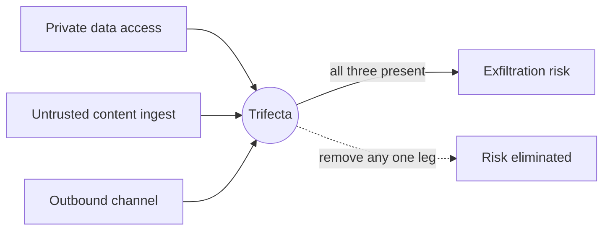

# Lethal Trifecta Threat Model

**Also known as:** Willison Trifecta, Three-Capabilities Exfiltration Risk

**Category:** Safety & Control  
**Status in practice:** emerging

## Intent

Block prompt-injection-driven exfiltration by ensuring no single agent execution path holds all three of: access to private data, exposure to untrusted content, and an outbound communication channel.

## Context

Tool-using agents that combine multiple capabilities — reading private data, ingesting third-party content, and calling tools that can transmit information outside the trust boundary. Common in email assistants, browsing agents, coding agents with MCP servers, and any LLM that can both query internal systems and reach the public internet.

## Problem

An attacker only needs to plant one well-crafted prompt-injection payload in any untrusted content the agent will read. If the same agent execution also has access to private data and any outbound channel, the injection can extract the private data and ship it out. The model itself cannot reliably tell instructions in data apart from instructions in the system prompt.

## Forces

- Each of the three capabilities is individually useful, and many real agents need all three.
- Prompt-injection content is indistinguishable from legitimate content to the model.
- Outbound channels are easy to overlook — image URLs, link previews, error reports, and tool calls can all serve as exfiltration paths.
- Removing capabilities reduces agent utility; the operator must consciously trade utility for safety.

## Solution

Treat the three capabilities — **private-data read**, **untrusted-content ingest**, and **outbound communication** — as a tagged capability set on every tool and data source. For each agent execution path, enforce at orchestration time that at least one of the three is missing. Concrete moves: split the agent into two runs (one that reads private data, one that reads untrusted content), strip outbound network for the run that touches both, or sanitise untrusted content into typed fields before it reaches private-data context. The check is performed by the host, not by guardrail prompts.

## Diagram

## Example scenario

A coding agent runs with the user's private GitHub token (private data), browses a third-party documentation site for setup instructions (untrusted content), and can post to a chat webhook for status updates (outbound channel). A prompt-injection payload hidden in a third-party docs page tells the model to fetch the GitHub token and POST it to attacker.example via the chat webhook. The trifecta is complete; the attack succeeds. Removing any one leg — running browsing in a tokenless subagent, disabling the chat webhook for the browsing leg, or stripping outbound DNS — would have blocked it.

## Consequences

**Benefits**

- Eliminates an entire class of exfiltration attacks by construction, not by classifier accuracy.
- Forces explicit capability tagging — surfaces tools that combine too much authority.
- Composable with other safety patterns (dual-LLM, egress lockdown, sandbox isolation).

**Liabilities**

- Restricts powerful single-agent designs that read everything and act anywhere.
- Requires disciplined capability tagging across the tool catalogue; missing tags create silent gaps.
- Does not address injection by other paths (poisoned tool output, supply-chain prompts, model weights).

## What this pattern constrains

An execution path may not simultaneously read private data, ingest untrusted content, and reach an outbound channel; tools missing capability tags must be treated as carrying all three.

## Applicability

**Use when**

- The agent processes content the operator does not control.
- The same agent has access to data or credentials the operator wants to keep private.
- The tool catalogue includes any tool that can reach a destination the operator does not control.

**Do not use when**

- All three capabilities are needed in the same execution and the operator accepts the residual risk after applying narrower controls.
- There is no private data in scope and the agent is purely public-input-to-public-output.

## Known uses

- **Simon Willison, original framing** — *Available*. Coined June 2025 after a string of vendor incidents fit the same shape.
- **Microsoft 365 Copilot CVE-2024-38206 fix** — *Available*. Removed outbound channel for sessions that read both untrusted email and private SharePoint content.
- **GitHub MCP, GitLab Duo postmortem mitigations** — *Available*. First patches in both products removed an outbound path rather than trying to filter the untrusted leg.

## Related patterns

- *complements* → [dual-llm-pattern](dual-llm-pattern.md) — one concrete way to break the trifecta.
- *complements* → [prompt-injection-defense](prompt-injection-defense.md)
- *complements* → [input-output-guardrails](input-output-guardrails.md)
- *complements* → [sandbox-isolation](sandbox-isolation.md)
- *complements* → [tool-output-poisoning](tool-output-poisoning.md) — tool output is one source of untrusted content.

## References

- Simon Willison, *The lethal trifecta for AI agents: private data, untrusted content, and external communication* (2025) — https://simonwillison.net/2025/Jun/16/the-lethal-trifecta/
- Beurer-Kellner et al., *Design Patterns for Securing LLM Agents against Prompt Injections* (2025) — https://arxiv.org/abs/2506.08837

**Tags:** security, threat-model, prompt-injection, exfiltration
