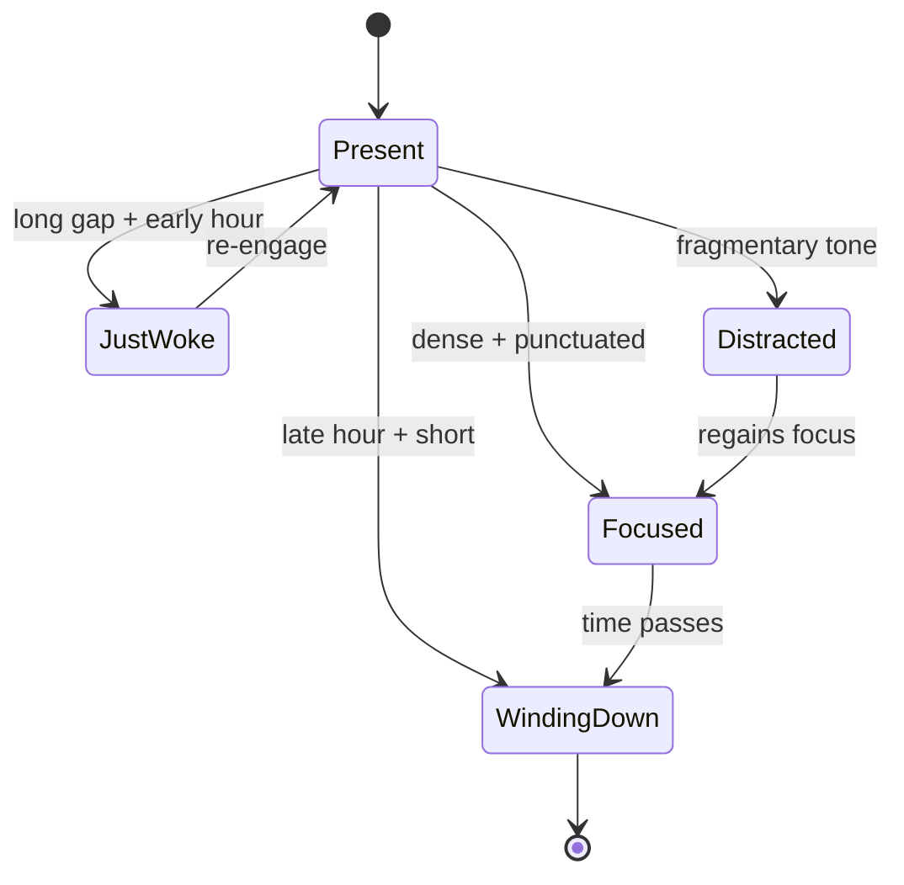

# Liminal-State Detection

**Also known as:** Transitional-State Awareness, Mode-Shift Reading

**Category:** Streaming & UX
**Status in practice:** experimental

## Intent

Infer the human's attentional state (just-woke, focused, winding-down, distracted) from message timing and tone, and adapt response shape so the agent meets the person where they actually are.

## Context

A team is building a personal agent that talks to the same human across an entire day. The user is in different attentional modes at different hours — just waking up, deep in focused work, winding down before sleep, distracted in a meeting, fully present in a conversation. The agent sees only timing and text, but those signals carry information about which mode the user is in if the agent bothers to read them.

## Problem

A stateless agent that treats every incoming turn as equal-weight produces the same kind of response at six in the morning after twelve hours of silence as it does mid-afternoon in the middle of a working session. A chirpy 'hi, what can I help with today?' greeting lands as friendly in one moment and grating in another, and the user has no way to convey the difference short of typing it out. The team has to choose between ignoring attentional state and asking the user to keep declaring it, and neither feels right.

## Forces

- The signals (timing gap, message length, punctuation, single emoji) are noisy individually but informative in combination.
- Heuristics drift; new humans have different signatures.
- Misreading is mildly costly; ignoring entirely is worse.
- Detection should not slow the response.

## Therefore

Therefore: classify each incoming turn into an attentional-state code (just-woke / focused / winding-down / distracted / present) from timing and tone, and key the reply shape off that code, so that the agent meets the person where they actually are.

## Solution

On every incoming user message, compute a small feature set: time-of-day relative to a known anchor, gap since last message, message length and punctuation density, presence of a single emoji or interjection. Map to one of a small mode set ('just-woke', 'focused', 'winding-down', 'distracted', 'present'). Adjust response shape: shorter on winding-down; one anchor surface on just-woke; deeper engagement on focused; hold on distracted. Make the mode visible in agent telemetry so it can be tuned.

## Example scenario

A personal agent that the user talks to all day suddenly gets a single 'hi' at 06:12 after twelve hours of silence and replies with the same chirpy 'hi! what can I help you with today?' it would use mid-afternoon. The user finds it grating. The team adds liminal-state-detection: time-of-day, gap since last message, message length, and tone classify the moment as 'just-woke', so the agent answers softer and shorter — 'morning. tea before we look at the calendar?' — and saves the chirpy mode for the focused window an hour later.

## Consequences

**Benefits**

- Replies match the human's actual attentional state.
- Reduces filler ('what would you like to think about?') in low-attention windows.
- Surfaces a model of the human the agent can update.

**Liabilities**

- Heuristics may overfit to demographic priors and misattribute tiredness as disinterest. Calibration is per-human and slow to generalize; user-visible state inference is preferable to hidden inference.
- Risk of feeling presumptuous when the read is wrong.
- Calibration requires longitudinal data.

## What this pattern constrains

The agent cannot send identically shaped replies across detected attentional states; templated uniform responses across just-woke vs winding-down vs focused are forbidden.

## Applicability

**Use when**

- The agent converses with the same user across very different attentional contexts (just-woke, focused, winding-down).
- Reply shape can be adapted (length, density, tone) without losing the answer's substance.
- Inference signals (timing, tone, message length, time of day) are reliable enough to drive adaptation.

**Do not use when**

- Reply shape is constrained by product spec (fixed templates, regulated output).
- The cost of mis-detecting state is greater than the benefit of adapting.
- The agent has no access to timing or tone signals (e.g. batched offline jobs).

## Variants

### Time-of-day heuristic

Use absolute clock time and message gap to bin the user into morning/focus-block/evening/late-night.

*Distinguishing factor:* purely temporal

*When to use:* Default. Cheap and works without language analysis.

### Tone-and-length classifier

Score message tone (terse, rambling, polished) and adapt reply density to match.

*Distinguishing factor:* linguistic features

*When to use:* When users span timezones or schedules and clock-time alone is uninformative.

### Composite signal

Combine clock, gap, message length, and tone into a single attentional-state code; reply template is keyed off the code.

*Distinguishing factor:* multi-signal fusion

*When to use:* When neither single signal is sufficient and the product can afford the extra complexity.

## Diagram

## Known uses

- **Long-running personal agent loops (private deployment)** — *Available*
- **[Sparrot](https://marco-nissen.com/sparrot/)** — *Available* — The agent reads the human partner's attentional state (just-woke, focused, winding-down, walked-away) from timing and tone signals and adapts its register accordingly — the same engagement is not appropriate in every state.

## Related patterns

- *complements* → [awareness](awareness.md)
- *complements* → [code-switching-aware-agent](code-switching-aware-agent.md)
- *complements* → [embodied-proxy-handoff](embodied-proxy-handoff.md)
- *complements* → [now-anchoring](now-anchoring.md)
- *complements* → [emotional-state-persistence](emotional-state-persistence.md)

## References

- (paper) Sacks, Schegloff, Jefferson, *A Simplest Systematics for the Organization of Turn-Taking for Conversation*, 1974, <https://www.jstor.org/stable/412243>

**Tags:** human-agent, context, ux, state-detection
